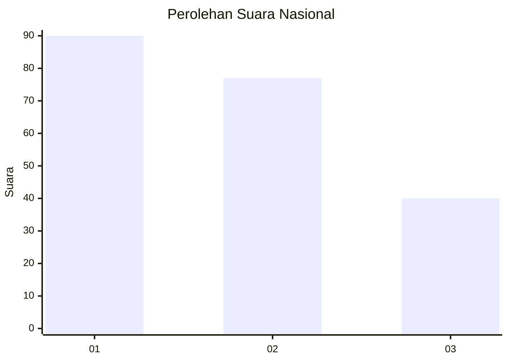
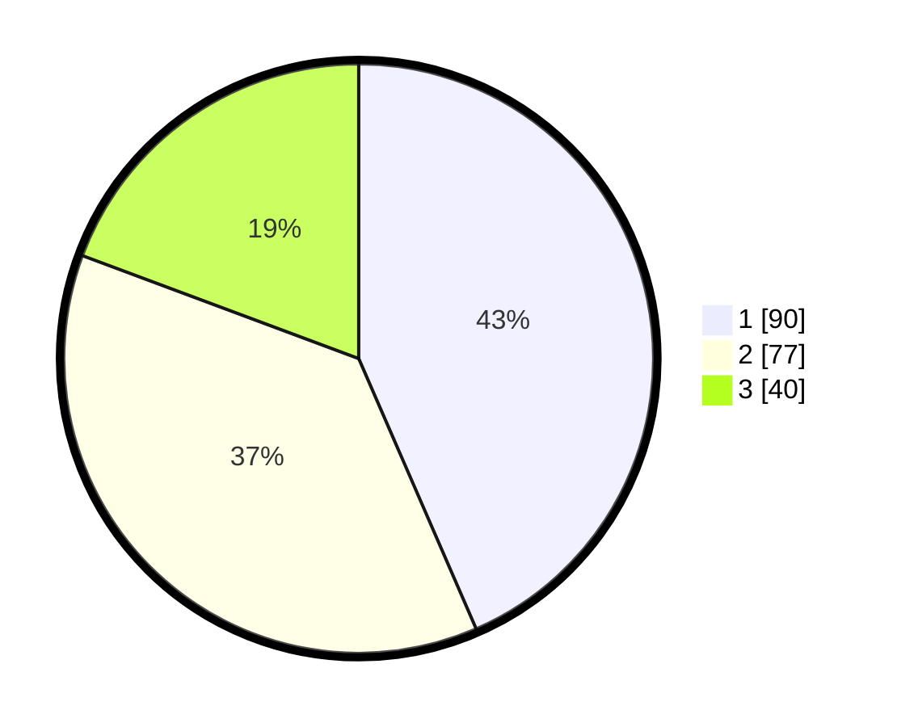

# Hasil

## Grafik

## Tabel

| No.    | Nama Paslon    | Suara | Suara (raw) | Persentase |
|:------ |:-------------- | -----:| -----------:| ----------:|
| 100025 | ANIES MUHAIMIN | 90    | [90][p-1]   | 43,48      |
| 100026 | PRABOWO GIBRAN | 77    | [77][p-2]   | 37,20      |
| 100027 | GANJAR MAHFUD  | 40    | [40][p-3]   | 19,32      |

[p-1]: https://github.com/gigit-pemilu/pemilu-2024/blob/main/pilpres/hitung-suara/sub/31-dki-jakarta/sub/75-jakarta-timur/sub/06-cakung/sub/1001-jatinegara/sub/131-tps/sub/paslon-1.txt
[p-2]: https://github.com/gigit-pemilu/pemilu-2024/blob/main/pilpres/hitung-suara/sub/31-dki-jakarta/sub/75-jakarta-timur/sub/06-cakung/sub/1001-jatinegara/sub/131-tps/sub/paslon-2.txt
[p-3]: https://github.com/gigit-pemilu/pemilu-2024/blob/main/pilpres/hitung-suara/sub/31-dki-jakarta/sub/75-jakarta-timur/sub/06-cakung/sub/1001-jatinegara/sub/131-tps/sub/paslon-3.txt

## Foto C Plano

https://sirekap-obj-formc.kpu.go.id/9b09/pemilu/ppwp/31/75/06/10/01/3175061001131-20240215-015043--a364bc3c-07d0-4f68-993c-7d6f8e612ff1.jpg

https://sirekap-obj-formc.kpu.go.id/9b09/pemilu/ppwp/31/75/06/10/01/3175061001131-20240215-015125--b9256ef8-71c6-487d-91e8-9c7b0ecf83ea.jpg

https://sirekap-obj-formc.kpu.go.id/9b09/pemilu/ppwp/31/75/06/10/01/3175061001131-20240215-015217--7a59f182-f04c-47e8-ba06-339aec0c2b42.jpg

## Metadata

| Key        | Value               |
| ---------- | ------------------- |
| Time Stamp | 2024-02-24 22:31:28 |

