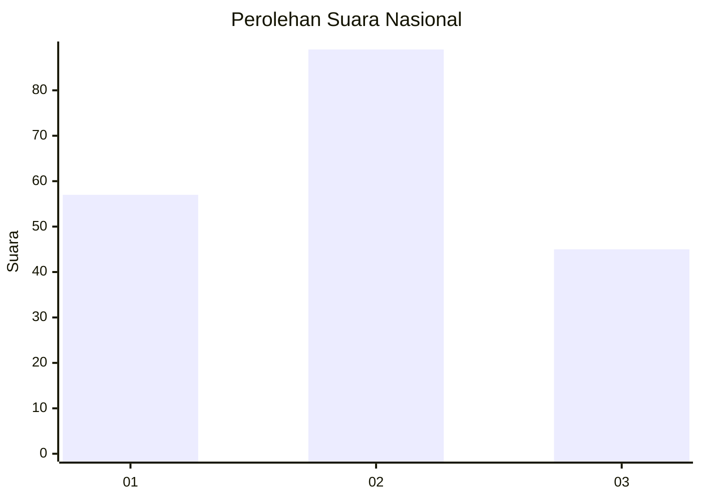
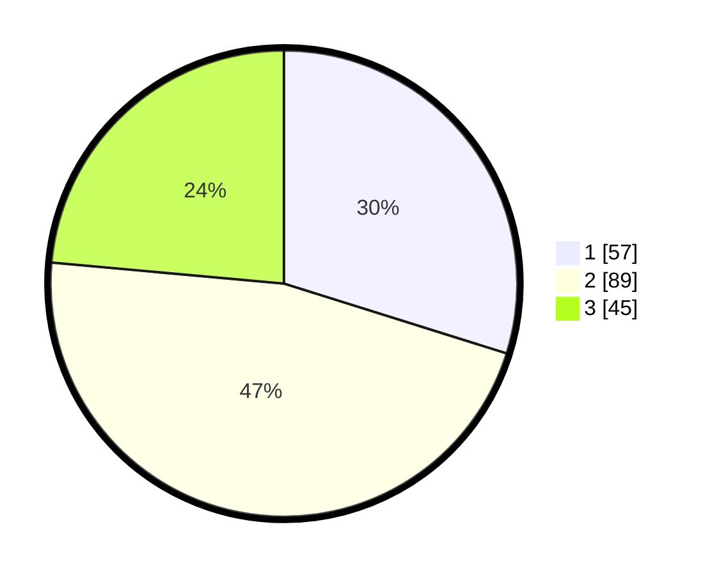

# Hasil

## Grafik

## Tabel

| No.    | Nama Paslon    | Suara | Suara (raw) | Persentase |
|:------ |:-------------- | -----:| -----------:| ----------:|
| 100025 | ANIES MUHAIMIN | 57    | [57][p-1]   | 29,84      |
| 100026 | PRABOWO GIBRAN | 89    | [89][p-2]   | 46,60      |
| 100027 | GANJAR MAHFUD  | 45    | [45][p-3]   | 23,56      |

[p-1]: https://github.com/gigit-pemilu/pemilu-2024/blob/main/pilpres/hitung-suara/sub/31-dki-jakarta/sub/75-jakarta-timur/sub/06-cakung/sub/1001-jatinegara/sub/135-tps/sub/paslon-1.txt
[p-2]: https://github.com/gigit-pemilu/pemilu-2024/blob/main/pilpres/hitung-suara/sub/31-dki-jakarta/sub/75-jakarta-timur/sub/06-cakung/sub/1001-jatinegara/sub/135-tps/sub/paslon-2.txt
[p-3]: https://github.com/gigit-pemilu/pemilu-2024/blob/main/pilpres/hitung-suara/sub/31-dki-jakarta/sub/75-jakarta-timur/sub/06-cakung/sub/1001-jatinegara/sub/135-tps/sub/paslon-3.txt

## Foto C Plano

https://sirekap-obj-formc.kpu.go.id/361b/pemilu/ppwp/31/75/06/10/01/3175061001135-20240214-223743--309b05b6-821a-414c-8cb9-f9926059c97a.jpg

https://sirekap-obj-formc.kpu.go.id/361b/pemilu/ppwp/31/75/06/10/01/3175061001135-20240214-223839--d211f68b-558b-4017-95d6-713b76a5909a.jpg

https://sirekap-obj-formc.kpu.go.id/361b/pemilu/ppwp/31/75/06/10/01/3175061001135-20240214-223935--8b84ab7f-053b-4bb0-ad8f-f9425a3dd861.jpg

## Metadata

| Key        | Value               |
| ---------- | ------------------- |
| Time Stamp | 2024-02-24 22:31:28 |

