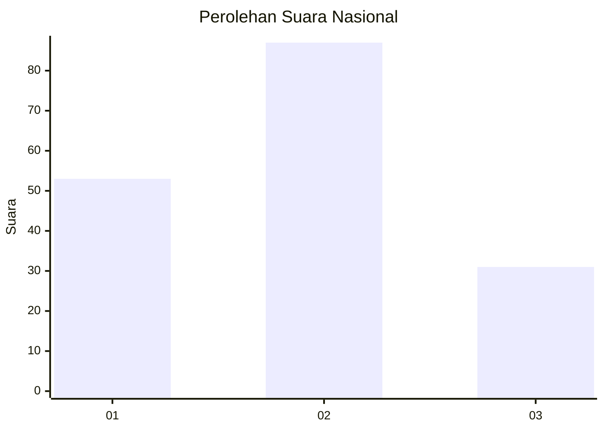
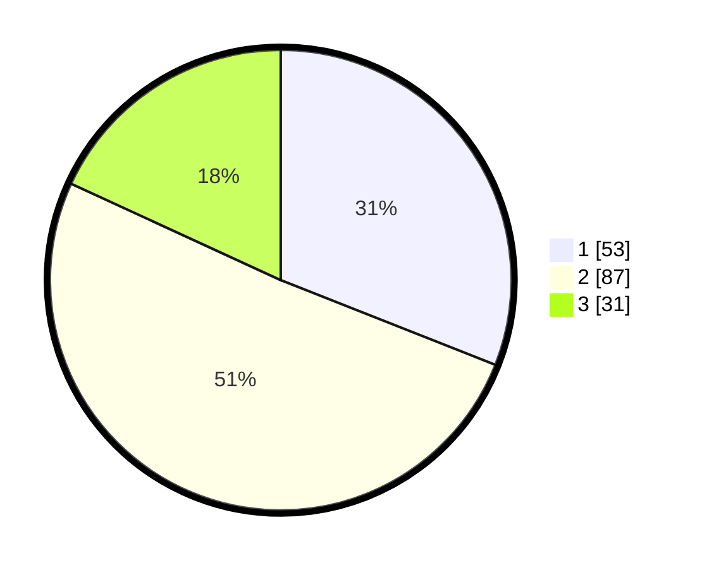

# Hasil

## Grafik

## Tabel

| No.    | Nama Paslon    | Suara | Suara (raw) | Persentase |
|:------ |:-------------- | -----:| -----------:| ----------:|
| 100025 | ANIES MUHAIMIN | 53    | [53][p-1]   | 30,99      |
| 100026 | PRABOWO GIBRAN | 87    | [87][p-2]   | 50,88      |
| 100027 | GANJAR MAHFUD  | 31    | [31][p-3]   | 18,13      |

[p-1]: https://github.com/gigit-pemilu/pemilu-2024/blob/main/pilpres/hitung-suara/sub/31-dki-jakarta/sub/75-jakarta-timur/sub/06-cakung/sub/1001-jatinegara/sub/136-tps/sub/paslon-1.txt
[p-2]: https://github.com/gigit-pemilu/pemilu-2024/blob/main/pilpres/hitung-suara/sub/31-dki-jakarta/sub/75-jakarta-timur/sub/06-cakung/sub/1001-jatinegara/sub/136-tps/sub/paslon-2.txt
[p-3]: https://github.com/gigit-pemilu/pemilu-2024/blob/main/pilpres/hitung-suara/sub/31-dki-jakarta/sub/75-jakarta-timur/sub/06-cakung/sub/1001-jatinegara/sub/136-tps/sub/paslon-3.txt

## Foto C Plano

https://sirekap-obj-formc.kpu.go.id/1261/pemilu/ppwp/31/75/06/10/01/3175061001136-20240214-232221--65f091c6-9143-4880-bd10-f3ec213ddd6e.jpg

https://sirekap-obj-formc.kpu.go.id/1261/pemilu/ppwp/31/75/06/10/01/3175061001136-20240214-232507--a078d6c2-7e96-466e-aed6-f864ab3233b6.jpg

https://sirekap-obj-formc.kpu.go.id/1261/pemilu/ppwp/31/75/06/10/01/3175061001136-20240214-232420--3dd66151-d1fe-45c4-8ddc-d8fc4c5661a4.jpg

## Metadata

| Key        | Value               |
| ---------- | ------------------- |
| Time Stamp | 2024-02-25 12:00:00 |

