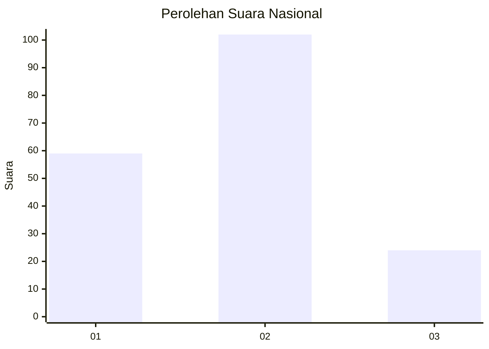
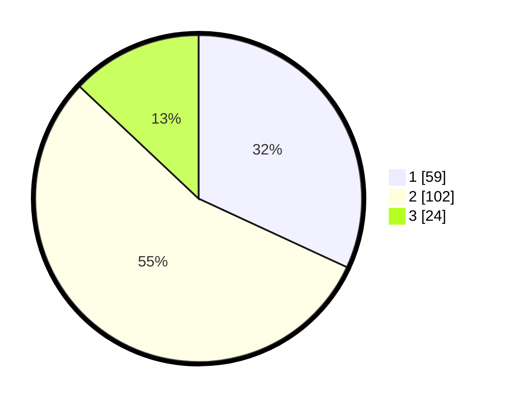

# Hasil

## Grafik

## Tabel

| No.    | Nama Paslon    | Suara | Suara (raw) | Persentase |
|:------ |:-------------- | -----:| -----------:| ----------:|
| 100025 | ANIES MUHAIMIN | 59    | [59][p-1]   | 31,89      |
| 100026 | PRABOWO GIBRAN | 102   | [102][p-2]  | 55,14      |
| 100027 | GANJAR MAHFUD  | 24    | [24][p-3]   | 12,97      |

[p-1]: https://github.com/gigit-pemilu/pemilu-2024/blob/main/pilpres/hitung-suara/sub/31-dki-jakarta/sub/75-jakarta-timur/sub/06-cakung/sub/1001-jatinegara/sub/140-tps/sub/paslon-1.txt
[p-2]: https://github.com/gigit-pemilu/pemilu-2024/blob/main/pilpres/hitung-suara/sub/31-dki-jakarta/sub/75-jakarta-timur/sub/06-cakung/sub/1001-jatinegara/sub/140-tps/sub/paslon-2.txt
[p-3]: https://github.com/gigit-pemilu/pemilu-2024/blob/main/pilpres/hitung-suara/sub/31-dki-jakarta/sub/75-jakarta-timur/sub/06-cakung/sub/1001-jatinegara/sub/140-tps/sub/paslon-3.txt

## Foto C Plano

https://sirekap-obj-formc.kpu.go.id/3845/pemilu/ppwp/31/75/06/10/01/3175061001140-20240214-204849--39a7c17e-b3a4-4422-8955-a95b3322a0a6.jpg

https://sirekap-obj-formc.kpu.go.id/3845/pemilu/ppwp/31/75/06/10/01/3175061001140-20240214-205837--a1ab1733-45ad-48db-95fd-7feda8cc9f3f.jpg

https://sirekap-obj-formc.kpu.go.id/3845/pemilu/ppwp/31/75/06/10/01/3175061001140-20240214-210021--a5468aa6-96aa-4b41-b1b5-6df1c33249a4.jpg

## Metadata

| Key        | Value               |
| ---------- | ------------------- |
| Time Stamp | 2024-02-15 21:01:18 |

