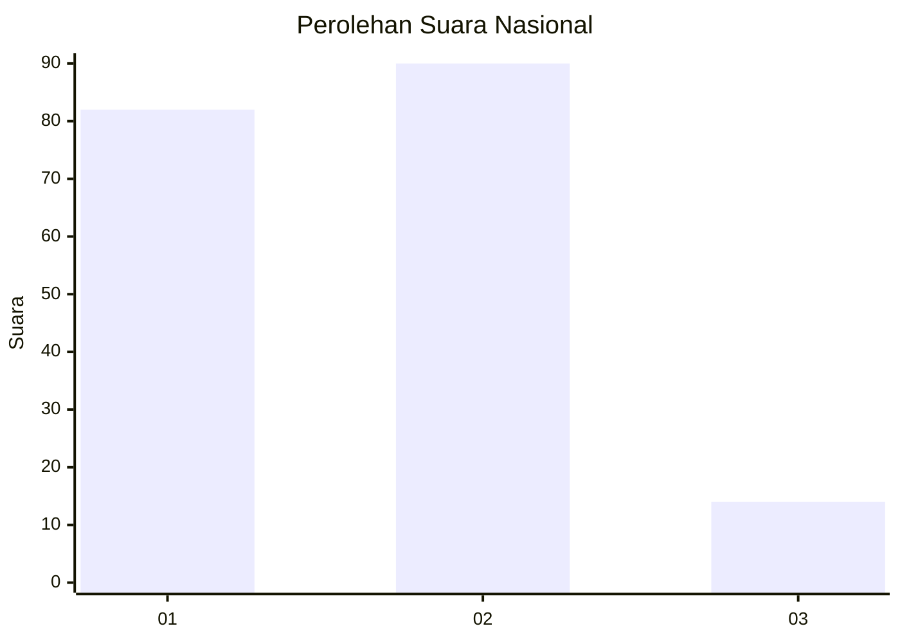
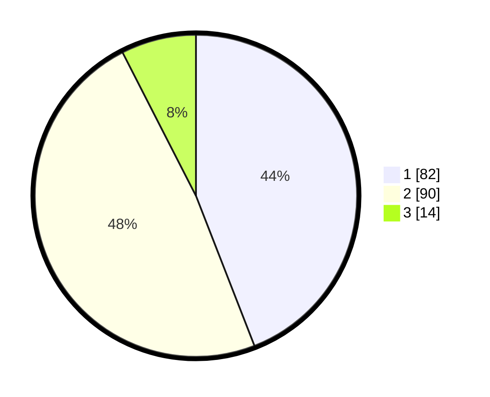

# Hasil

## Grafik

## Tabel

| No.    | Nama Paslon    | Suara | Suara (raw) | Persentase |
|:------ |:-------------- | -----:| -----------:| ----------:|
| 100025 | ANIES MUHAIMIN | 82    | [82][p-1]   | 44,09      |
| 100026 | PRABOWO GIBRAN | 90    | [90][p-2]   | 48,39      |
| 100027 | GANJAR MAHFUD  | 14    | [14][p-3]   | 7,53       |

[p-1]: https://github.com/gigit-pemilu/pemilu-2024/blob/main/pilpres/hitung-suara/sub/31-dki-jakarta/sub/75-jakarta-timur/sub/06-cakung/sub/1001-jatinegara/sub/184-tps/sub/paslon-1.txt
[p-2]: https://github.com/gigit-pemilu/pemilu-2024/blob/main/pilpres/hitung-suara/sub/31-dki-jakarta/sub/75-jakarta-timur/sub/06-cakung/sub/1001-jatinegara/sub/184-tps/sub/paslon-2.txt
[p-3]: https://github.com/gigit-pemilu/pemilu-2024/blob/main/pilpres/hitung-suara/sub/31-dki-jakarta/sub/75-jakarta-timur/sub/06-cakung/sub/1001-jatinegara/sub/184-tps/sub/paslon-3.txt

## Foto C Plano

https://sirekap-obj-formc.kpu.go.id/13c5/pemilu/ppwp/31/75/06/10/01/3175061001184-20240215-200246--df1a2c38-f08f-45fd-b0c2-37abdb101075.jpg

https://sirekap-obj-formc.kpu.go.id/13c5/pemilu/ppwp/31/75/06/10/01/3175061001184-20240215-200300--b4c596bf-3ae3-40f8-9b8f-4dbbad201927.jpg

https://sirekap-obj-formc.kpu.go.id/13c5/pemilu/ppwp/31/75/06/10/01/3175061001184-20240215-200307--8a6e3cb3-ab1e-4dc1-8edb-6a9289614fce.jpg

## Metadata

| Key        | Value               |
| ---------- | ------------------- |
| Time Stamp | 2024-02-24 22:31:28 |

