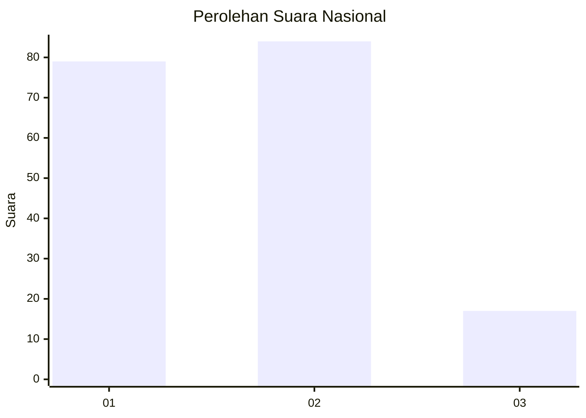
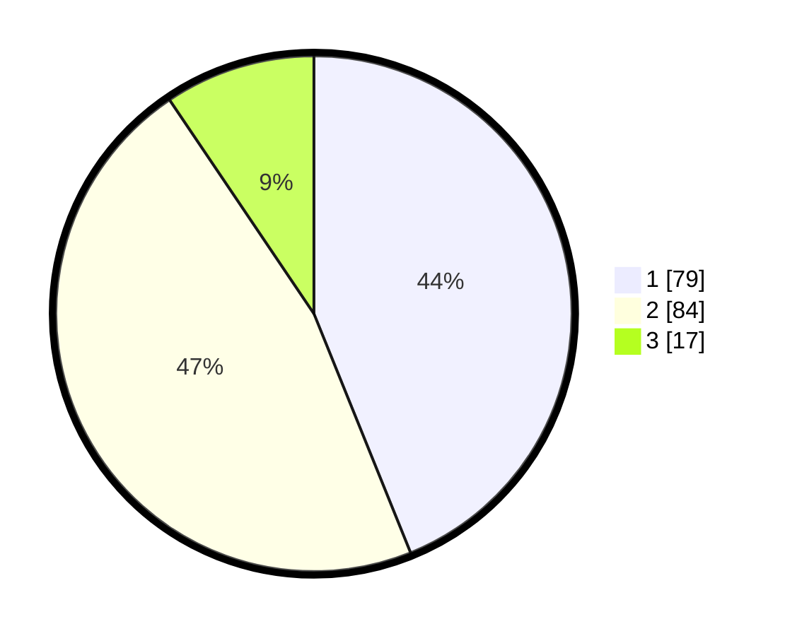

# Hasil

## Grafik

## Tabel

| No.    | Nama Paslon    | Suara | Suara (raw) | Persentase |
|:------ |:-------------- | -----:| -----------:| ----------:|
| 100025 | ANIES MUHAIMIN | 79    | [79][p-1]   | 43,89      |
| 100026 | PRABOWO GIBRAN | 84    | [84][p-2]   | 46,67      |
| 100027 | GANJAR MAHFUD  | 17    | [17][p-3]   | 9,44       |

[p-1]: https://github.com/gigit-pemilu/pemilu-2024/blob/main/pilpres/hitung-suara/sub/31-dki-jakarta/sub/75-jakarta-timur/sub/06-cakung/sub/1001-jatinegara/sub/188-tps/sub/paslon-1.txt
[p-2]: https://github.com/gigit-pemilu/pemilu-2024/blob/main/pilpres/hitung-suara/sub/31-dki-jakarta/sub/75-jakarta-timur/sub/06-cakung/sub/1001-jatinegara/sub/188-tps/sub/paslon-2.txt
[p-3]: https://github.com/gigit-pemilu/pemilu-2024/blob/main/pilpres/hitung-suara/sub/31-dki-jakarta/sub/75-jakarta-timur/sub/06-cakung/sub/1001-jatinegara/sub/188-tps/sub/paslon-3.txt

## Foto C Plano

https://sirekap-obj-formc.kpu.go.id/8ec6/pemilu/ppwp/31/75/06/10/01/3175061001188-20240214-155427--06ffa83b-2086-4c43-aca0-a012134b4c75.jpg

https://sirekap-obj-formc.kpu.go.id/8ec6/pemilu/ppwp/31/75/06/10/01/3175061001188-20240214-155222--3ba6956f-ba2a-40ae-a71d-8d3413e913cb.jpg

https://sirekap-obj-formc.kpu.go.id/8ec6/pemilu/ppwp/31/75/06/10/01/3175061001188-20240214-155358--e246b9bf-bb95-48ca-bd77-d43f0582338f.jpg

## Metadata

| Key        | Value               |
| ---------- | ------------------- |
| Time Stamp | 2024-02-24 22:31:28 |

