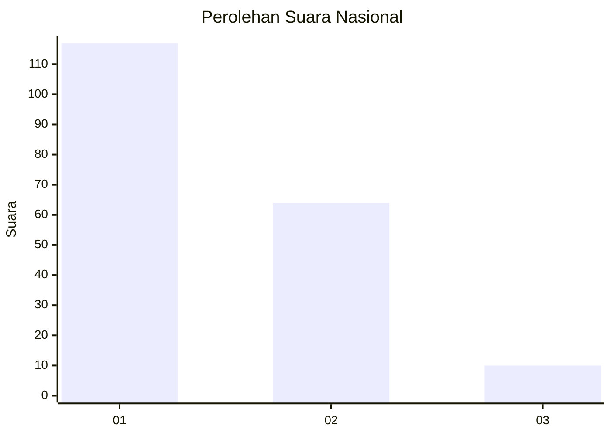
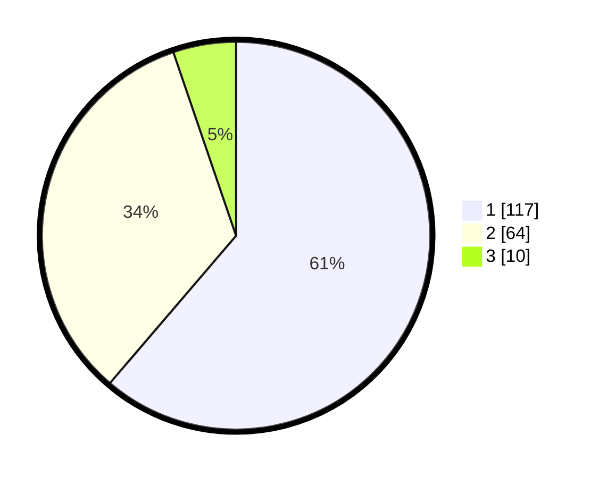

# Hasil

## Grafik

## Tabel

| No.    | Nama Paslon    | Suara | Suara (raw) | Persentase |
|:------ |:-------------- | -----:| -----------:| ----------:|
| 100025 | ANIES MUHAIMIN | 117   | [117][p-1]  | 61,26      |
| 100026 | PRABOWO GIBRAN | 64    | [64][p-2]   | 33,51      |
| 100027 | GANJAR MAHFUD  | 10    | [10][p-3]   | 5,24       |

[p-1]: https://github.com/gigit-pemilu/pemilu-2024/blob/main/pilpres/hitung-suara/sub/31-dki-jakarta/sub/75-jakarta-timur/sub/06-cakung/sub/1001-jatinegara/sub/194-tps/sub/paslon-1.txt
[p-2]: https://github.com/gigit-pemilu/pemilu-2024/blob/main/pilpres/hitung-suara/sub/31-dki-jakarta/sub/75-jakarta-timur/sub/06-cakung/sub/1001-jatinegara/sub/194-tps/sub/paslon-2.txt
[p-3]: https://github.com/gigit-pemilu/pemilu-2024/blob/main/pilpres/hitung-suara/sub/31-dki-jakarta/sub/75-jakarta-timur/sub/06-cakung/sub/1001-jatinegara/sub/194-tps/sub/paslon-3.txt

## Foto C Plano

https://sirekap-obj-formc.kpu.go.id/d80e/pemilu/ppwp/31/75/06/10/01/3175061001194-20240214-160104--bfc91661-25c2-4a3d-8e37-88d7de7fe036.jpg

https://sirekap-obj-formc.kpu.go.id/d80e/pemilu/ppwp/31/75/06/10/01/3175061001194-20240214-231557--3ae4c9dc-6660-4347-b7c2-a4cd9f70378b.jpg

https://sirekap-obj-formc.kpu.go.id/d80e/pemilu/ppwp/31/75/06/10/01/3175061001194-20240214-231753--28802ad1-45b2-47ae-a9e6-663f8332c011.jpg

## Metadata

| Key        | Value               |
| ---------- | ------------------- |
| Time Stamp | 2024-02-24 22:31:28 |

