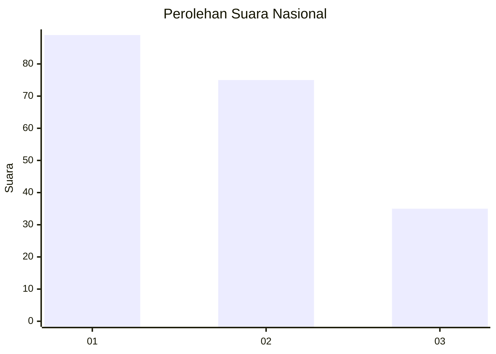
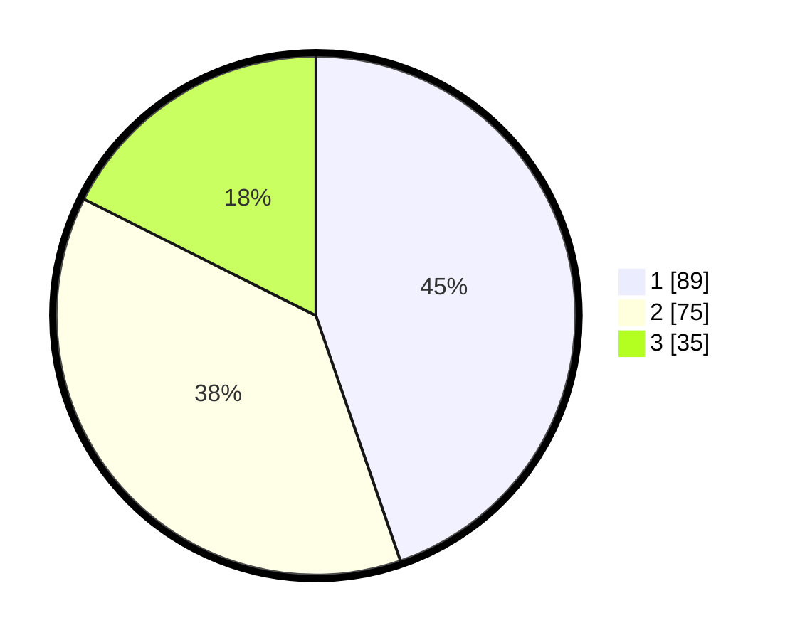

# Hasil

## Grafik

## Tabel

| No.    | Nama Paslon    | Suara | Suara (raw) | Persentase |
|:------ |:-------------- | -----:| -----------:| ----------:|
| 100025 | ANIES MUHAIMIN | 89    | [89][p-1]   | 44,72      |
| 100026 | PRABOWO GIBRAN | 75    | [75][p-2]   | 37,69      |
| 100027 | GANJAR MAHFUD  | 35    | [35][p-3]   | 17,59      |

[p-1]: https://github.com/gigit-pemilu/pemilu-2024/blob/main/pilpres/hitung-suara/sub/31-dki-jakarta/sub/75-jakarta-timur/sub/06-cakung/sub/1001-jatinegara/sub/197-tps/sub/paslon-1.txt
[p-2]: https://github.com/gigit-pemilu/pemilu-2024/blob/main/pilpres/hitung-suara/sub/31-dki-jakarta/sub/75-jakarta-timur/sub/06-cakung/sub/1001-jatinegara/sub/197-tps/sub/paslon-2.txt
[p-3]: https://github.com/gigit-pemilu/pemilu-2024/blob/main/pilpres/hitung-suara/sub/31-dki-jakarta/sub/75-jakarta-timur/sub/06-cakung/sub/1001-jatinegara/sub/197-tps/sub/paslon-3.txt

## Foto C Plano

https://sirekap-obj-formc.kpu.go.id/adf4/pemilu/ppwp/31/75/06/10/01/3175061001197-20240214-233359--8c467fb3-4803-42d2-ae3f-20a7428c4dbe.jpg

https://sirekap-obj-formc.kpu.go.id/adf4/pemilu/ppwp/31/75/06/10/01/3175061001197-20240214-233650--d1d4f0ee-b7cd-4c1d-b262-e696e28ec034.jpg

https://sirekap-obj-formc.kpu.go.id/adf4/pemilu/ppwp/31/75/06/10/01/3175061001197-20240214-233930--973f77b8-46e8-4085-81d4-23bb8234a8dd.jpg

## Metadata

| Key        | Value               |
| ---------- | ------------------- |
| Time Stamp | 2024-02-25 15:00:00 |

