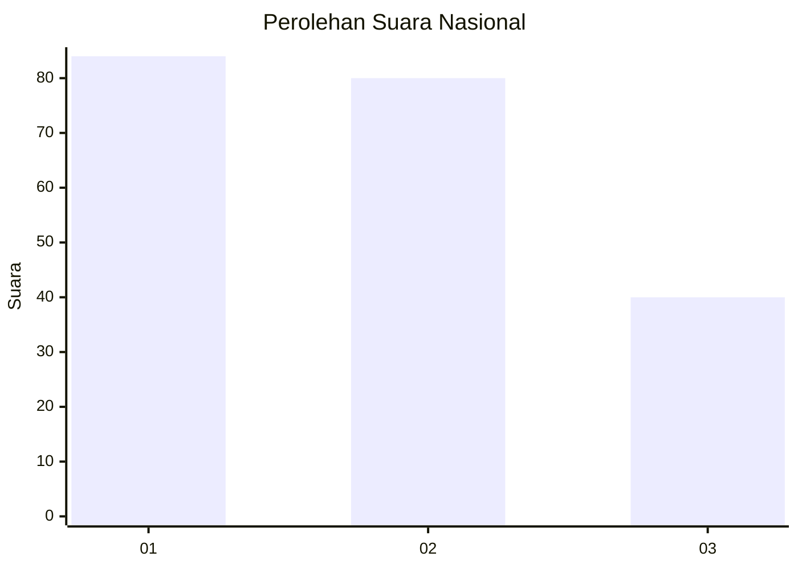
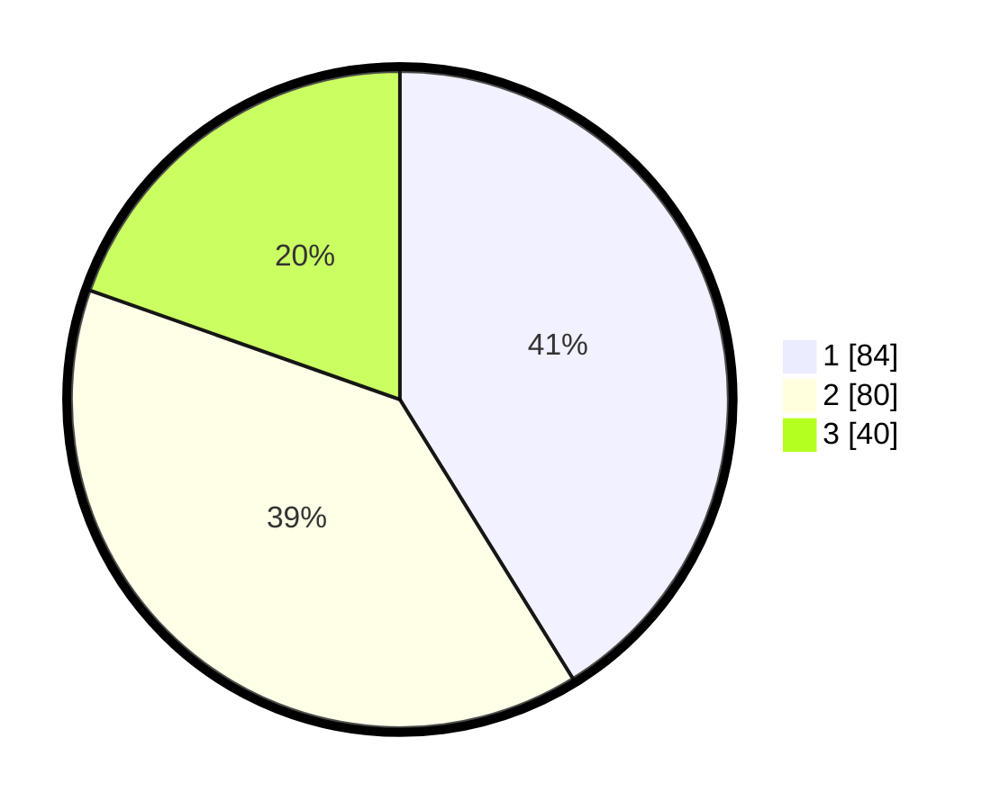

# Hasil

## Grafik

## Tabel

| No.    | Nama Paslon    | Suara | Suara (raw) | Persentase |
|:------ |:-------------- | -----:| -----------:| ----------:|
| 100025 | ANIES MUHAIMIN | 84    | [84][p-1]   | 41,18      |
| 100026 | PRABOWO GIBRAN | 80    | [80][p-2]   | 39,22      |
| 100027 | GANJAR MAHFUD  | 40    | [40][p-3]   | 19,61      |

[p-1]: https://github.com/gigit-pemilu/pemilu-2024/blob/main/pilpres/hitung-suara/sub/31-dki-jakarta/sub/75-jakarta-timur/sub/06-cakung/sub/1001-jatinegara/sub/210-tps/sub/paslon-1.txt
[p-2]: https://github.com/gigit-pemilu/pemilu-2024/blob/main/pilpres/hitung-suara/sub/31-dki-jakarta/sub/75-jakarta-timur/sub/06-cakung/sub/1001-jatinegara/sub/210-tps/sub/paslon-2.txt
[p-3]: https://github.com/gigit-pemilu/pemilu-2024/blob/main/pilpres/hitung-suara/sub/31-dki-jakarta/sub/75-jakarta-timur/sub/06-cakung/sub/1001-jatinegara/sub/210-tps/sub/paslon-3.txt

## Foto C Plano

https://sirekap-obj-formc.kpu.go.id/27af/pemilu/ppwp/31/75/06/10/01/3175061001210-20240215-002308--2bc52f3a-6a3a-4f35-a85d-6a06041fe0e9.jpg

https://sirekap-obj-formc.kpu.go.id/27af/pemilu/ppwp/31/75/06/10/01/3175061001210-20240215-002409--9d96f1a5-d33a-4d61-a8b7-110489e2e974.jpg

https://sirekap-obj-formc.kpu.go.id/27af/pemilu/ppwp/31/75/06/10/01/3175061001210-20240215-002503--d6d7addb-b4f4-434c-8896-9ac8f3b56a5c.jpg

## Metadata

| Key        | Value               |
| ---------- | ------------------- |
| Time Stamp | 2024-02-15 21:30:27 |

