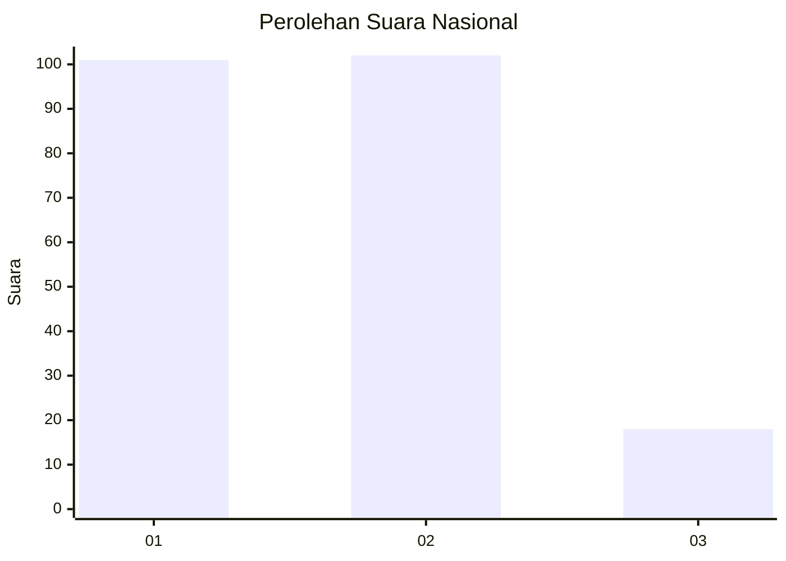
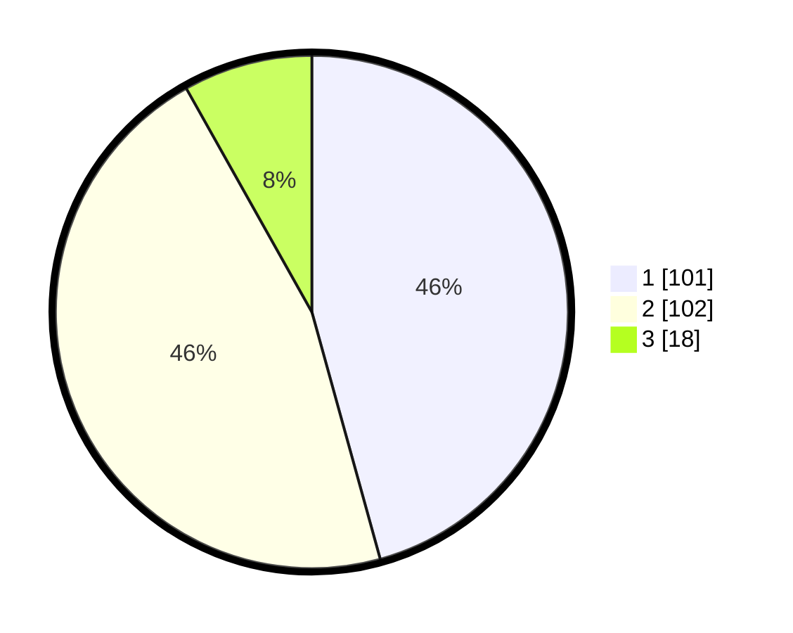

# Hasil

## Grafik

## Tabel

| No.    | Nama Paslon    | Suara | Suara (raw) | Persentase |
|:------ |:-------------- | -----:| -----------:| ----------:|
| 100025 | ANIES MUHAIMIN | 101   | [101][p-1]  | 45,70      |
| 100026 | PRABOWO GIBRAN | 102   | [102][p-2]  | 46,15      |
| 100027 | GANJAR MAHFUD  | 18    | [18][p-3]   | 8,14       |

[p-1]: https://github.com/gigit-pemilu/pemilu-2024/blob/main/pilpres/hitung-suara/sub/31-dki-jakarta/sub/75-jakarta-timur/sub/06-cakung/sub/1001-jatinegara/sub/212-tps/sub/paslon-1.txt
[p-2]: https://github.com/gigit-pemilu/pemilu-2024/blob/main/pilpres/hitung-suara/sub/31-dki-jakarta/sub/75-jakarta-timur/sub/06-cakung/sub/1001-jatinegara/sub/212-tps/sub/paslon-2.txt
[p-3]: https://github.com/gigit-pemilu/pemilu-2024/blob/main/pilpres/hitung-suara/sub/31-dki-jakarta/sub/75-jakarta-timur/sub/06-cakung/sub/1001-jatinegara/sub/212-tps/sub/paslon-3.txt

## Foto C Plano

https://sirekap-obj-formc.kpu.go.id/9462/pemilu/ppwp/31/75/06/10/01/3175061001212-20240214-221152--d936e855-ed16-459e-a7e4-9fe606dd9b2e.jpg

https://sirekap-obj-formc.kpu.go.id/9462/pemilu/ppwp/31/75/06/10/01/3175061001212-20240214-221506--29c6d565-cdd9-4913-b874-819b190578a9.jpg

https://sirekap-obj-formc.kpu.go.id/9462/pemilu/ppwp/31/75/06/10/01/3175061001212-20240214-221656--1c887b03-f300-4452-9724-0bb335388786.jpg

## Metadata

| Key        | Value               |
| ---------- | ------------------- |
| Time Stamp | 2024-02-15 21:30:27 |

