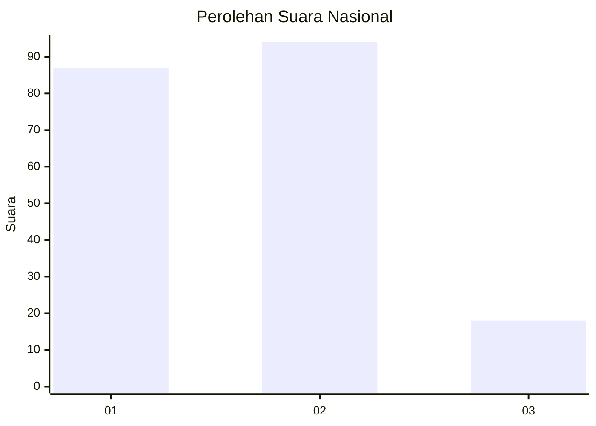
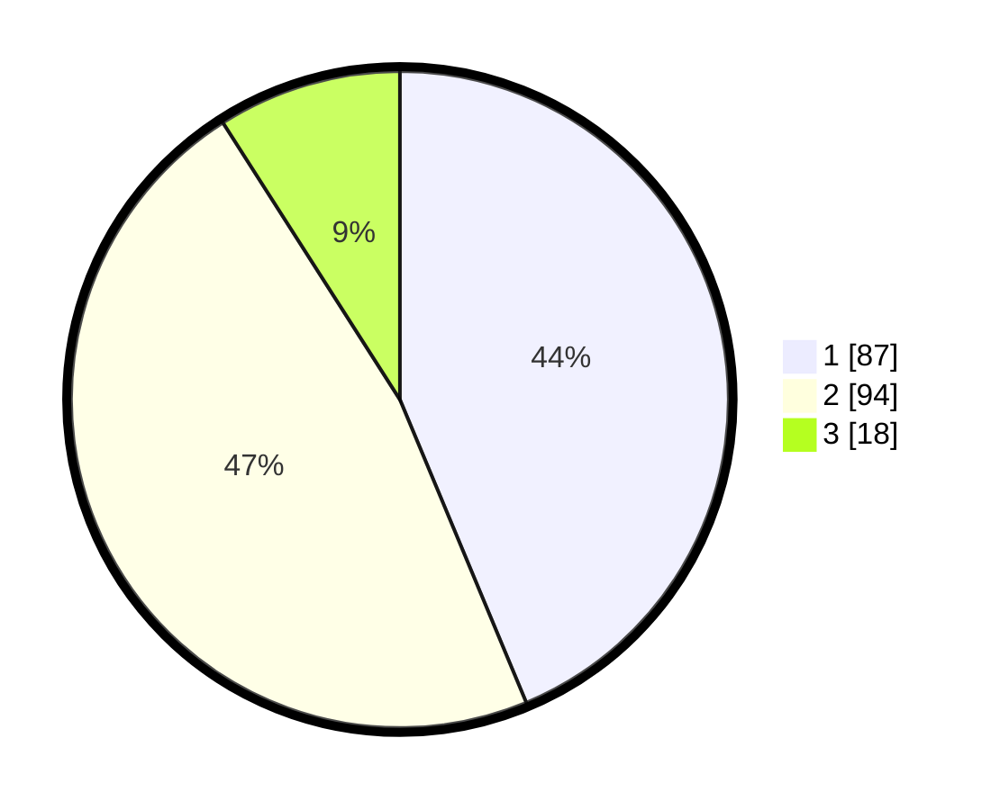

# Hasil

## Grafik

## Tabel

| No.    | Nama Paslon    | Suara | Suara (raw) | Persentase |
|:------ |:-------------- | -----:| -----------:| ----------:|
| 100025 | ANIES MUHAIMIN | 87    | [87][p-1]   | 43,72      |
| 100026 | PRABOWO GIBRAN | 94    | [94][p-2]   | 47,24      |
| 100027 | GANJAR MAHFUD  | 18    | [18][p-3]   | 9,05       |

[p-1]: https://github.com/gigit-pemilu/pemilu-2024/blob/main/pilpres/hitung-suara/sub/31-dki-jakarta/sub/75-jakarta-timur/sub/06-cakung/sub/1001-jatinegara/sub/235-tps/sub/paslon-1.txt
[p-2]: https://github.com/gigit-pemilu/pemilu-2024/blob/main/pilpres/hitung-suara/sub/31-dki-jakarta/sub/75-jakarta-timur/sub/06-cakung/sub/1001-jatinegara/sub/235-tps/sub/paslon-2.txt
[p-3]: https://github.com/gigit-pemilu/pemilu-2024/blob/main/pilpres/hitung-suara/sub/31-dki-jakarta/sub/75-jakarta-timur/sub/06-cakung/sub/1001-jatinegara/sub/235-tps/sub/paslon-3.txt

## Foto C Plano

https://sirekap-obj-formc.kpu.go.id/f898/pemilu/ppwp/31/75/06/10/01/3175061001235-20240215-001602--e4228667-8372-45d9-b5ca-39b9899ed0c8.jpg

https://sirekap-obj-formc.kpu.go.id/f898/pemilu/ppwp/31/75/06/10/01/3175061001235-20240215-001738--a0ba3e3d-1be4-4333-bb73-1dd4dde7f441.jpg

https://sirekap-obj-formc.kpu.go.id/f898/pemilu/ppwp/31/75/06/10/01/3175061001235-20240215-001809--b153a374-f907-4de2-9367-5e9a2b56b5c0.jpg

## Metadata

| Key        | Value               |
| ---------- | ------------------- |
| Time Stamp | 2024-02-15 21:30:27 |

