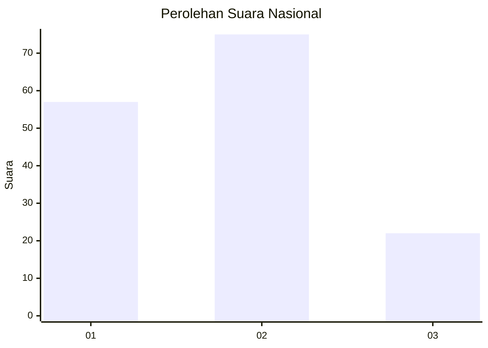
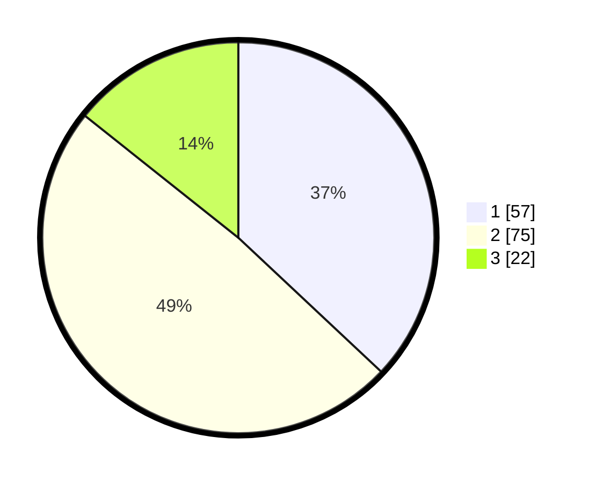

# Hasil

## Grafik

## Tabel

| No.    | Nama Paslon    | Suara | Suara (raw) | Persentase |
|:------ |:-------------- | -----:| -----------:| ----------:|
| 100025 | ANIES MUHAIMIN | 57    | [57][p-1]   | 37,01      |
| 100026 | PRABOWO GIBRAN | 75    | [75][p-2]   | 48,70      |
| 100027 | GANJAR MAHFUD  | 22    | [22][p-3]   | 14,29      |

[p-1]: https://github.com/gigit-pemilu/pemilu-2024/blob/main/pilpres/hitung-suara/sub/31-dki-jakarta/sub/75-jakarta-timur/sub/06-cakung/sub/1001-jatinegara/sub/240-tps/sub/paslon-1.txt
[p-2]: https://github.com/gigit-pemilu/pemilu-2024/blob/main/pilpres/hitung-suara/sub/31-dki-jakarta/sub/75-jakarta-timur/sub/06-cakung/sub/1001-jatinegara/sub/240-tps/sub/paslon-2.txt
[p-3]: https://github.com/gigit-pemilu/pemilu-2024/blob/main/pilpres/hitung-suara/sub/31-dki-jakarta/sub/75-jakarta-timur/sub/06-cakung/sub/1001-jatinegara/sub/240-tps/sub/paslon-3.txt

## Foto C Plano

https://sirekap-obj-formc.kpu.go.id/685f/pemilu/ppwp/31/75/06/10/01/3175061001240-20240214-234037--93b53241-acdb-46cd-9a6e-e3ffb282f327.jpg

https://sirekap-obj-formc.kpu.go.id/685f/pemilu/ppwp/31/75/06/10/01/3175061001240-20240214-234123--4fb1bc32-68b3-4ef9-a445-53ec1cbdfa47.jpg

https://sirekap-obj-formc.kpu.go.id/685f/pemilu/ppwp/31/75/06/10/01/3175061001240-20240214-234155--fd2e8822-e444-4891-a7bd-1b29b2660fb4.jpg

## Metadata

| Key        | Value               |
| ---------- | ------------------- |
| Time Stamp | 2024-02-24 22:31:28 |

