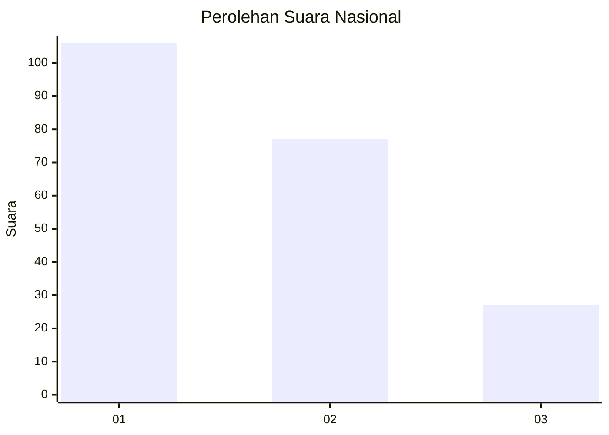
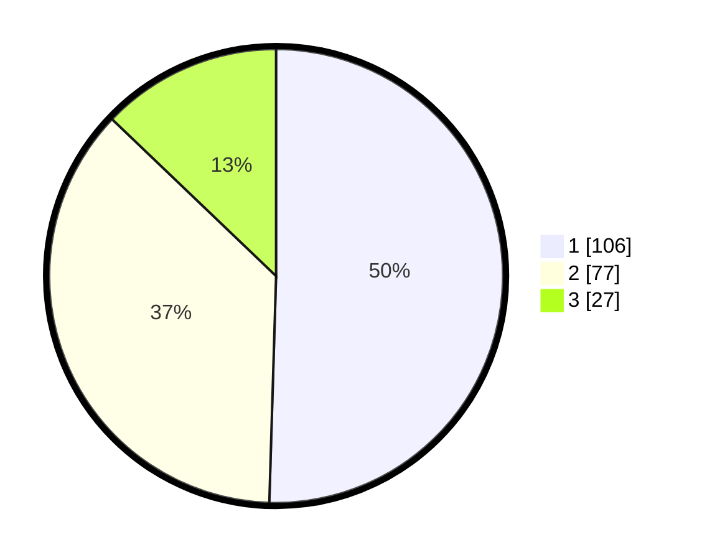

# Hasil

## Grafik

## Tabel

| No.    | Nama Paslon    | Suara | Suara (raw) | Persentase |
|:------ |:-------------- | -----:| -----------:| ----------:|
| 100025 | ANIES MUHAIMIN | 106   | [106][p-1]  | 50,48      |
| 100026 | PRABOWO GIBRAN | 77    | [77][p-2]   | 36,67      |
| 100027 | GANJAR MAHFUD  | 27    | [27][p-3]   | 12,86      |

[p-1]: https://github.com/gigit-pemilu/pemilu-2024/blob/main/pilpres/hitung-suara/sub/31-dki-jakarta/sub/75-jakarta-timur/sub/06-cakung/sub/1001-jatinegara/sub/246-tps/sub/paslon-1.txt
[p-2]: https://github.com/gigit-pemilu/pemilu-2024/blob/main/pilpres/hitung-suara/sub/31-dki-jakarta/sub/75-jakarta-timur/sub/06-cakung/sub/1001-jatinegara/sub/246-tps/sub/paslon-2.txt
[p-3]: https://github.com/gigit-pemilu/pemilu-2024/blob/main/pilpres/hitung-suara/sub/31-dki-jakarta/sub/75-jakarta-timur/sub/06-cakung/sub/1001-jatinegara/sub/246-tps/sub/paslon-3.txt

## Foto C Plano

https://sirekap-obj-formc.kpu.go.id/b49c/pemilu/ppwp/31/75/06/10/01/3175061001246-20240214-221940--da1695f1-a4bf-4848-bf2d-d32fd3d3f036.jpg

https://sirekap-obj-formc.kpu.go.id/b49c/pemilu/ppwp/31/75/06/10/01/3175061001246-20240214-222333--f81a9f76-436b-44a9-bcaa-87bfb993ecda.jpg

https://sirekap-obj-formc.kpu.go.id/b49c/pemilu/ppwp/31/75/06/10/01/3175061001246-20240214-222542--b65f5352-d9d0-4d81-b99c-0b2ab80ca7cb.jpg

## Metadata

| Key        | Value               |
| ---------- | ------------------- |
| Time Stamp | 2024-02-15 21:30:27 |

