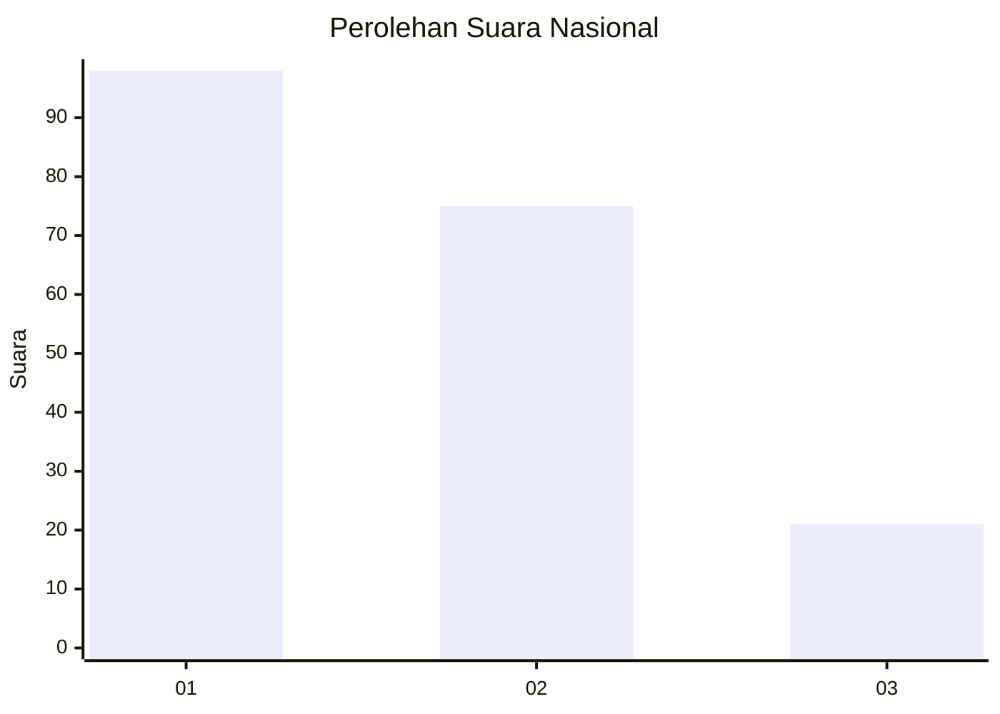
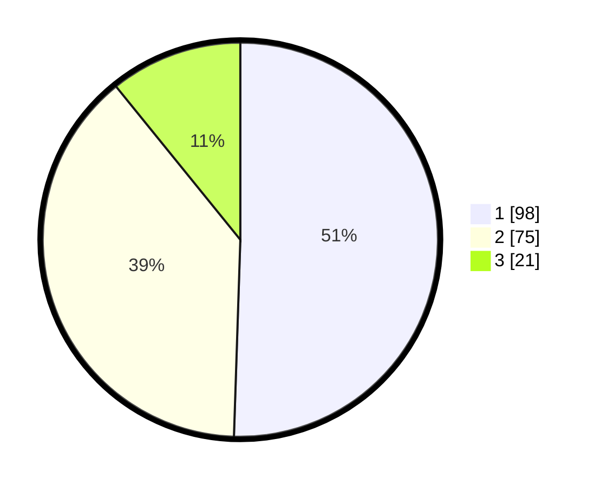

# Hasil

## Grafik

## Tabel

| No.    | Nama Paslon    | Suara | Suara (raw) | Persentase |
|:------ |:-------------- | -----:| -----------:| ----------:|
| 100025 | ANIES MUHAIMIN | 98    | [98][p-1]   | 50,52      |
| 100026 | PRABOWO GIBRAN | 75    | [75][p-2]   | 38,66      |
| 100027 | GANJAR MAHFUD  | 21    | [21][p-3]   | 10,82      |

[p-1]: https://github.com/gigit-pemilu/pemilu-2024/blob/main/pilpres/hitung-suara/sub/31-dki-jakarta/sub/75-jakarta-timur/sub/06-cakung/sub/1001-jatinegara/sub/250-tps/sub/paslon-1.txt
[p-2]: https://github.com/gigit-pemilu/pemilu-2024/blob/main/pilpres/hitung-suara/sub/31-dki-jakarta/sub/75-jakarta-timur/sub/06-cakung/sub/1001-jatinegara/sub/250-tps/sub/paslon-2.txt
[p-3]: https://github.com/gigit-pemilu/pemilu-2024/blob/main/pilpres/hitung-suara/sub/31-dki-jakarta/sub/75-jakarta-timur/sub/06-cakung/sub/1001-jatinegara/sub/250-tps/sub/paslon-3.txt

## Foto C Plano

https://sirekap-obj-formc.kpu.go.id/647c/pemilu/ppwp/31/75/06/10/01/3175061001250-20240214-194630--08ecc760-657a-4009-b5dd-1564512bd234.jpg

https://sirekap-obj-formc.kpu.go.id/647c/pemilu/ppwp/31/75/06/10/01/3175061001250-20240214-194355--c63ce28b-de75-4161-9f79-1bbad8db4683.jpg

https://sirekap-obj-formc.kpu.go.id/647c/pemilu/ppwp/31/75/06/10/01/3175061001250-20240214-194444--5f7c7d7d-94bf-40b5-b118-b43a3388fa6d.jpg

## Metadata

| Key        | Value               |
| ---------- | ------------------- |
| Time Stamp | 2024-02-15 21:30:27 |

