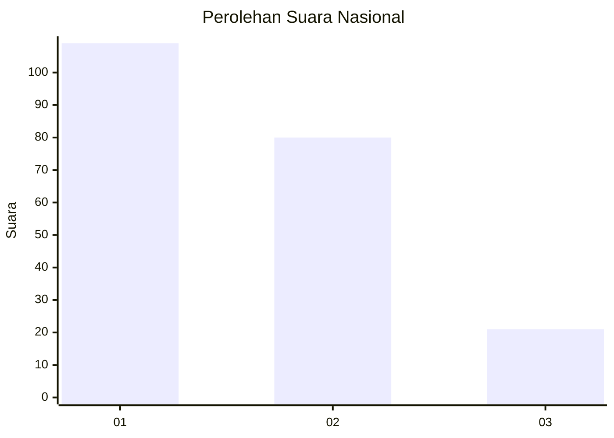
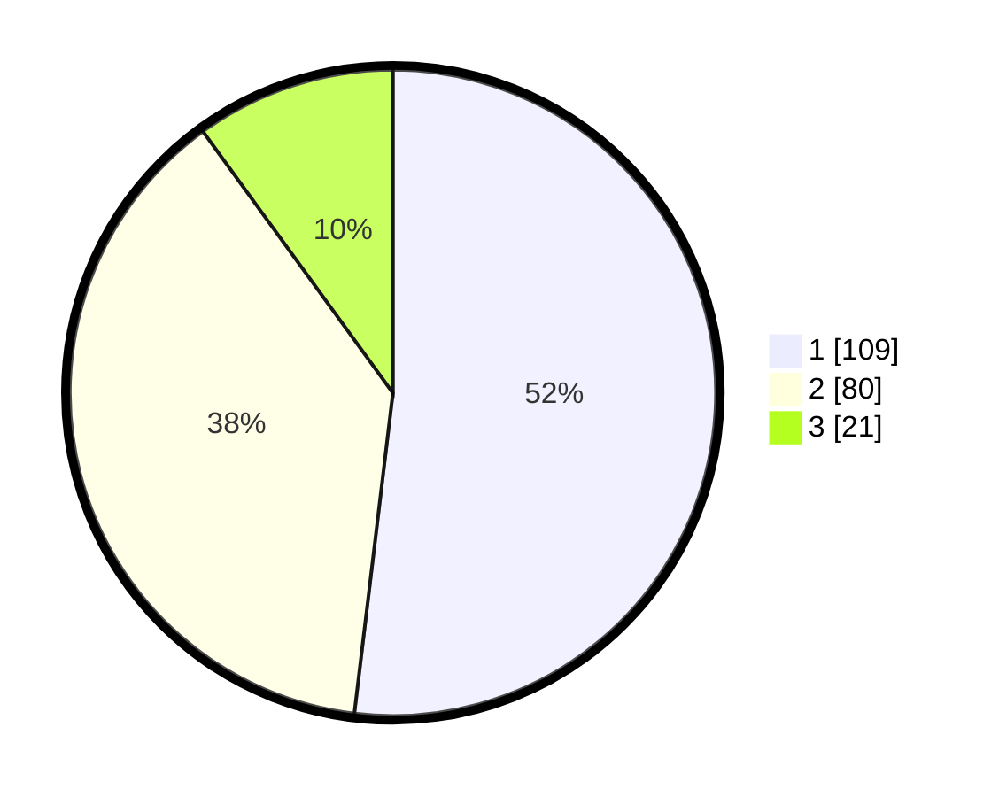

# Hasil

## Grafik

## Tabel

| No.    | Nama Paslon    | Suara | Suara (raw) | Persentase |
|:------ |:-------------- | -----:| -----------:| ----------:|
| 100025 | ANIES MUHAIMIN | 109   | [109][p-1]  | 51,90      |
| 100026 | PRABOWO GIBRAN | 80    | [80][p-2]   | 38,10      |
| 100027 | GANJAR MAHFUD  | 21    | [21][p-3]   | 10,00      |

[p-1]: https://github.com/gigit-pemilu/pemilu-2024/blob/main/pilpres/hitung-suara/sub/31-dki-jakarta/sub/75-jakarta-timur/sub/06-cakung/sub/1001-jatinegara/sub/276-tps/sub/paslon-1.txt
[p-2]: https://github.com/gigit-pemilu/pemilu-2024/blob/main/pilpres/hitung-suara/sub/31-dki-jakarta/sub/75-jakarta-timur/sub/06-cakung/sub/1001-jatinegara/sub/276-tps/sub/paslon-2.txt
[p-3]: https://github.com/gigit-pemilu/pemilu-2024/blob/main/pilpres/hitung-suara/sub/31-dki-jakarta/sub/75-jakarta-timur/sub/06-cakung/sub/1001-jatinegara/sub/276-tps/sub/paslon-3.txt

## Foto C Plano

https://sirekap-obj-formc.kpu.go.id/e7e7/pemilu/ppwp/31/75/06/10/01/3175061001276-20240214-220745--824fbaec-b78d-4eca-ac5a-5dae05ceb2d8.jpg

https://sirekap-obj-formc.kpu.go.id/e7e7/pemilu/ppwp/31/75/06/10/01/3175061001276-20240214-222941--7e539f52-294b-4769-87a5-685650818c1f.jpg

https://sirekap-obj-formc.kpu.go.id/e7e7/pemilu/ppwp/31/75/06/10/01/3175061001276-20240214-223528--d36c7d07-07e6-4027-9426-80bf750e5579.jpg

## Metadata

| Key        | Value               |
| ---------- | ------------------- |
| Time Stamp | 2024-02-24 22:31:28 |

