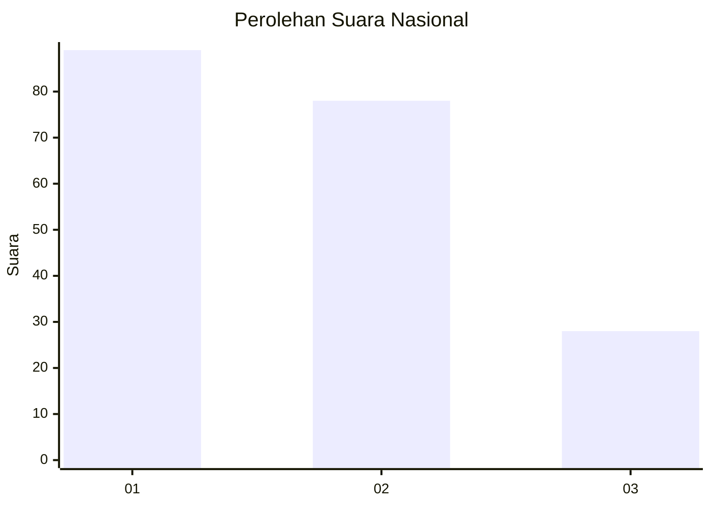
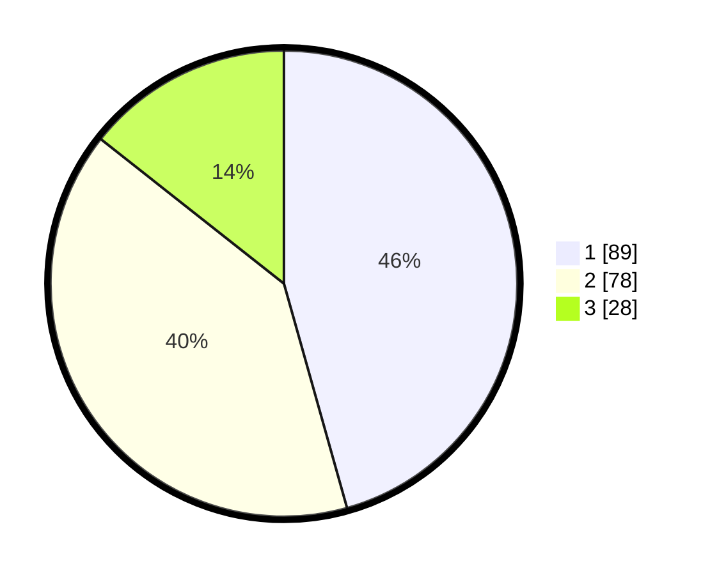

# Hasil

## Grafik

## Tabel

| No.    | Nama Paslon    | Suara | Suara (raw) | Persentase |
|:------ |:-------------- | -----:| -----------:| ----------:|
| 100025 | ANIES MUHAIMIN | 89    | [89][p-1]   | 45,64      |
| 100026 | PRABOWO GIBRAN | 78    | [78][p-2]   | 40,00      |
| 100027 | GANJAR MAHFUD  | 28    | [28][p-3]   | 14,36      |

[p-1]: https://github.com/gigit-pemilu/pemilu-2024/blob/main/pilpres/hitung-suara/sub/31-dki-jakarta/sub/75-jakarta-timur/sub/06-cakung/sub/1001-jatinegara/sub/280-tps/sub/paslon-1.txt
[p-2]: https://github.com/gigit-pemilu/pemilu-2024/blob/main/pilpres/hitung-suara/sub/31-dki-jakarta/sub/75-jakarta-timur/sub/06-cakung/sub/1001-jatinegara/sub/280-tps/sub/paslon-2.txt
[p-3]: https://github.com/gigit-pemilu/pemilu-2024/blob/main/pilpres/hitung-suara/sub/31-dki-jakarta/sub/75-jakarta-timur/sub/06-cakung/sub/1001-jatinegara/sub/280-tps/sub/paslon-3.txt

## Foto C Plano

https://sirekap-obj-formc.kpu.go.id/21e8/pemilu/ppwp/31/75/06/10/01/3175061001280-20240214-191854--209881bc-33d8-4257-a33b-9862888034a7.jpg

https://sirekap-obj-formc.kpu.go.id/21e8/pemilu/ppwp/31/75/06/10/01/3175061001280-20240214-191925--87132b22-221e-4e34-8f3e-9a8fe52a3f9c.jpg

https://sirekap-obj-formc.kpu.go.id/21e8/pemilu/ppwp/31/75/06/10/01/3175061001280-20240214-191948--d3d74579-ea1c-40f0-8828-ed7422cf7ec0.jpg

## Metadata

| Key        | Value               |
| ---------- | ------------------- |
| Time Stamp | 2024-02-24 22:31:28 |

