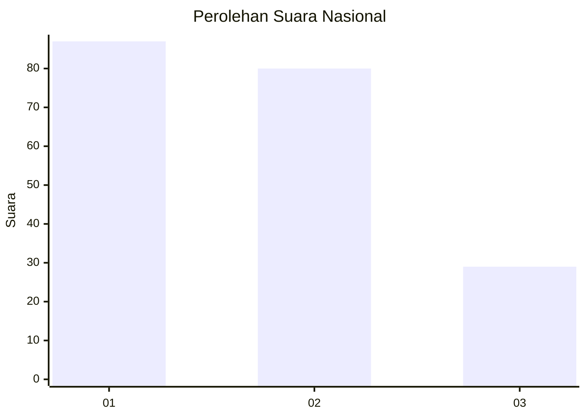
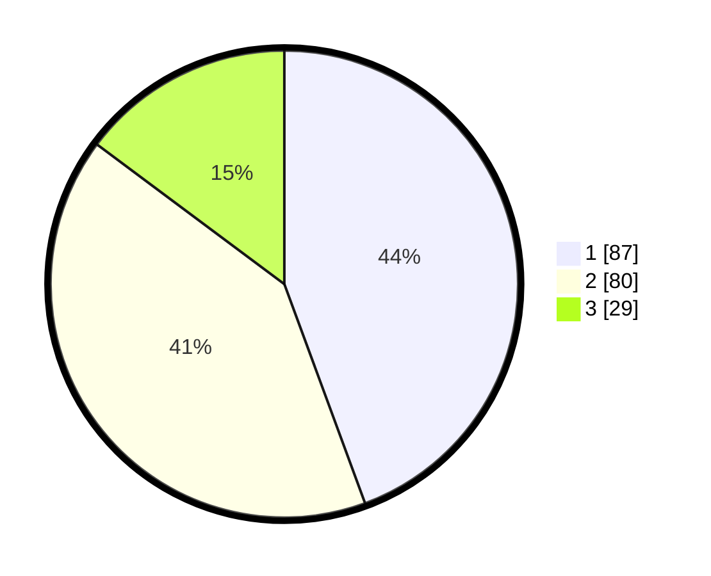

# Hasil

## Grafik

## Tabel

| No.    | Nama Paslon    | Suara | Suara (raw) | Persentase |
|:------ |:-------------- | -----:| -----------:| ----------:|
| 100025 | ANIES MUHAIMIN | 87    | [87][p-1]   | 44,39      |
| 100026 | PRABOWO GIBRAN | 80    | [80][p-2]   | 40,82      |
| 100027 | GANJAR MAHFUD  | 29    | [29][p-3]   | 14,80      |

[p-1]: https://github.com/gigit-pemilu/pemilu-2024/blob/main/pilpres/hitung-suara/sub/31-dki-jakarta/sub/75-jakarta-timur/sub/06-cakung/sub/1001-jatinegara/sub/290-tps/sub/paslon-1.txt
[p-2]: https://github.com/gigit-pemilu/pemilu-2024/blob/main/pilpres/hitung-suara/sub/31-dki-jakarta/sub/75-jakarta-timur/sub/06-cakung/sub/1001-jatinegara/sub/290-tps/sub/paslon-2.txt
[p-3]: https://github.com/gigit-pemilu/pemilu-2024/blob/main/pilpres/hitung-suara/sub/31-dki-jakarta/sub/75-jakarta-timur/sub/06-cakung/sub/1001-jatinegara/sub/290-tps/sub/paslon-3.txt

## Foto C Plano

https://sirekap-obj-formc.kpu.go.id/9180/pemilu/ppwp/31/75/06/10/01/3175061001290-20240214-233801--6a237ffd-6d06-4906-90c3-0a529a1019f9.jpg

https://sirekap-obj-formc.kpu.go.id/9180/pemilu/ppwp/31/75/06/10/01/3175061001290-20240215-010304--6a5adb62-10e9-4265-b895-3fd9c5696adc.jpg

https://sirekap-obj-formc.kpu.go.id/9180/pemilu/ppwp/31/75/06/10/01/3175061001290-20240214-233841--d6b3f3ee-4c41-4a41-b46d-56d90a24ebb2.jpg

## Metadata

| Key        | Value               |
| ---------- | ------------------- |
| Time Stamp | 2024-02-24 22:31:28 |

