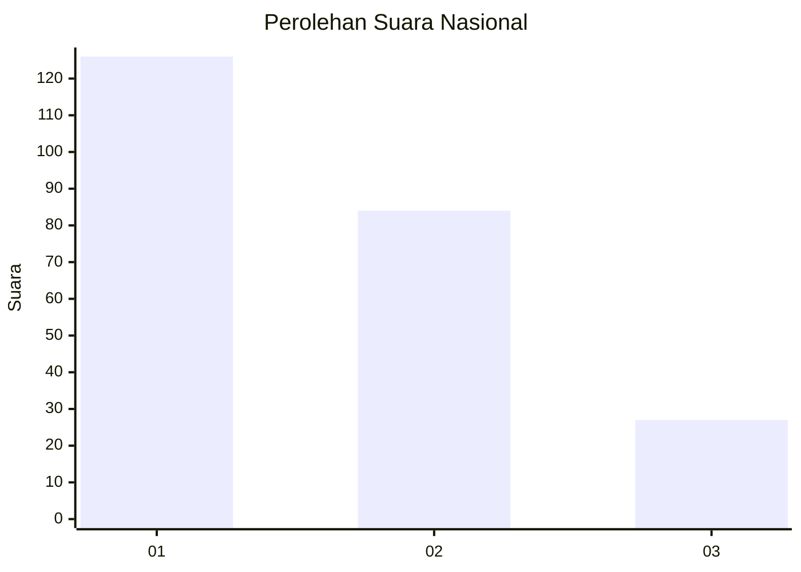
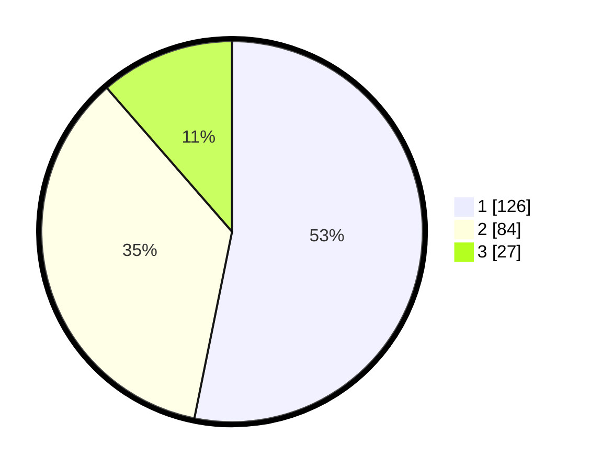

# Hasil

## Grafik

## Tabel

| No.    | Nama Paslon    | Suara | Suara (raw) | Persentase |
|:------ |:-------------- | -----:| -----------:| ----------:|
| 100025 | ANIES MUHAIMIN | 126   | [126][p-1]  | 53,16      |
| 100026 | PRABOWO GIBRAN | 84    | [84][p-2]   | 35,44      |
| 100027 | GANJAR MAHFUD  | 27    | [27][p-3]   | 11,39      |

[p-1]: https://github.com/gigit-pemilu/pemilu-2024/blob/main/pilpres/hitung-suara/sub/31-dki-jakarta/sub/75-jakarta-timur/sub/06-cakung/sub/1002-rawa-terate/sub/001-tps/sub/paslon-1.txt
[p-2]: https://github.com/gigit-pemilu/pemilu-2024/blob/main/pilpres/hitung-suara/sub/31-dki-jakarta/sub/75-jakarta-timur/sub/06-cakung/sub/1002-rawa-terate/sub/001-tps/sub/paslon-2.txt
[p-3]: https://github.com/gigit-pemilu/pemilu-2024/blob/main/pilpres/hitung-suara/sub/31-dki-jakarta/sub/75-jakarta-timur/sub/06-cakung/sub/1002-rawa-terate/sub/001-tps/sub/paslon-3.txt

## Foto C Plano

https://sirekap-obj-formc.kpu.go.id/1380/pemilu/ppwp/31/75/06/10/02/3175061002001-20240215-132234--a04ee856-928e-4fd2-924d-eff26384ea68.jpg

https://sirekap-obj-formc.kpu.go.id/1380/pemilu/ppwp/31/75/06/10/02/3175061002001-20240215-132318--525dc6b4-8da5-4135-81ea-d5656faad6a1.jpg

https://sirekap-obj-formc.kpu.go.id/1380/pemilu/ppwp/31/75/06/10/02/3175061002001-20240215-132351--e711e7f9-41f5-41cd-9497-017e6f6a95eb.jpg

## Metadata

| Key        | Value               |
| ---------- | ------------------- |
| Time Stamp | 2024-02-15 21:01:18 |

