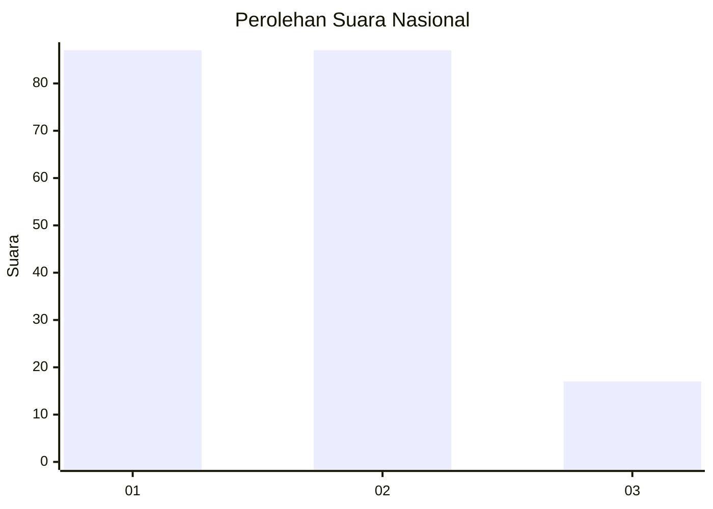
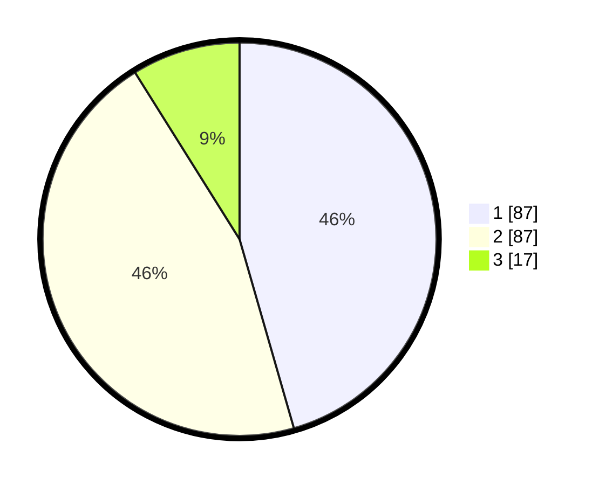

# Hasil

## Grafik

## Tabel

| No.    | Nama Paslon    | Suara | Suara (raw) | Persentase |
|:------ |:-------------- | -----:| -----------:| ----------:|
| 100025 | ANIES MUHAIMIN | 87    | [87][p-1]   | 45,55      |
| 100026 | PRABOWO GIBRAN | 87    | [87][p-2]   | 45,55      |
| 100027 | GANJAR MAHFUD  | 17    | [17][p-3]   | 8,90       |

[p-1]: https://github.com/gigit-pemilu/pemilu-2024/blob/main/pilpres/hitung-suara/sub/31-dki-jakarta/sub/75-jakarta-timur/sub/06-cakung/sub/1002-rawa-terate/sub/016-tps/sub/paslon-1.txt
[p-2]: https://github.com/gigit-pemilu/pemilu-2024/blob/main/pilpres/hitung-suara/sub/31-dki-jakarta/sub/75-jakarta-timur/sub/06-cakung/sub/1002-rawa-terate/sub/016-tps/sub/paslon-2.txt
[p-3]: https://github.com/gigit-pemilu/pemilu-2024/blob/main/pilpres/hitung-suara/sub/31-dki-jakarta/sub/75-jakarta-timur/sub/06-cakung/sub/1002-rawa-terate/sub/016-tps/sub/paslon-3.txt

## Foto C Plano

https://sirekap-obj-formc.kpu.go.id/d453/pemilu/ppwp/31/75/06/10/02/3175061002016-20240215-033912--20e1d838-e0c0-4e99-b547-a28f023de679.jpg

https://sirekap-obj-formc.kpu.go.id/d453/pemilu/ppwp/31/75/06/10/02/3175061002016-20240215-034111--e0177a3a-876a-4f56-bf7c-4a4a375ea580.jpg

https://sirekap-obj-formc.kpu.go.id/d453/pemilu/ppwp/31/75/06/10/02/3175061002016-20240215-034209--f59cc1fa-e275-454f-9e37-238b790badb3.jpg

## Metadata

| Key        | Value               |
| ---------- | ------------------- |
| Time Stamp | 2024-02-24 22:31:28 |

