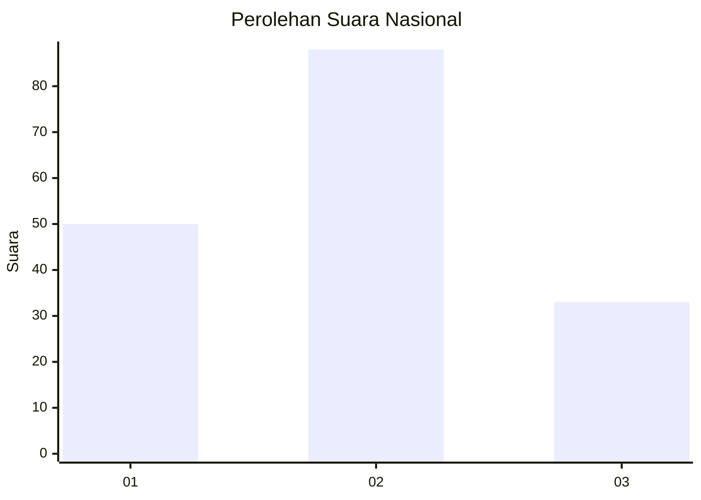
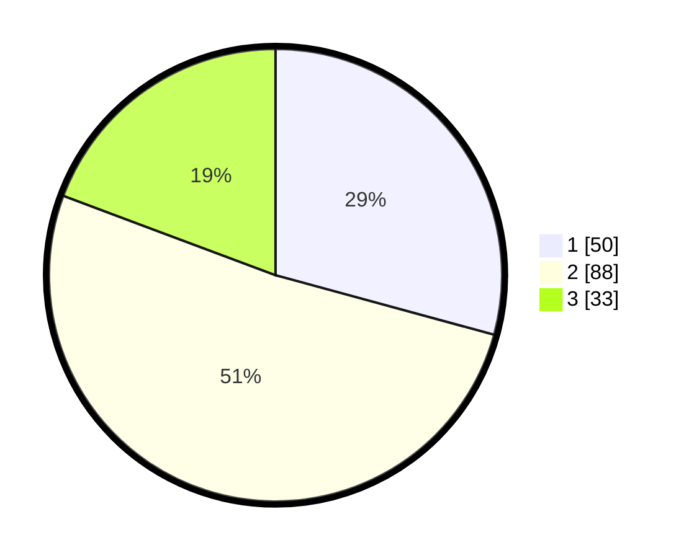

# Hasil

## Grafik

## Tabel

| No.    | Nama Paslon    | Suara | Suara (raw) | Persentase |
|:------ |:-------------- | -----:| -----------:| ----------:|
| 100025 | ANIES MUHAIMIN | 50    | [50][p-1]   | 29,24      |
| 100026 | PRABOWO GIBRAN | 88    | [88][p-2]   | 51,46      |
| 100027 | GANJAR MAHFUD  | 33    | [33][p-3]   | 19,30      |

[p-1]: https://github.com/gigit-pemilu/pemilu-2024/blob/main/pilpres/hitung-suara/sub/31-dki-jakarta/sub/75-jakarta-timur/sub/06-cakung/sub/1002-rawa-terate/sub/024-tps/sub/paslon-1.txt
[p-2]: https://github.com/gigit-pemilu/pemilu-2024/blob/main/pilpres/hitung-suara/sub/31-dki-jakarta/sub/75-jakarta-timur/sub/06-cakung/sub/1002-rawa-terate/sub/024-tps/sub/paslon-2.txt
[p-3]: https://github.com/gigit-pemilu/pemilu-2024/blob/main/pilpres/hitung-suara/sub/31-dki-jakarta/sub/75-jakarta-timur/sub/06-cakung/sub/1002-rawa-terate/sub/024-tps/sub/paslon-3.txt

## Foto C Plano

https://sirekap-obj-formc.kpu.go.id/1345/pemilu/ppwp/31/75/06/10/02/3175061002024-20240215-002857--4ad89184-2ad5-4194-9ae6-2f8d97c392b3.jpg

https://sirekap-obj-formc.kpu.go.id/1345/pemilu/ppwp/31/75/06/10/02/3175061002024-20240215-002958--96e8d899-db0e-4405-bf3d-8efe6249e715.jpg

https://sirekap-obj-formc.kpu.go.id/1345/pemilu/ppwp/31/75/06/10/02/3175061002024-20240215-003048--60fd6770-a02f-4268-8902-6fd6a73ecea0.jpg

## Metadata

| Key        | Value               |
| ---------- | ------------------- |
| Time Stamp | 2024-02-15 21:30:27 |

