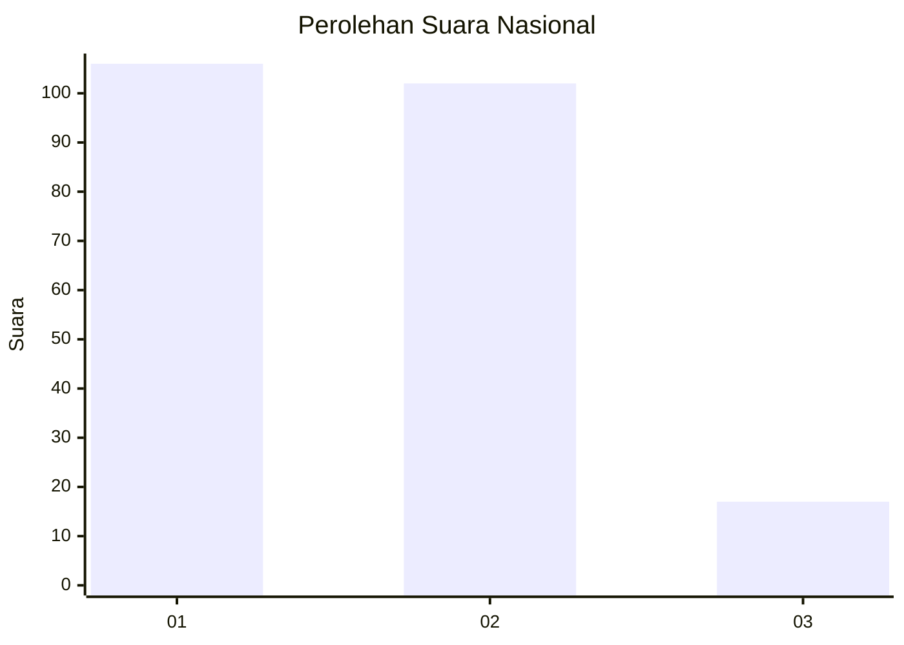
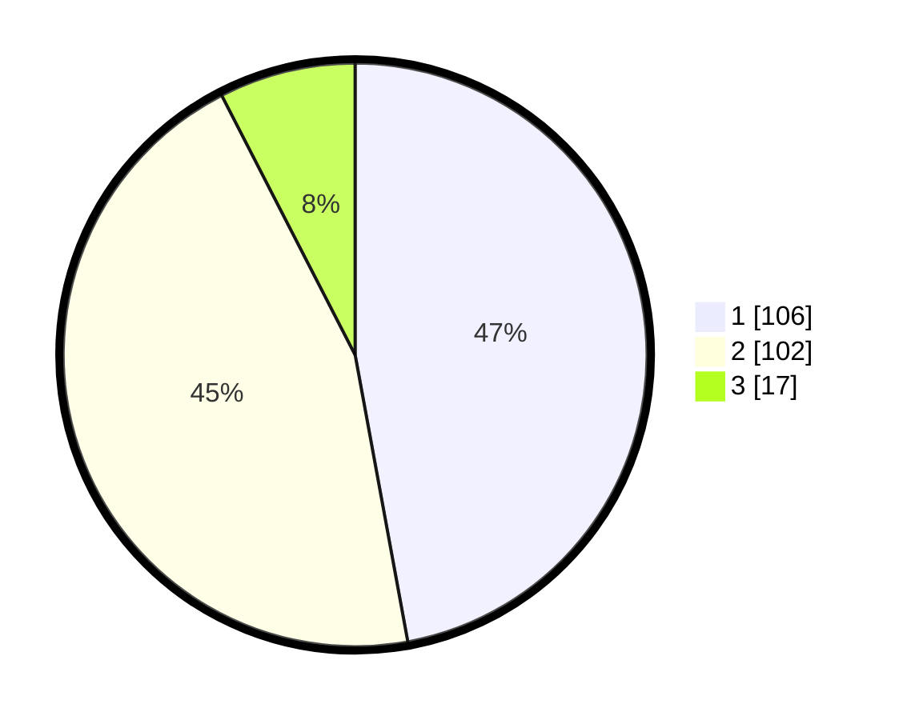

# Hasil

## Grafik

## Tabel

| No.    | Nama Paslon    | Suara | Suara (raw) | Persentase |
|:------ |:-------------- | -----:| -----------:| ----------:|
| 100025 | ANIES MUHAIMIN | 106   | [106][p-1]  | 47,11      |
| 100026 | PRABOWO GIBRAN | 102   | [102][p-2]  | 45,33      |
| 100027 | GANJAR MAHFUD  | 17    | [17][p-3]   | 7,56       |

[p-1]: https://github.com/gigit-pemilu/pemilu-2024/blob/main/pilpres/hitung-suara/sub/31-dki-jakarta/sub/75-jakarta-timur/sub/06-cakung/sub/1002-rawa-terate/sub/030-tps/sub/paslon-1.txt
[p-2]: https://github.com/gigit-pemilu/pemilu-2024/blob/main/pilpres/hitung-suara/sub/31-dki-jakarta/sub/75-jakarta-timur/sub/06-cakung/sub/1002-rawa-terate/sub/030-tps/sub/paslon-2.txt
[p-3]: https://github.com/gigit-pemilu/pemilu-2024/blob/main/pilpres/hitung-suara/sub/31-dki-jakarta/sub/75-jakarta-timur/sub/06-cakung/sub/1002-rawa-terate/sub/030-tps/sub/paslon-3.txt

## Foto C Plano

https://sirekap-obj-formc.kpu.go.id/5628/pemilu/ppwp/31/75/06/10/02/3175061002030-20240214-212353--e6c286d2-2cc2-4e79-8a3a-67bf3c1a4012.jpg

https://sirekap-obj-formc.kpu.go.id/5628/pemilu/ppwp/31/75/06/10/02/3175061002030-20240214-212458--a5c37104-4049-4c98-8a07-c1c9f643dc8f.jpg

https://sirekap-obj-formc.kpu.go.id/5628/pemilu/ppwp/31/75/06/10/02/3175061002030-20240214-212625--6bd829b0-ba2e-4af6-bfc3-fb89b56686ad.jpg

## Metadata

| Key        | Value               |
| ---------- | ------------------- |
| Time Stamp | 2024-02-24 22:31:28 |

