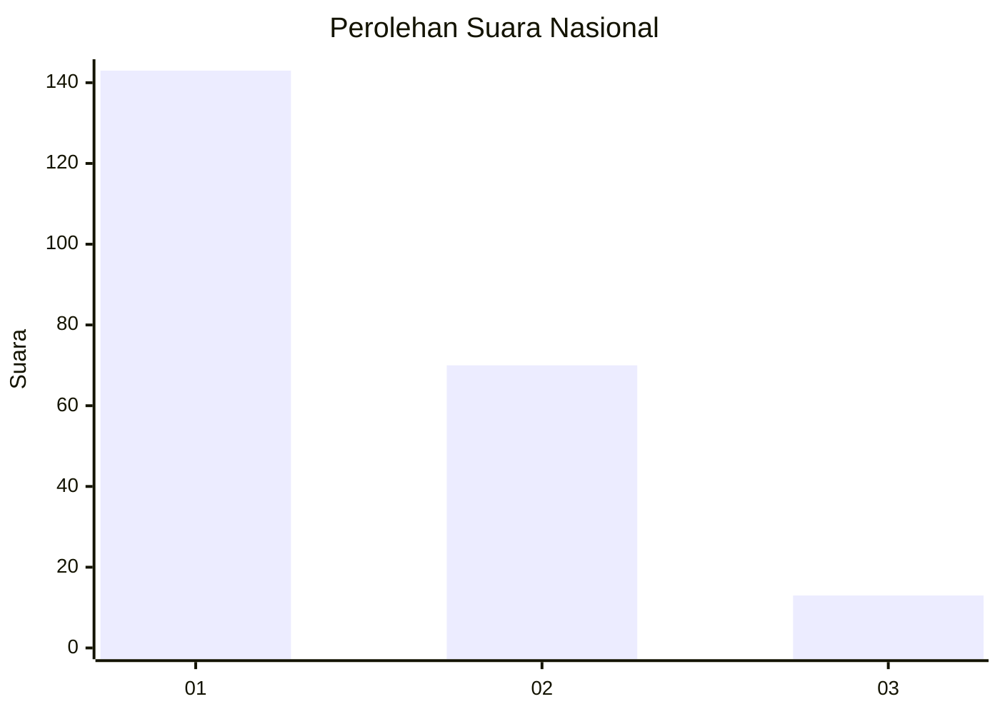
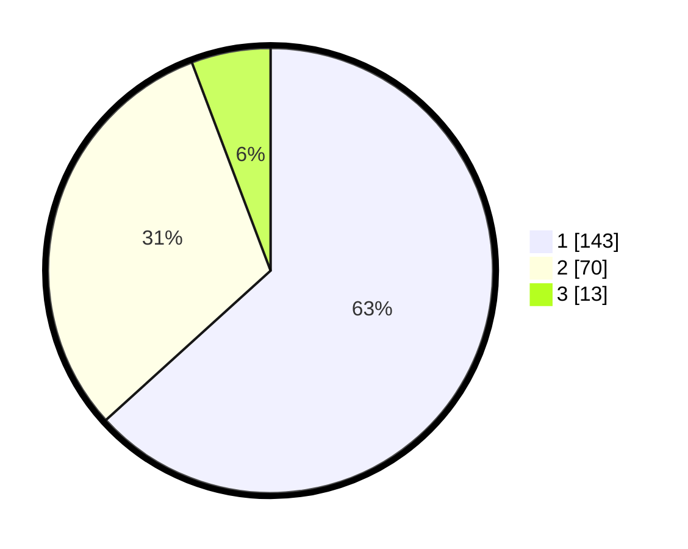

# Hasil

## Grafik

## Tabel

| No.    | Nama Paslon    | Suara | Suara (raw) | Persentase |
|:------ |:-------------- | -----:| -----------:| ----------:|
| 100025 | ANIES MUHAIMIN | 143   | [143][p-1]  | 63,27      |
| 100026 | PRABOWO GIBRAN | 70    | [70][p-2]   | 30,97      |
| 100027 | GANJAR MAHFUD  | 13    | [13][p-3]   | 5,75       |

[p-1]: https://github.com/gigit-pemilu/pemilu-2024/blob/main/pilpres/hitung-suara/sub/31-dki-jakarta/sub/75-jakarta-timur/sub/06-cakung/sub/1002-rawa-terate/sub/035-tps/sub/paslon-1.txt
[p-2]: https://github.com/gigit-pemilu/pemilu-2024/blob/main/pilpres/hitung-suara/sub/31-dki-jakarta/sub/75-jakarta-timur/sub/06-cakung/sub/1002-rawa-terate/sub/035-tps/sub/paslon-2.txt
[p-3]: https://github.com/gigit-pemilu/pemilu-2024/blob/main/pilpres/hitung-suara/sub/31-dki-jakarta/sub/75-jakarta-timur/sub/06-cakung/sub/1002-rawa-terate/sub/035-tps/sub/paslon-3.txt

## Foto C Plano

https://sirekap-obj-formc.kpu.go.id/3069/pemilu/ppwp/31/75/06/10/02/3175061002035-20240215-002715--6f145deb-6e14-43f5-8a1d-8de55dbb13f2.jpg

https://sirekap-obj-formc.kpu.go.id/3069/pemilu/ppwp/31/75/06/10/02/3175061002035-20240215-002852--97a5eb7f-700c-4e2a-8027-12a171c897c6.jpg

https://sirekap-obj-formc.kpu.go.id/3069/pemilu/ppwp/31/75/06/10/02/3175061002035-20240215-004817--22d93b76-d77e-4ba8-9886-42e389822340.jpg

## Metadata

| Key        | Value               |
| ---------- | ------------------- |
| Time Stamp | 2024-02-15 21:30:27 |

