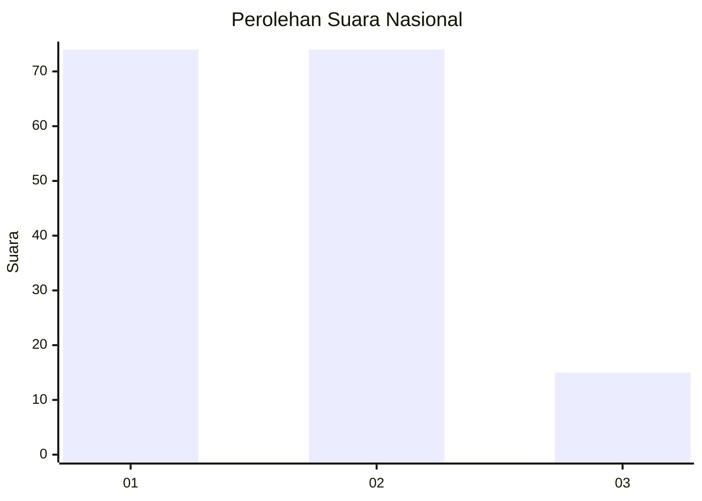
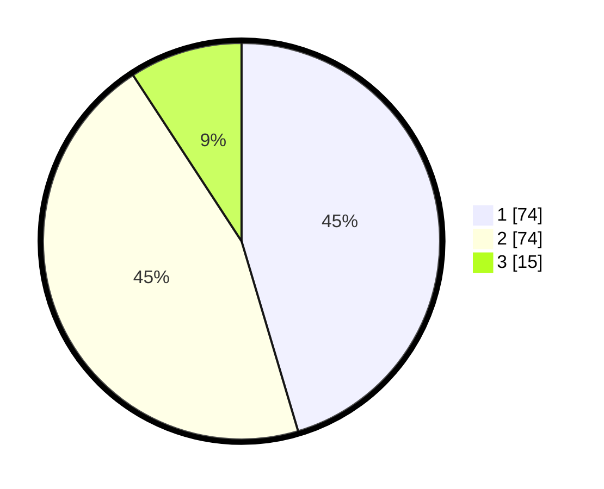

# Hasil

## Grafik

## Tabel

| No.    | Nama Paslon    | Suara | Suara (raw) | Persentase |
|:------ |:-------------- | -----:| -----------:| ----------:|
| 100025 | ANIES MUHAIMIN | 74    | [74][p-1]   | 45,40      |
| 100026 | PRABOWO GIBRAN | 74    | [74][p-2]   | 45,40      |
| 100027 | GANJAR MAHFUD  | 15    | [15][p-3]   | 9,20       |

[p-1]: https://github.com/gigit-pemilu/pemilu-2024/blob/main/pilpres/hitung-suara/sub/31-dki-jakarta/sub/75-jakarta-timur/sub/06-cakung/sub/1002-rawa-terate/sub/042-tps/sub/paslon-1.txt
[p-2]: https://github.com/gigit-pemilu/pemilu-2024/blob/main/pilpres/hitung-suara/sub/31-dki-jakarta/sub/75-jakarta-timur/sub/06-cakung/sub/1002-rawa-terate/sub/042-tps/sub/paslon-2.txt
[p-3]: https://github.com/gigit-pemilu/pemilu-2024/blob/main/pilpres/hitung-suara/sub/31-dki-jakarta/sub/75-jakarta-timur/sub/06-cakung/sub/1002-rawa-terate/sub/042-tps/sub/paslon-3.txt

## Foto C Plano

https://sirekap-obj-formc.kpu.go.id/4c65/pemilu/ppwp/31/75/06/10/02/3175061002042-20240214-213959--1e4e4de8-fb5f-4fcd-9f05-461dde49a8de.jpg

https://sirekap-obj-formc.kpu.go.id/4c65/pemilu/ppwp/31/75/06/10/02/3175061002042-20240214-214036--5697cf1b-71b0-4547-987c-0f62d940f065.jpg

https://sirekap-obj-formc.kpu.go.id/4c65/pemilu/ppwp/31/75/06/10/02/3175061002042-20240214-214945--817140d1-e303-4b72-983e-4218521756bd.jpg

## Metadata

| Key        | Value               |
| ---------- | ------------------- |
| Time Stamp | 2024-02-19 12:00:00 |

