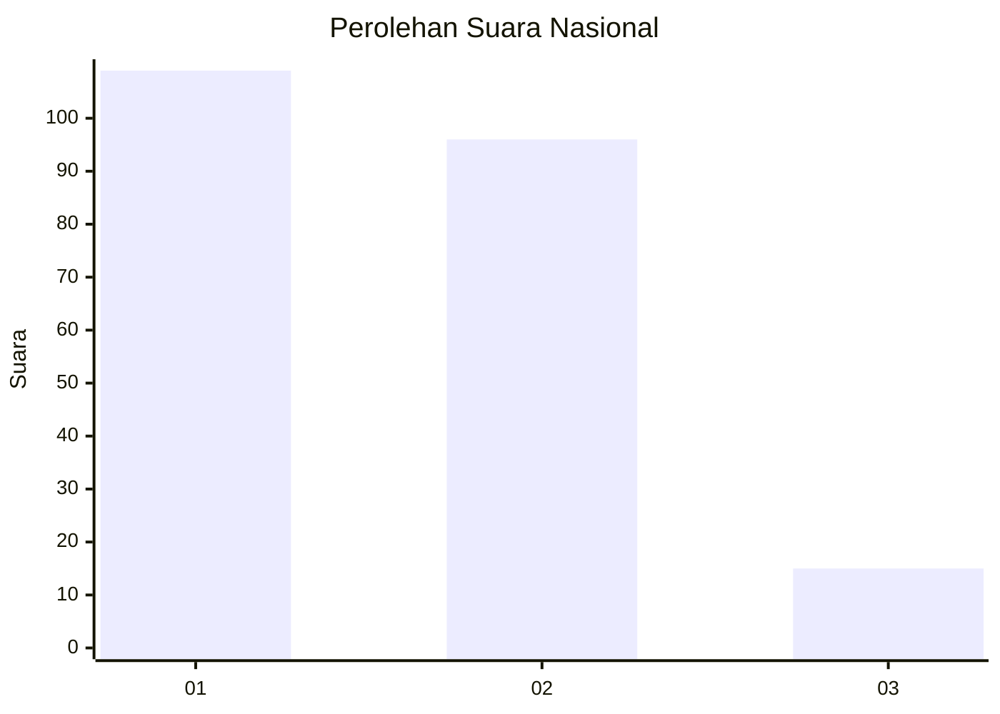
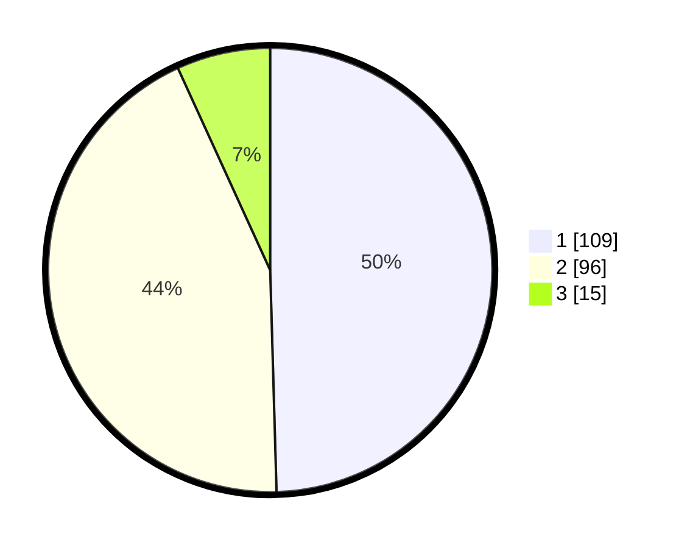

# Hasil

## Grafik

## Tabel

| No.    | Nama Paslon    | Suara | Suara (raw) | Persentase |
|:------ |:-------------- | -----:| -----------:| ----------:|
| 100025 | ANIES MUHAIMIN | 109   | [109][p-1]  | 49,55      |
| 100026 | PRABOWO GIBRAN | 96    | [96][p-2]   | 43,64      |
| 100027 | GANJAR MAHFUD  | 15    | [15][p-3]   | 6,82       |

[p-1]: https://github.com/gigit-pemilu/pemilu-2024/blob/main/pilpres/hitung-suara/sub/31-dki-jakarta/sub/75-jakarta-timur/sub/06-cakung/sub/1002-rawa-terate/sub/069-tps/sub/paslon-1.txt
[p-2]: https://github.com/gigit-pemilu/pemilu-2024/blob/main/pilpres/hitung-suara/sub/31-dki-jakarta/sub/75-jakarta-timur/sub/06-cakung/sub/1002-rawa-terate/sub/069-tps/sub/paslon-2.txt
[p-3]: https://github.com/gigit-pemilu/pemilu-2024/blob/main/pilpres/hitung-suara/sub/31-dki-jakarta/sub/75-jakarta-timur/sub/06-cakung/sub/1002-rawa-terate/sub/069-tps/sub/paslon-3.txt

## Foto C Plano

https://sirekap-obj-formc.kpu.go.id/a25a/pemilu/ppwp/31/75/06/10/02/3175061002069-20240214-223205--66a9f593-4267-427d-ad8f-9a36947c1010.jpg

https://sirekap-obj-formc.kpu.go.id/a25a/pemilu/ppwp/31/75/06/10/02/3175061002069-20240214-223444--bfa92bb2-d673-4862-8bc6-97d8d908337c.jpg

https://sirekap-obj-formc.kpu.go.id/a25a/pemilu/ppwp/31/75/06/10/02/3175061002069-20240214-223601--9b3f2e6b-e90b-4700-bb87-dbf59971dc01.jpg

## Metadata

| Key        | Value               |
| ---------- | ------------------- |
| Time Stamp | 2024-02-24 22:31:28 |

