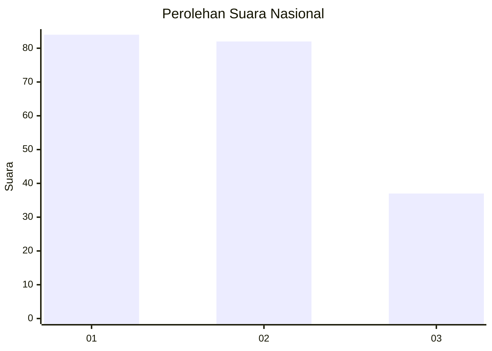
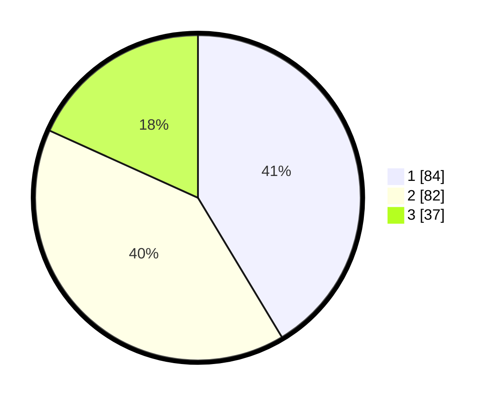

# Hasil

## Grafik

## Tabel

| No.    | Nama Paslon    | Suara | Suara (raw) | Persentase |
|:------ |:-------------- | -----:| -----------:| ----------:|
| 100025 | ANIES MUHAIMIN | 84    | [84][p-1]   | 41,38      |
| 100026 | PRABOWO GIBRAN | 82    | [82][p-2]   | 40,39      |
| 100027 | GANJAR MAHFUD  | 37    | [37][p-3]   | 18,23      |

[p-1]: https://github.com/gigit-pemilu/pemilu-2024/blob/main/pilpres/hitung-suara/sub/31-dki-jakarta/sub/75-jakarta-timur/sub/06-cakung/sub/1002-rawa-terate/sub/071-tps/sub/paslon-1.txt
[p-2]: https://github.com/gigit-pemilu/pemilu-2024/blob/main/pilpres/hitung-suara/sub/31-dki-jakarta/sub/75-jakarta-timur/sub/06-cakung/sub/1002-rawa-terate/sub/071-tps/sub/paslon-2.txt
[p-3]: https://github.com/gigit-pemilu/pemilu-2024/blob/main/pilpres/hitung-suara/sub/31-dki-jakarta/sub/75-jakarta-timur/sub/06-cakung/sub/1002-rawa-terate/sub/071-tps/sub/paslon-3.txt

## Foto C Plano

https://sirekap-obj-formc.kpu.go.id/d5fb/pemilu/ppwp/31/75/06/10/02/3175061002071-20240214-220649--81b17c5d-2f0a-4ee3-ab0b-744489906018.jpg

https://sirekap-obj-formc.kpu.go.id/d5fb/pemilu/ppwp/31/75/06/10/02/3175061002071-20240214-203938--b6df55fe-7732-436a-a140-1090ecde5bee.jpg

https://sirekap-obj-formc.kpu.go.id/d5fb/pemilu/ppwp/31/75/06/10/02/3175061002071-20240214-204046--aca2ba27-4b94-4933-8cc6-646db7a8fd09.jpg

## Metadata

| Key        | Value               |
| ---------- | ------------------- |
| Time Stamp | 2024-02-15 22:00:27 |

