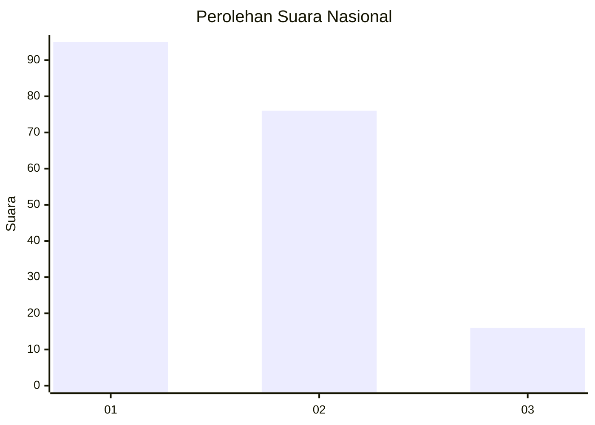
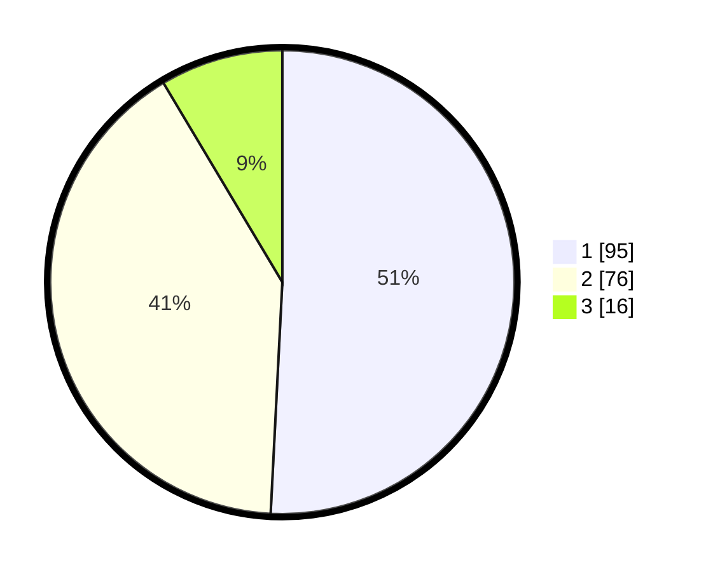

# Hasil

## Grafik

## Tabel

| No.    | Nama Paslon    | Suara | Suara (raw) | Persentase |
|:------ |:-------------- | -----:| -----------:| ----------:|
| 100025 | ANIES MUHAIMIN | 95    | [95][p-1]   | 50,80      |
| 100026 | PRABOWO GIBRAN | 76    | [76][p-2]   | 40,64      |
| 100027 | GANJAR MAHFUD  | 16    | [16][p-3]   | 8,56       |

[p-1]: https://github.com/gigit-pemilu/pemilu-2024/blob/main/pilpres/hitung-suara/sub/31-dki-jakarta/sub/75-jakarta-timur/sub/06-cakung/sub/1002-rawa-terate/sub/082-tps/sub/paslon-1.txt
[p-2]: https://github.com/gigit-pemilu/pemilu-2024/blob/main/pilpres/hitung-suara/sub/31-dki-jakarta/sub/75-jakarta-timur/sub/06-cakung/sub/1002-rawa-terate/sub/082-tps/sub/paslon-2.txt
[p-3]: https://github.com/gigit-pemilu/pemilu-2024/blob/main/pilpres/hitung-suara/sub/31-dki-jakarta/sub/75-jakarta-timur/sub/06-cakung/sub/1002-rawa-terate/sub/082-tps/sub/paslon-3.txt

## Foto C Plano

https://sirekap-obj-formc.kpu.go.id/734f/pemilu/ppwp/31/75/06/10/02/3175061002082-20240215-010121--b0703d81-e4d3-4996-8fd7-b31ee759cbdc.jpg

https://sirekap-obj-formc.kpu.go.id/734f/pemilu/ppwp/31/75/06/10/02/3175061002082-20240215-010239--4fa344ea-b5be-4cf9-99f6-3b5156fbea3f.jpg

https://sirekap-obj-formc.kpu.go.id/734f/pemilu/ppwp/31/75/06/10/02/3175061002082-20240215-011135--7dcb367b-ffd9-4407-bee4-e91be120b65d.jpg

## Metadata

| Key        | Value               |
| ---------- | ------------------- |
| Time Stamp | 2024-02-19 12:00:00 |

