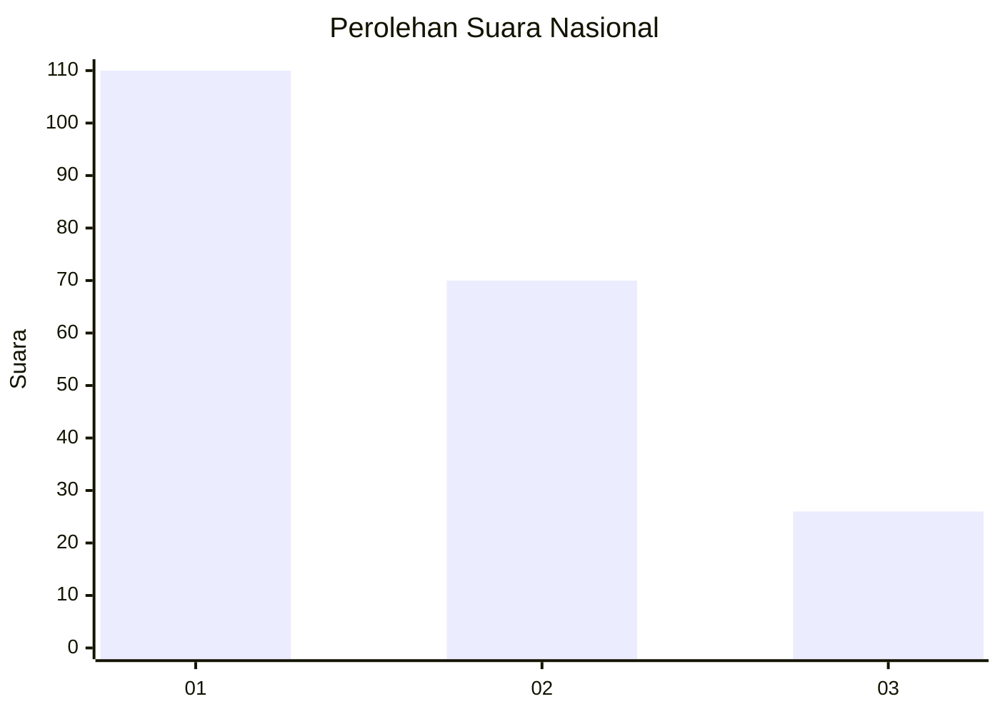
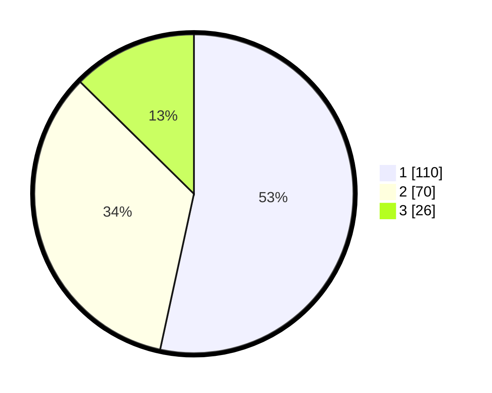

# Hasil

## Grafik

## Tabel

| No.    | Nama Paslon    | Suara | Suara (raw) | Persentase |
|:------ |:-------------- | -----:| -----------:| ----------:|
| 100025 | ANIES MUHAIMIN | 110   | [110][p-1]  | 53,40      |
| 100026 | PRABOWO GIBRAN | 70    | [70][p-2]   | 33,98      |
| 100027 | GANJAR MAHFUD  | 26    | [26][p-3]   | 12,62      |

[p-1]: https://github.com/gigit-pemilu/pemilu-2024/blob/main/pilpres/hitung-suara/sub/31-dki-jakarta/sub/75-jakarta-timur/sub/06-cakung/sub/1003-penggilingan/sub/022-tps/sub/paslon-1.txt
[p-2]: https://github.com/gigit-pemilu/pemilu-2024/blob/main/pilpres/hitung-suara/sub/31-dki-jakarta/sub/75-jakarta-timur/sub/06-cakung/sub/1003-penggilingan/sub/022-tps/sub/paslon-2.txt
[p-3]: https://github.com/gigit-pemilu/pemilu-2024/blob/main/pilpres/hitung-suara/sub/31-dki-jakarta/sub/75-jakarta-timur/sub/06-cakung/sub/1003-penggilingan/sub/022-tps/sub/paslon-3.txt

## Foto C Plano

https://sirekap-obj-formc.kpu.go.id/2dc0/pemilu/ppwp/31/75/06/10/03/3175061003022-20240214-233408--66779d54-f5c7-4d76-8bf0-c34d9dc2f8ad.jpg

https://sirekap-obj-formc.kpu.go.id/2dc0/pemilu/ppwp/31/75/06/10/03/3175061003022-20240214-233351--82bef70d-cb03-4902-aabf-bfc7818583f0.jpg

https://sirekap-obj-formc.kpu.go.id/2dc0/pemilu/ppwp/31/75/06/10/03/3175061003022-20240214-233331--c368ef69-6390-4d23-a29e-e8e1965ad984.jpg

## Metadata

| Key        | Value               |
| ---------- | ------------------- |
| Time Stamp | 2024-02-15 22:00:27 |

