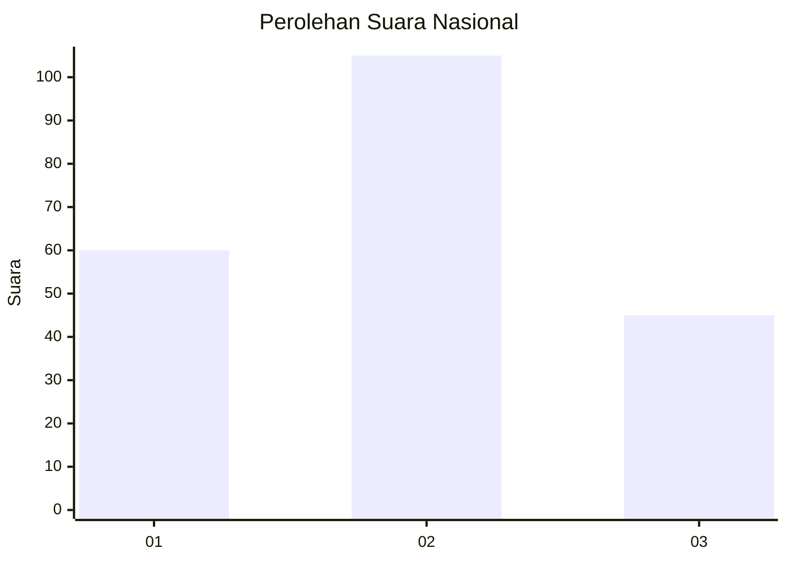
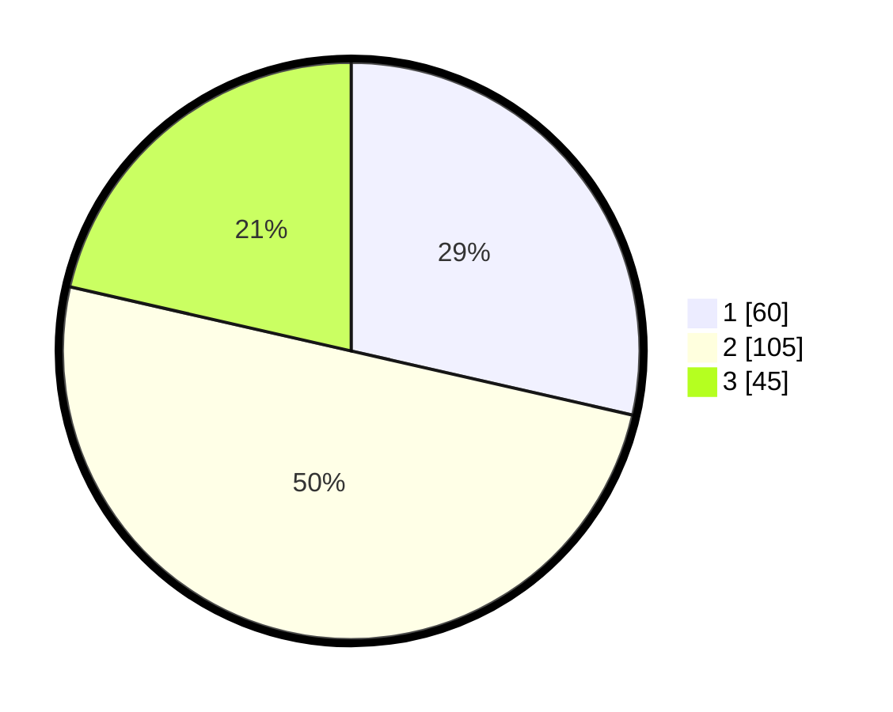

# Hasil

## Grafik

## Tabel

| No.    | Nama Paslon    | Suara | Suara (raw) | Persentase |
|:------ |:-------------- | -----:| -----------:| ----------:|
| 100025 | ANIES MUHAIMIN | 60    | [60][p-1]   | 28,57      |
| 100026 | PRABOWO GIBRAN | 105   | [105][p-2]  | 50,00      |
| 100027 | GANJAR MAHFUD  | 45    | [45][p-3]   | 21,43      |

[p-1]: https://github.com/gigit-pemilu/pemilu-2024/blob/main/pilpres/hitung-suara/sub/31-dki-jakarta/sub/75-jakarta-timur/sub/06-cakung/sub/1003-penggilingan/sub/032-tps/sub/paslon-1.txt
[p-2]: https://github.com/gigit-pemilu/pemilu-2024/blob/main/pilpres/hitung-suara/sub/31-dki-jakarta/sub/75-jakarta-timur/sub/06-cakung/sub/1003-penggilingan/sub/032-tps/sub/paslon-2.txt
[p-3]: https://github.com/gigit-pemilu/pemilu-2024/blob/main/pilpres/hitung-suara/sub/31-dki-jakarta/sub/75-jakarta-timur/sub/06-cakung/sub/1003-penggilingan/sub/032-tps/sub/paslon-3.txt

## Foto C Plano

https://sirekap-obj-formc.kpu.go.id/cf00/pemilu/ppwp/31/75/06/10/03/3175061003032-20240214-155827--2856019b-6c2d-4d59-bd4d-e7978c381c46.jpg

https://sirekap-obj-formc.kpu.go.id/cf00/pemilu/ppwp/31/75/06/10/03/3175061003032-20240215-002146--4c6301c8-fefe-4482-a709-3126fe63cf45.jpg

https://sirekap-obj-formc.kpu.go.id/cf00/pemilu/ppwp/31/75/06/10/03/3175061003032-20240215-002305--585a70dd-0435-4d17-8381-4194d95ae00a.jpg

## Metadata

| Key        | Value               |
| ---------- | ------------------- |
| Time Stamp | 2024-02-15 19:30:26 |

