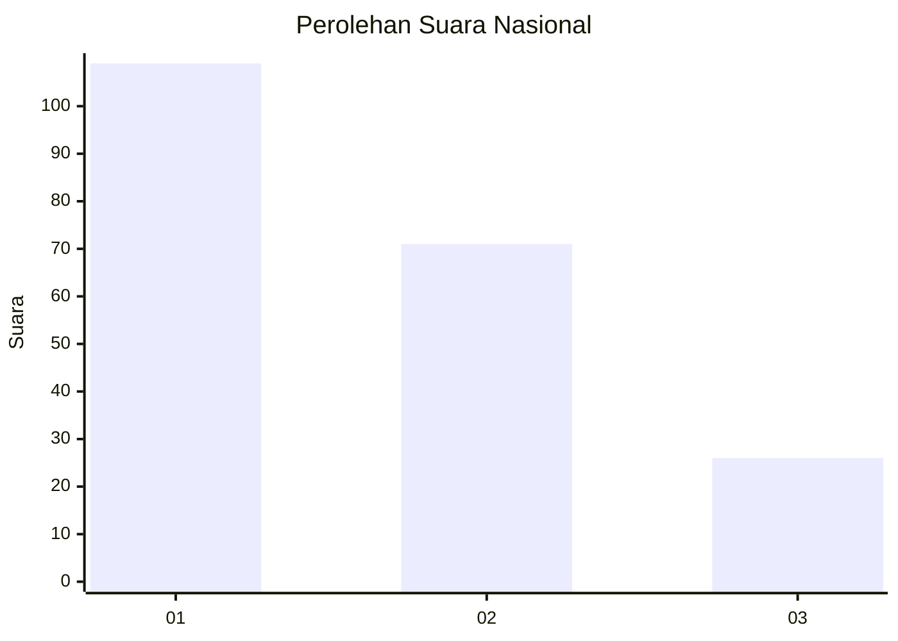
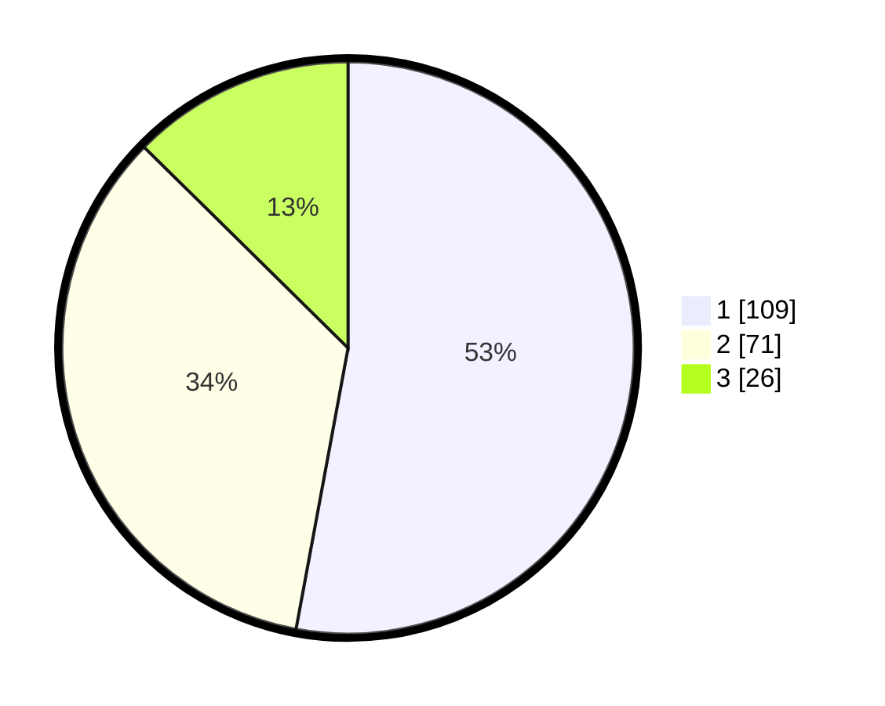

# Hasil

## Grafik

## Tabel

| No.    | Nama Paslon    | Suara | Suara (raw) | Persentase |
|:------ |:-------------- | -----:| -----------:| ----------:|
| 100025 | ANIES MUHAIMIN | 109   | [109][p-1]  | 52,91      |
| 100026 | PRABOWO GIBRAN | 71    | [71][p-2]   | 34,47      |
| 100027 | GANJAR MAHFUD  | 26    | [26][p-3]   | 12,62      |

[p-1]: https://github.com/gigit-pemilu/pemilu-2024/blob/main/pilpres/hitung-suara/sub/31-dki-jakarta/sub/75-jakarta-timur/sub/06-cakung/sub/1003-penggilingan/sub/033-tps/sub/paslon-1.txt
[p-2]: https://github.com/gigit-pemilu/pemilu-2024/blob/main/pilpres/hitung-suara/sub/31-dki-jakarta/sub/75-jakarta-timur/sub/06-cakung/sub/1003-penggilingan/sub/033-tps/sub/paslon-2.txt
[p-3]: https://github.com/gigit-pemilu/pemilu-2024/blob/main/pilpres/hitung-suara/sub/31-dki-jakarta/sub/75-jakarta-timur/sub/06-cakung/sub/1003-penggilingan/sub/033-tps/sub/paslon-3.txt

## Foto C Plano

https://sirekap-obj-formc.kpu.go.id/c858/pemilu/ppwp/31/75/06/10/03/3175061003033-20240215-020328--4056bc54-a10b-47c3-bd21-9c8cc6008a37.jpg

https://sirekap-obj-formc.kpu.go.id/c858/pemilu/ppwp/31/75/06/10/03/3175061003033-20240214-211136--cc8f94cf-535b-4f85-9e13-cf12faf94559.jpg

https://sirekap-obj-formc.kpu.go.id/c858/pemilu/ppwp/31/75/06/10/03/3175061003033-20240214-211246--1fd310ee-de76-4a61-b2cd-e6ed251df9b9.jpg

## Metadata

| Key        | Value               |
| ---------- | ------------------- |
| Time Stamp | 2024-02-15 22:00:27 |

