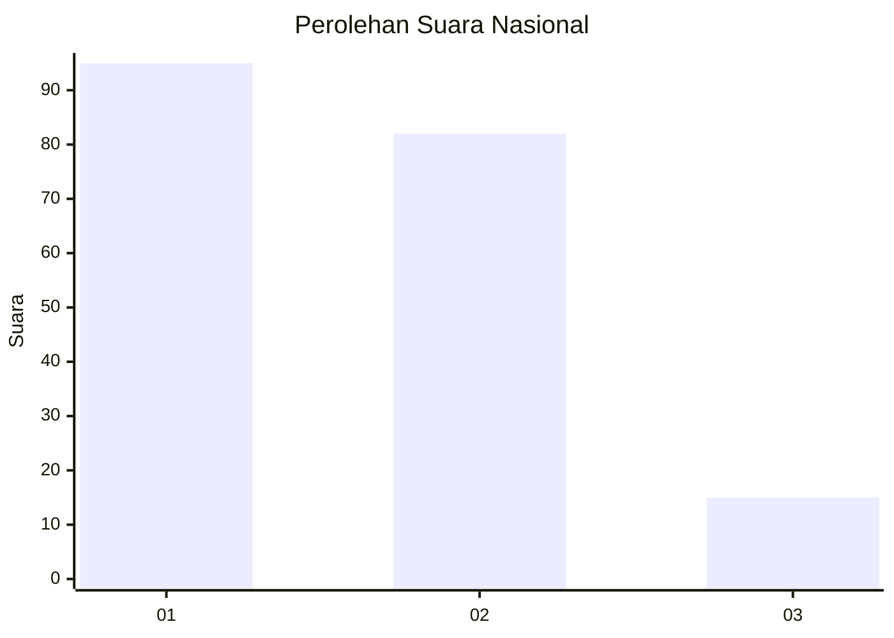
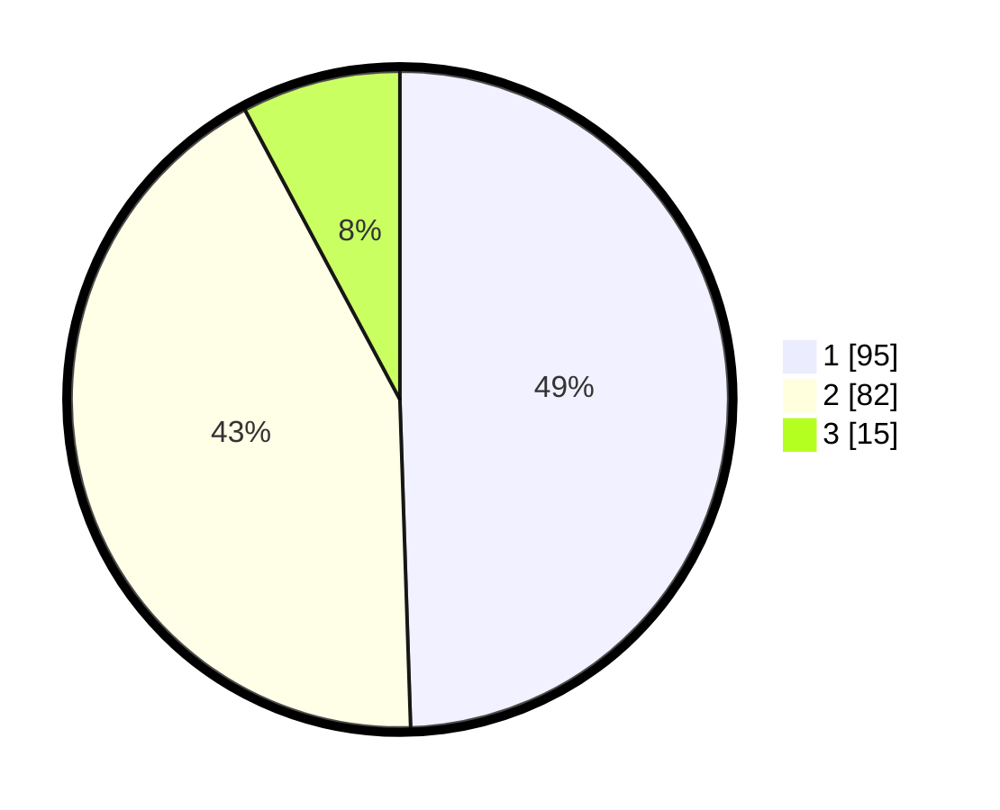

# Hasil

## Grafik

## Tabel

| No.    | Nama Paslon    | Suara | Suara (raw) | Persentase |
|:------ |:-------------- | -----:| -----------:| ----------:|
| 100025 | ANIES MUHAIMIN | 95    | [95][p-1]   | 49,48      |
| 100026 | PRABOWO GIBRAN | 82    | [82][p-2]   | 42,71      |
| 100027 | GANJAR MAHFUD  | 15    | [15][p-3]   | 7,81       |

[p-1]: https://github.com/gigit-pemilu/pemilu-2024/blob/main/pilpres/hitung-suara/sub/31-dki-jakarta/sub/75-jakarta-timur/sub/06-cakung/sub/1003-penggilingan/sub/036-tps/sub/paslon-1.txt
[p-2]: https://github.com/gigit-pemilu/pemilu-2024/blob/main/pilpres/hitung-suara/sub/31-dki-jakarta/sub/75-jakarta-timur/sub/06-cakung/sub/1003-penggilingan/sub/036-tps/sub/paslon-2.txt
[p-3]: https://github.com/gigit-pemilu/pemilu-2024/blob/main/pilpres/hitung-suara/sub/31-dki-jakarta/sub/75-jakarta-timur/sub/06-cakung/sub/1003-penggilingan/sub/036-tps/sub/paslon-3.txt

## Foto C Plano

https://sirekap-obj-formc.kpu.go.id/90db/pemilu/ppwp/31/75/06/10/03/3175061003036-20240214-205548--fcd20939-2258-4533-b8c1-d7ca9cce607d.jpg

https://sirekap-obj-formc.kpu.go.id/90db/pemilu/ppwp/31/75/06/10/03/3175061003036-20240214-205924--2ce87135-b9d2-45cb-97bd-8221726935f2.jpg

https://sirekap-obj-formc.kpu.go.id/90db/pemilu/ppwp/31/75/06/10/03/3175061003036-20240214-210331--442bd769-b33c-4a57-9f3c-2961a5fa7533.jpg

## Metadata

| Key        | Value               |
| ---------- | ------------------- |
| Time Stamp | 2024-02-19 12:00:00 |

