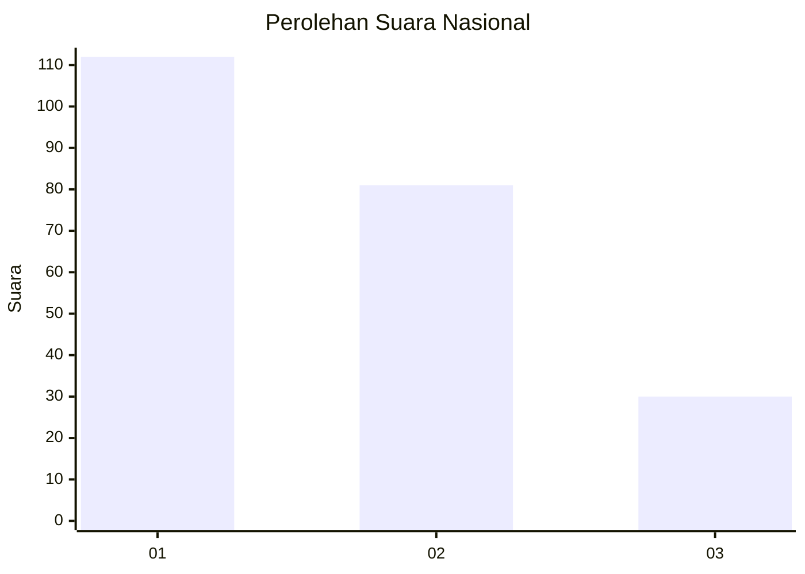
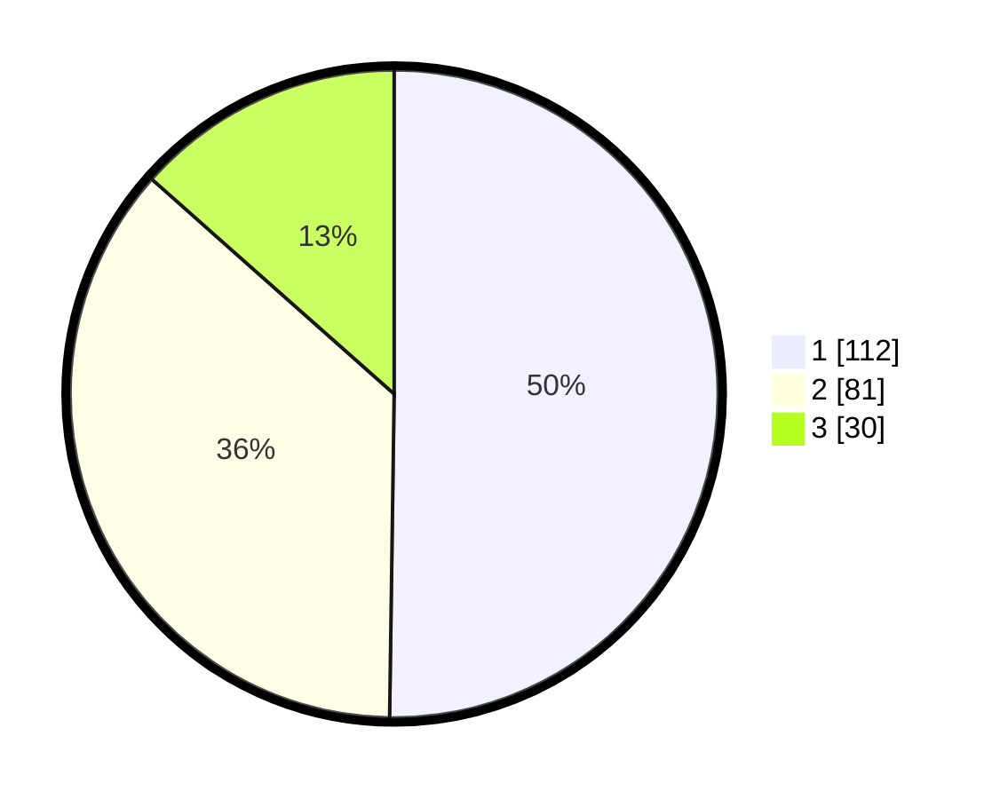

# Hasil

## Grafik

## Tabel

| No.    | Nama Paslon    | Suara | Suara (raw) | Persentase |
|:------ |:-------------- | -----:| -----------:| ----------:|
| 100025 | ANIES MUHAIMIN | 112   | [112][p-1]  | 50,22      |
| 100026 | PRABOWO GIBRAN | 81    | [81][p-2]   | 36,32      |
| 100027 | GANJAR MAHFUD  | 30    | [30][p-3]   | 13,45      |

[p-1]: https://github.com/gigit-pemilu/pemilu-2024/blob/main/pilpres/hitung-suara/sub/31-dki-jakarta/sub/75-jakarta-timur/sub/06-cakung/sub/1003-penggilingan/sub/042-tps/sub/paslon-1.txt
[p-2]: https://github.com/gigit-pemilu/pemilu-2024/blob/main/pilpres/hitung-suara/sub/31-dki-jakarta/sub/75-jakarta-timur/sub/06-cakung/sub/1003-penggilingan/sub/042-tps/sub/paslon-2.txt
[p-3]: https://github.com/gigit-pemilu/pemilu-2024/blob/main/pilpres/hitung-suara/sub/31-dki-jakarta/sub/75-jakarta-timur/sub/06-cakung/sub/1003-penggilingan/sub/042-tps/sub/paslon-3.txt

## Foto C Plano

https://sirekap-obj-formc.kpu.go.id/e90d/pemilu/ppwp/31/75/06/10/03/3175061003042-20240215-022208--016abf21-c956-4b16-ba0c-7f19fd065324.jpg

https://sirekap-obj-formc.kpu.go.id/e90d/pemilu/ppwp/31/75/06/10/03/3175061003042-20240214-221440--8c0ef775-8d25-4047-ac31-ff48e2063397.jpg

https://sirekap-obj-formc.kpu.go.id/e90d/pemilu/ppwp/31/75/06/10/03/3175061003042-20240214-221627--9d26ee1f-69d4-49ef-bee5-a47ce0e0f559.jpg

## Metadata

| Key        | Value               |
| ---------- | ------------------- |
| Time Stamp | 2024-02-15 22:00:27 |

