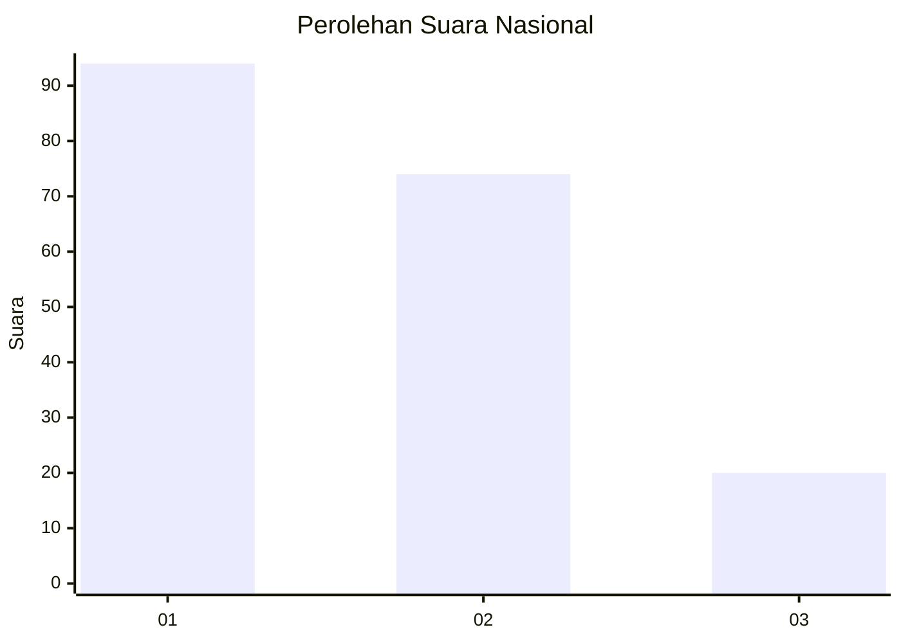
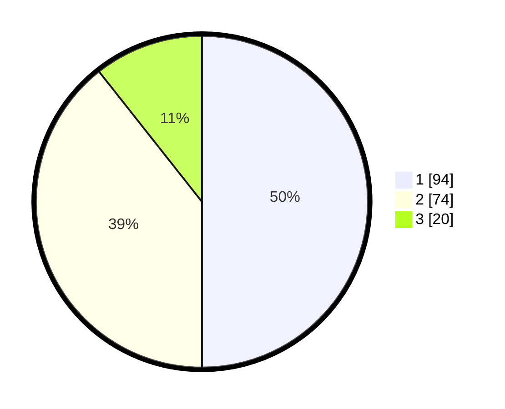

# Hasil

## Grafik

## Tabel

| No.    | Nama Paslon    | Suara | Suara (raw) | Persentase |
|:------ |:-------------- | -----:| -----------:| ----------:|
| 100025 | ANIES MUHAIMIN | 94    | [94][p-1]   | 50,00      |
| 100026 | PRABOWO GIBRAN | 74    | [74][p-2]   | 39,36      |
| 100027 | GANJAR MAHFUD  | 20    | [20][p-3]   | 10,64      |

[p-1]: https://github.com/gigit-pemilu/pemilu-2024/blob/main/pilpres/hitung-suara/sub/31-dki-jakarta/sub/75-jakarta-timur/sub/06-cakung/sub/1003-penggilingan/sub/064-tps/sub/paslon-1.txt
[p-2]: https://github.com/gigit-pemilu/pemilu-2024/blob/main/pilpres/hitung-suara/sub/31-dki-jakarta/sub/75-jakarta-timur/sub/06-cakung/sub/1003-penggilingan/sub/064-tps/sub/paslon-2.txt
[p-3]: https://github.com/gigit-pemilu/pemilu-2024/blob/main/pilpres/hitung-suara/sub/31-dki-jakarta/sub/75-jakarta-timur/sub/06-cakung/sub/1003-penggilingan/sub/064-tps/sub/paslon-3.txt

## Foto C Plano

https://sirekap-obj-formc.kpu.go.id/25c3/pemilu/ppwp/31/75/06/10/03/3175061003064-20240215-012906--2366308f-675d-4113-bd44-1c228c1a48d2.jpg

https://sirekap-obj-formc.kpu.go.id/25c3/pemilu/ppwp/31/75/06/10/03/3175061003064-20240215-013003--9146334c-cd14-43c0-816d-3c8b4dafd251.jpg

https://sirekap-obj-formc.kpu.go.id/25c3/pemilu/ppwp/31/75/06/10/03/3175061003064-20240215-013040--047718fc-5292-4c7e-966b-bd63c71e014c.jpg

## Metadata

| Key        | Value               |
| ---------- | ------------------- |
| Time Stamp | 2024-02-24 22:31:28 |

