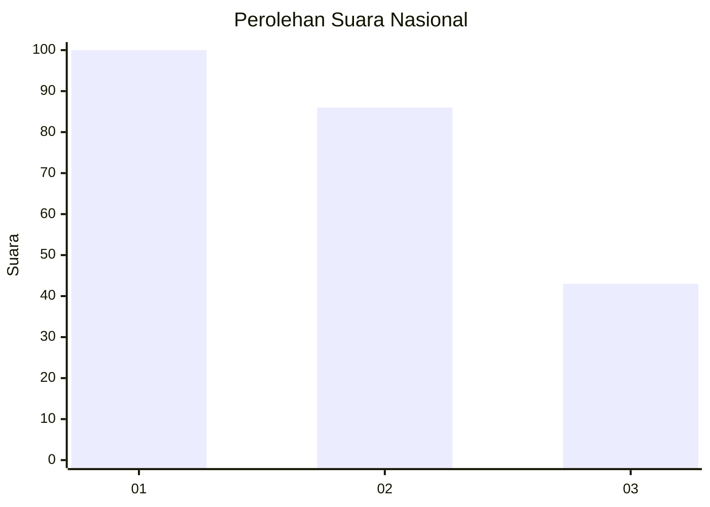
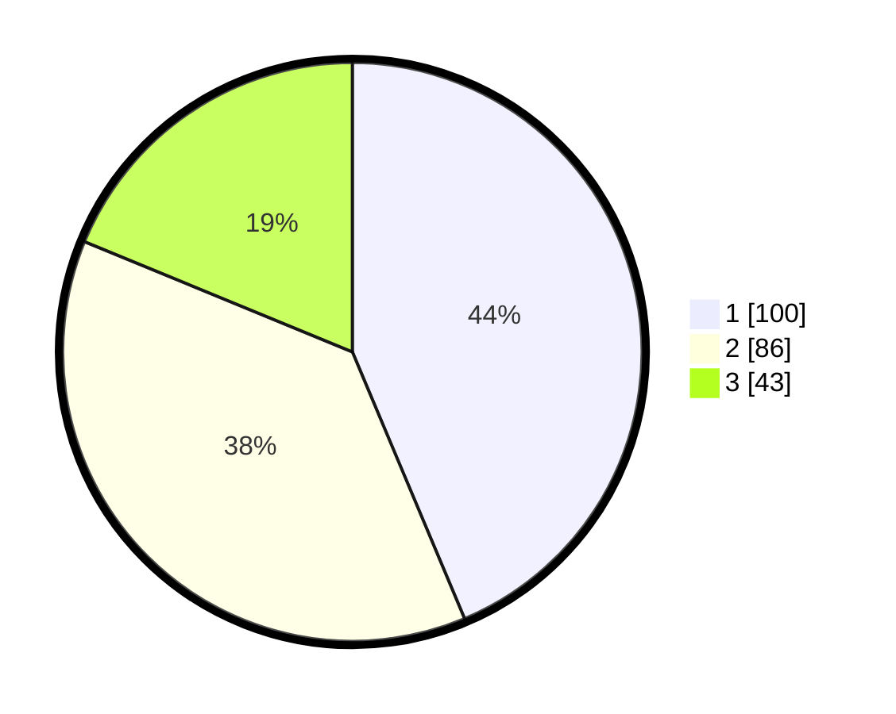

# Hasil

## Grafik

## Tabel

| No.    | Nama Paslon    | Suara | Suara (raw) | Persentase |
|:------ |:-------------- | -----:| -----------:| ----------:|
| 100025 | ANIES MUHAIMIN | 100   | [100][p-1]  | 43,67      |
| 100026 | PRABOWO GIBRAN | 86    | [86][p-2]   | 37,55      |
| 100027 | GANJAR MAHFUD  | 43    | [43][p-3]   | 18,78      |

[p-1]: https://github.com/gigit-pemilu/pemilu-2024/blob/main/pilpres/hitung-suara/sub/31-dki-jakarta/sub/75-jakarta-timur/sub/06-cakung/sub/1003-penggilingan/sub/105-tps/sub/paslon-1.txt
[p-2]: https://github.com/gigit-pemilu/pemilu-2024/blob/main/pilpres/hitung-suara/sub/31-dki-jakarta/sub/75-jakarta-timur/sub/06-cakung/sub/1003-penggilingan/sub/105-tps/sub/paslon-2.txt
[p-3]: https://github.com/gigit-pemilu/pemilu-2024/blob/main/pilpres/hitung-suara/sub/31-dki-jakarta/sub/75-jakarta-timur/sub/06-cakung/sub/1003-penggilingan/sub/105-tps/sub/paslon-3.txt

## Foto C Plano

https://sirekap-obj-formc.kpu.go.id/5ed6/pemilu/ppwp/31/75/06/10/03/3175061003105-20240214-215304--b67d702c-0192-4d9a-b349-9019f1a248ed.jpg

https://sirekap-obj-formc.kpu.go.id/5ed6/pemilu/ppwp/31/75/06/10/03/3175061003105-20240214-215353--92fc16ab-a569-46a1-95bf-706da3f13343.jpg

https://sirekap-obj-formc.kpu.go.id/5ed6/pemilu/ppwp/31/75/06/10/03/3175061003105-20240214-215438--a3a473ed-51eb-4db3-b852-9533875eaed3.jpg

## Metadata

| Key        | Value               |
| ---------- | ------------------- |
| Time Stamp | 2024-02-25 14:00:00 |

