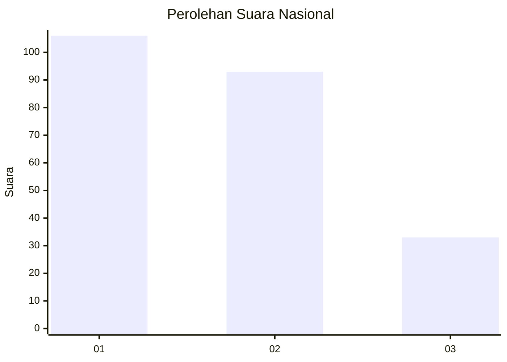
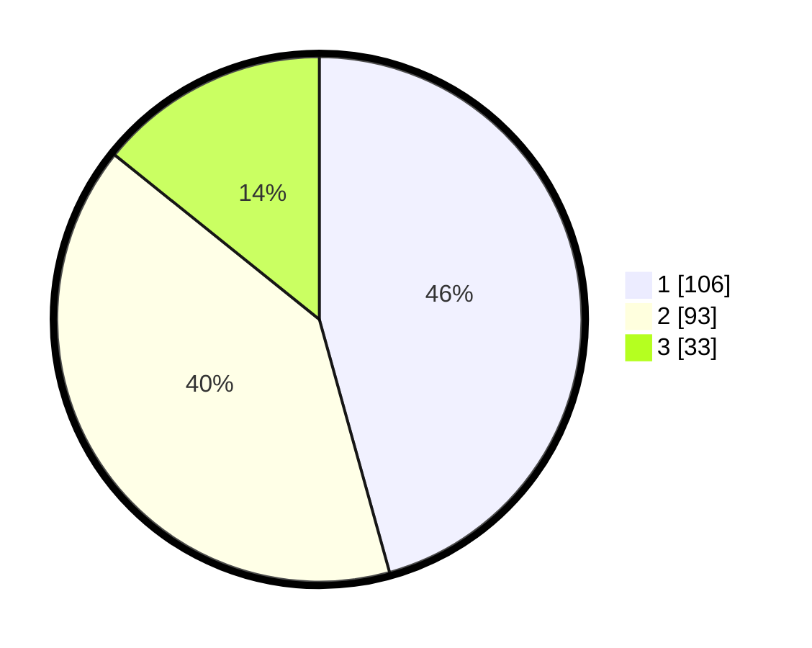

# Hasil

## Grafik

## Tabel

| No.    | Nama Paslon    | Suara | Suara (raw) | Persentase |
|:------ |:-------------- | -----:| -----------:| ----------:|
| 100025 | ANIES MUHAIMIN | 106   | [106][p-1]  | 45,69      |
| 100026 | PRABOWO GIBRAN | 93    | [93][p-2]   | 40,09      |
| 100027 | GANJAR MAHFUD  | 33    | [33][p-3]   | 14,22      |

[p-1]: https://github.com/gigit-pemilu/pemilu-2024/blob/main/pilpres/hitung-suara/sub/31-dki-jakarta/sub/75-jakarta-timur/sub/06-cakung/sub/1003-penggilingan/sub/107-tps/sub/paslon-1.txt
[p-2]: https://github.com/gigit-pemilu/pemilu-2024/blob/main/pilpres/hitung-suara/sub/31-dki-jakarta/sub/75-jakarta-timur/sub/06-cakung/sub/1003-penggilingan/sub/107-tps/sub/paslon-2.txt
[p-3]: https://github.com/gigit-pemilu/pemilu-2024/blob/main/pilpres/hitung-suara/sub/31-dki-jakarta/sub/75-jakarta-timur/sub/06-cakung/sub/1003-penggilingan/sub/107-tps/sub/paslon-3.txt

## Foto C Plano

https://sirekap-obj-formc.kpu.go.id/4809/pemilu/ppwp/31/75/06/10/03/3175061003107-20240215-011449--726f75c5-b971-4a6f-a698-b11940a2dfb6.jpg

https://sirekap-obj-formc.kpu.go.id/4809/pemilu/ppwp/31/75/06/10/03/3175061003107-20240215-011453--05ad6e80-bb7f-4d42-b4d2-f6d3f62af6ac.jpg

https://sirekap-obj-formc.kpu.go.id/4809/pemilu/ppwp/31/75/06/10/03/3175061003107-20240215-011457--20609e8c-c1da-40f4-b35c-adcde5a474e5.jpg

## Metadata

| Key        | Value               |
| ---------- | ------------------- |
| Time Stamp | 2024-02-15 22:00:27 |

