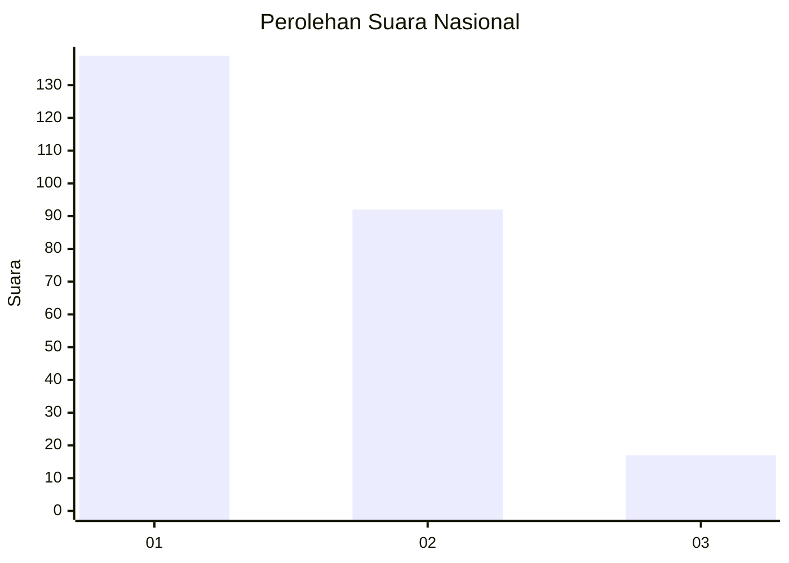
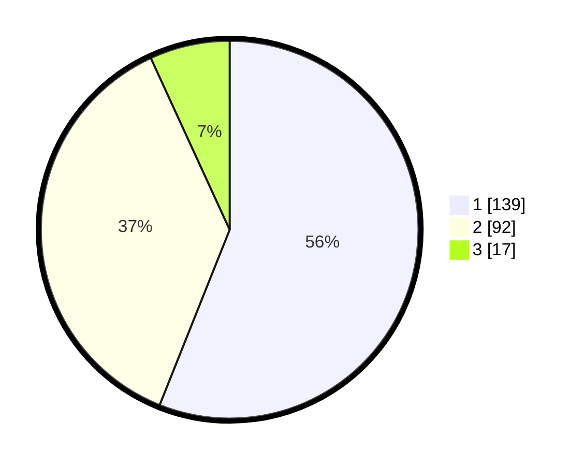

# Hasil

## Grafik

## Tabel

| No.    | Nama Paslon    | Suara | Suara (raw) | Persentase |
|:------ |:-------------- | -----:| -----------:| ----------:|
| 100025 | ANIES MUHAIMIN | 139   | [139][p-1]  | 56,05      |
| 100026 | PRABOWO GIBRAN | 92    | [92][p-2]   | 37,10      |
| 100027 | GANJAR MAHFUD  | 17    | [17][p-3]   | 6,85       |

[p-1]: https://github.com/gigit-pemilu/pemilu-2024/blob/main/pilpres/hitung-suara/sub/31-dki-jakarta/sub/75-jakarta-timur/sub/06-cakung/sub/1003-penggilingan/sub/121-tps/sub/paslon-1.txt
[p-2]: https://github.com/gigit-pemilu/pemilu-2024/blob/main/pilpres/hitung-suara/sub/31-dki-jakarta/sub/75-jakarta-timur/sub/06-cakung/sub/1003-penggilingan/sub/121-tps/sub/paslon-2.txt
[p-3]: https://github.com/gigit-pemilu/pemilu-2024/blob/main/pilpres/hitung-suara/sub/31-dki-jakarta/sub/75-jakarta-timur/sub/06-cakung/sub/1003-penggilingan/sub/121-tps/sub/paslon-3.txt

## Foto C Plano

https://sirekap-obj-formc.kpu.go.id/4059/pemilu/ppwp/31/75/06/10/03/3175061003121-20240214-221729--2eb8b29f-f44a-41ef-b2f2-d688a593a93a.jpg

https://sirekap-obj-formc.kpu.go.id/4059/pemilu/ppwp/31/75/06/10/03/3175061003121-20240214-222003--a308e8ea-1db1-459f-9a51-11ffe3fd069c.jpg

https://sirekap-obj-formc.kpu.go.id/4059/pemilu/ppwp/31/75/06/10/03/3175061003121-20240214-222101--47c850f4-3dc9-42d5-b1c9-3303accf681c.jpg

## Metadata

| Key        | Value               |
| ---------- | ------------------- |
| Time Stamp | 2024-02-15 09:00:24 |

