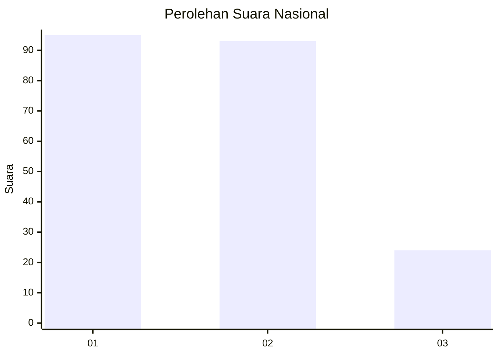
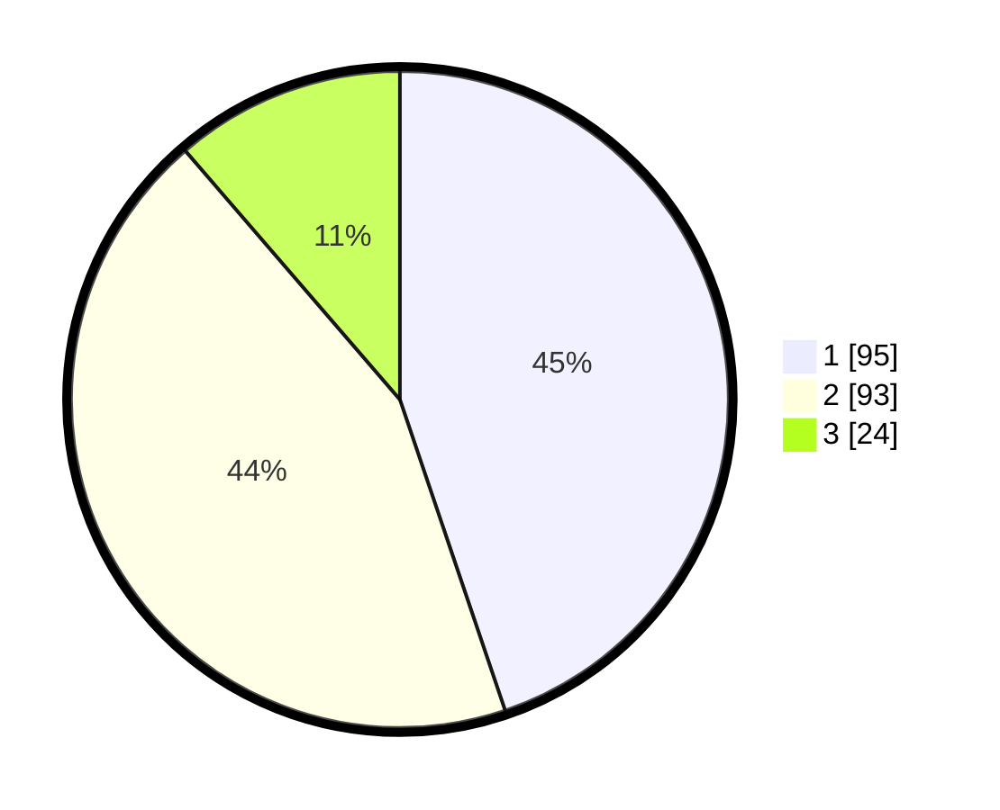

# Hasil

## Grafik

## Tabel

| No.    | Nama Paslon    | Suara | Suara (raw) | Persentase |
|:------ |:-------------- | -----:| -----------:| ----------:|
| 100025 | ANIES MUHAIMIN | 95    | [95][p-1]   | 44,81      |
| 100026 | PRABOWO GIBRAN | 93    | [93][p-2]   | 43,87      |
| 100027 | GANJAR MAHFUD  | 24    | [24][p-3]   | 11,32      |

[p-1]: https://github.com/gigit-pemilu/pemilu-2024/blob/main/pilpres/hitung-suara/sub/31-dki-jakarta/sub/75-jakarta-timur/sub/06-cakung/sub/1003-penggilingan/sub/123-tps/sub/paslon-1.txt
[p-2]: https://github.com/gigit-pemilu/pemilu-2024/blob/main/pilpres/hitung-suara/sub/31-dki-jakarta/sub/75-jakarta-timur/sub/06-cakung/sub/1003-penggilingan/sub/123-tps/sub/paslon-2.txt
[p-3]: https://github.com/gigit-pemilu/pemilu-2024/blob/main/pilpres/hitung-suara/sub/31-dki-jakarta/sub/75-jakarta-timur/sub/06-cakung/sub/1003-penggilingan/sub/123-tps/sub/paslon-3.txt

## Foto C Plano

https://sirekap-obj-formc.kpu.go.id/4cae/pemilu/ppwp/31/75/06/10/03/3175061003123-20240214-231116--c7699a75-4e97-42c4-aec7-df3c632af08a.jpg

https://sirekap-obj-formc.kpu.go.id/4cae/pemilu/ppwp/31/75/06/10/03/3175061003123-20240214-231805--6fe3fb59-12f3-4d5a-b2c5-b052974da051.jpg

https://sirekap-obj-formc.kpu.go.id/4cae/pemilu/ppwp/31/75/06/10/03/3175061003123-20240214-232018--de121f4d-0be7-4399-bdfc-6b32489c378b.jpg

## Metadata

| Key        | Value               |
| ---------- | ------------------- |
| Time Stamp | 2024-02-17 16:36:25 |

