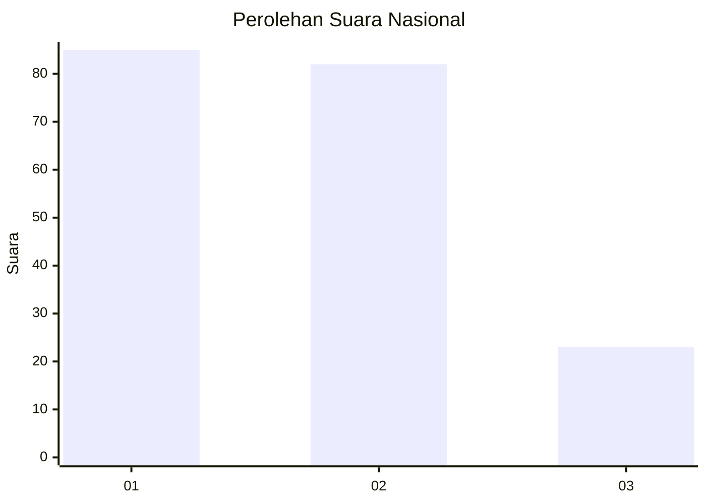
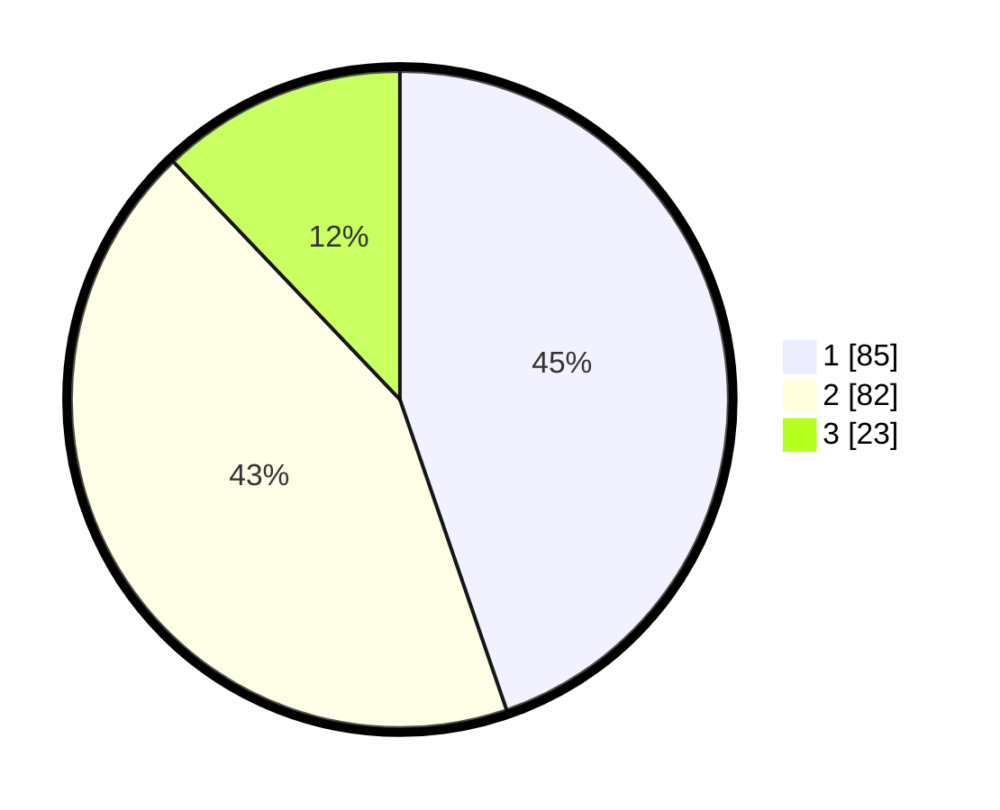

# Hasil

## Grafik

## Tabel

| No.    | Nama Paslon    | Suara | Suara (raw) | Persentase |
|:------ |:-------------- | -----:| -----------:| ----------:|
| 100025 | ANIES MUHAIMIN | 85    | [85][p-1]   | 44,74      |
| 100026 | PRABOWO GIBRAN | 82    | [82][p-2]   | 43,16      |
| 100027 | GANJAR MAHFUD  | 23    | [23][p-3]   | 12,11      |

[p-1]: https://github.com/gigit-pemilu/pemilu-2024/blob/main/pilpres/hitung-suara/sub/31-dki-jakarta/sub/75-jakarta-timur/sub/06-cakung/sub/1003-penggilingan/sub/127-tps/sub/paslon-1.txt
[p-2]: https://github.com/gigit-pemilu/pemilu-2024/blob/main/pilpres/hitung-suara/sub/31-dki-jakarta/sub/75-jakarta-timur/sub/06-cakung/sub/1003-penggilingan/sub/127-tps/sub/paslon-2.txt
[p-3]: https://github.com/gigit-pemilu/pemilu-2024/blob/main/pilpres/hitung-suara/sub/31-dki-jakarta/sub/75-jakarta-timur/sub/06-cakung/sub/1003-penggilingan/sub/127-tps/sub/paslon-3.txt

## Foto C Plano

https://sirekap-obj-formc.kpu.go.id/2ff0/pemilu/ppwp/31/75/06/10/03/3175061003127-20240214-233438--9ad86845-29b0-4a1a-b9c7-8def7c8e69fc.jpg

https://sirekap-obj-formc.kpu.go.id/2ff0/pemilu/ppwp/31/75/06/10/03/3175061003127-20240214-233535--58dfb3bc-740c-42d6-abe9-e96cc3d0efb7.jpg

https://sirekap-obj-formc.kpu.go.id/2ff0/pemilu/ppwp/31/75/06/10/03/3175061003127-20240214-233640--2d54b386-b947-4699-97ee-0c294b346482.jpg

## Metadata

| Key        | Value               |
| ---------- | ------------------- |
| Time Stamp | 2024-02-24 22:31:28 |

