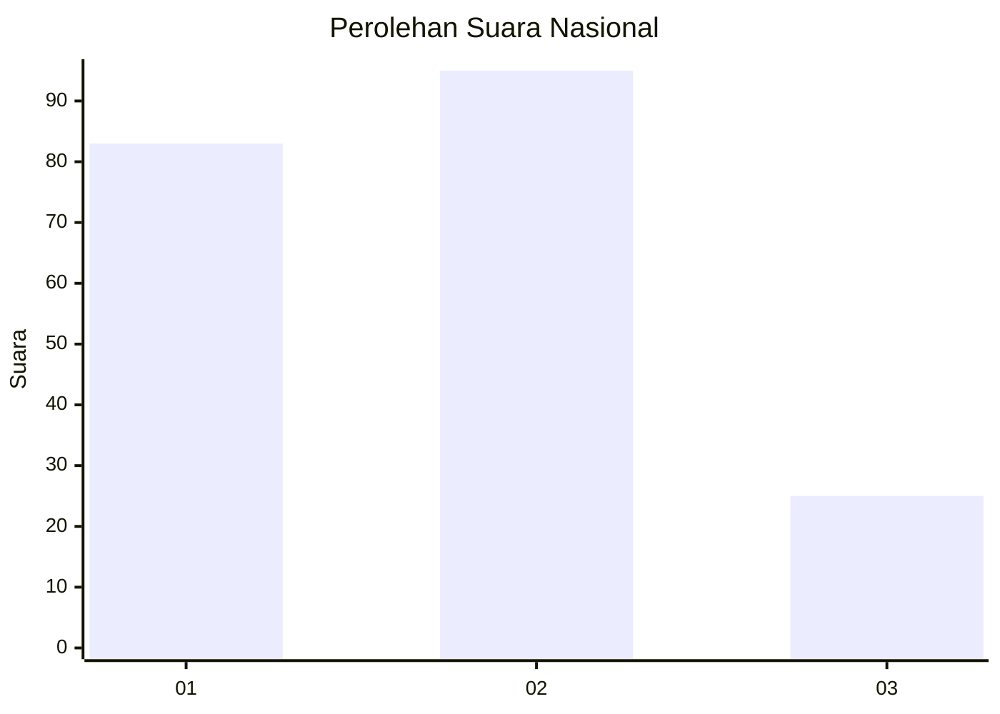
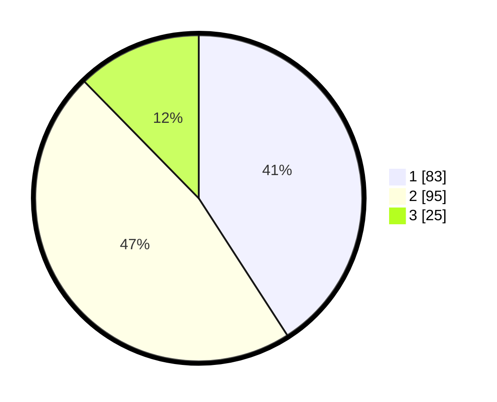

# Hasil

## Grafik

## Tabel

| No.    | Nama Paslon    | Suara | Suara (raw) | Persentase |
|:------ |:-------------- | -----:| -----------:| ----------:|
| 100025 | ANIES MUHAIMIN | 83    | [83][p-1]   | 40,89      |
| 100026 | PRABOWO GIBRAN | 95    | [95][p-2]   | 46,80      |
| 100027 | GANJAR MAHFUD  | 25    | [25][p-3]   | 12,32      |

[p-1]: https://github.com/gigit-pemilu/pemilu-2024/blob/main/pilpres/hitung-suara/sub/31-dki-jakarta/sub/75-jakarta-timur/sub/06-cakung/sub/1003-penggilingan/sub/138-tps/sub/paslon-1.txt
[p-2]: https://github.com/gigit-pemilu/pemilu-2024/blob/main/pilpres/hitung-suara/sub/31-dki-jakarta/sub/75-jakarta-timur/sub/06-cakung/sub/1003-penggilingan/sub/138-tps/sub/paslon-2.txt
[p-3]: https://github.com/gigit-pemilu/pemilu-2024/blob/main/pilpres/hitung-suara/sub/31-dki-jakarta/sub/75-jakarta-timur/sub/06-cakung/sub/1003-penggilingan/sub/138-tps/sub/paslon-3.txt

## Foto C Plano

https://sirekap-obj-formc.kpu.go.id/da5a/pemilu/ppwp/31/75/06/10/03/3175061003138-20240215-001452--91de0525-99fe-4e83-b808-6ce252b96f1e.jpg

https://sirekap-obj-formc.kpu.go.id/da5a/pemilu/ppwp/31/75/06/10/03/3175061003138-20240214-223537--cc6af52b-67b5-442c-aeec-4d31e967f8ce.jpg

https://sirekap-obj-formc.kpu.go.id/da5a/pemilu/ppwp/31/75/06/10/03/3175061003138-20240214-223749--0cf2f736-cfdb-4fc8-a97d-9eab0f05cab0.jpg

## Metadata

| Key        | Value               |
| ---------- | ------------------- |
| Time Stamp | 2024-02-19 12:00:00 |

