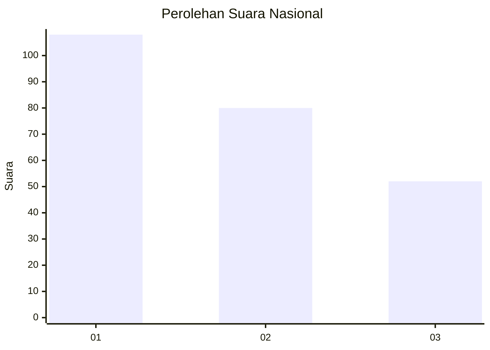
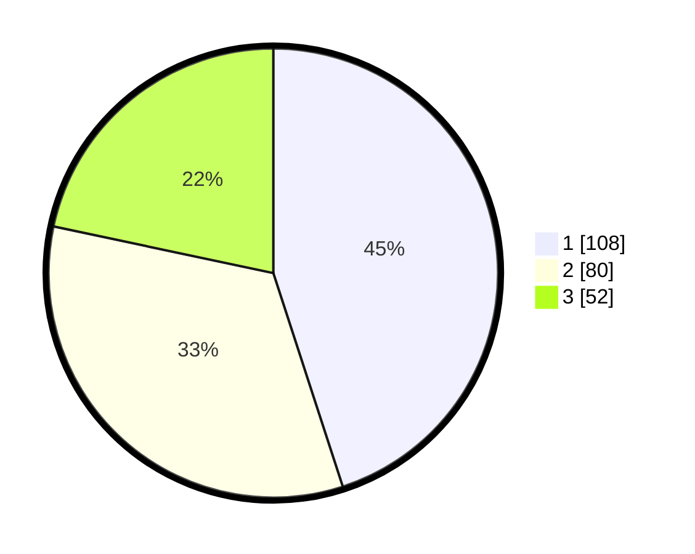

# Hasil

## Grafik

## Tabel

| No.    | Nama Paslon    | Suara | Suara (raw) | Persentase |
|:------ |:-------------- | -----:| -----------:| ----------:|
| 100025 | ANIES MUHAIMIN | 108   | [108][p-1]  | 45,00      |
| 100026 | PRABOWO GIBRAN | 80    | [80][p-2]   | 33,33      |
| 100027 | GANJAR MAHFUD  | 52    | [52][p-3]   | 21,67      |

[p-1]: https://github.com/gigit-pemilu/pemilu-2024/blob/main/pilpres/hitung-suara/sub/31-dki-jakarta/sub/75-jakarta-timur/sub/06-cakung/sub/1003-penggilingan/sub/150-tps/sub/paslon-1.txt
[p-2]: https://github.com/gigit-pemilu/pemilu-2024/blob/main/pilpres/hitung-suara/sub/31-dki-jakarta/sub/75-jakarta-timur/sub/06-cakung/sub/1003-penggilingan/sub/150-tps/sub/paslon-2.txt
[p-3]: https://github.com/gigit-pemilu/pemilu-2024/blob/main/pilpres/hitung-suara/sub/31-dki-jakarta/sub/75-jakarta-timur/sub/06-cakung/sub/1003-penggilingan/sub/150-tps/sub/paslon-3.txt

## Foto C Plano

https://sirekap-obj-formc.kpu.go.id/3e17/pemilu/ppwp/31/75/06/10/03/3175061003150-20240216-085117--3e93af99-a12d-46f0-a1d4-54fa5579c1af.jpg

https://sirekap-obj-formc.kpu.go.id/3e17/pemilu/ppwp/31/75/06/10/03/3175061003150-20240216-084705--d87c0255-a954-46d9-8db7-76b4f2942391.jpg

https://sirekap-obj-formc.kpu.go.id/3e17/pemilu/ppwp/31/75/06/10/03/3175061003150-20240216-084832--9a2ab2b4-4674-4910-bd6c-b53283252255.jpg

## Metadata

| Key        | Value               |
| ---------- | ------------------- |
| Time Stamp | 2024-02-19 12:00:00 |

