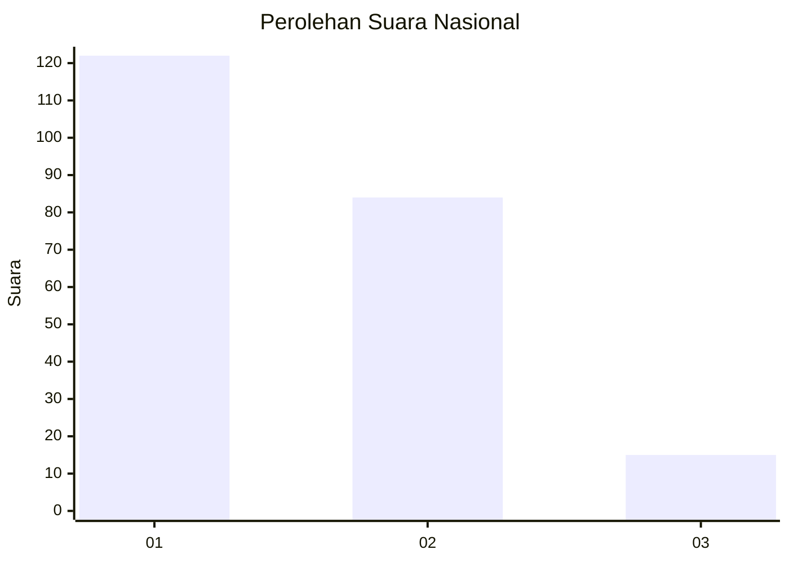
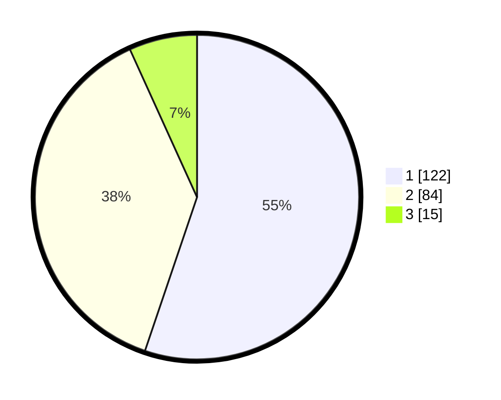

# Hasil

## Grafik

## Tabel

| No.    | Nama Paslon    | Suara | Suara (raw) | Persentase |
|:------ |:-------------- | -----:| -----------:| ----------:|
| 100025 | ANIES MUHAIMIN | 122   | [122][p-1]  | 55,20      |
| 100026 | PRABOWO GIBRAN | 84    | [84][p-2]   | 38,01      |
| 100027 | GANJAR MAHFUD  | 15    | [15][p-3]   | 6,79       |

[p-1]: https://github.com/gigit-pemilu/pemilu-2024/blob/main/pilpres/hitung-suara/sub/31-dki-jakarta/sub/75-jakarta-timur/sub/06-cakung/sub/1003-penggilingan/sub/191-tps/sub/paslon-1.txt
[p-2]: https://github.com/gigit-pemilu/pemilu-2024/blob/main/pilpres/hitung-suara/sub/31-dki-jakarta/sub/75-jakarta-timur/sub/06-cakung/sub/1003-penggilingan/sub/191-tps/sub/paslon-2.txt
[p-3]: https://github.com/gigit-pemilu/pemilu-2024/blob/main/pilpres/hitung-suara/sub/31-dki-jakarta/sub/75-jakarta-timur/sub/06-cakung/sub/1003-penggilingan/sub/191-tps/sub/paslon-3.txt

## Foto C Plano

https://sirekap-obj-formc.kpu.go.id/92ee/pemilu/ppwp/31/75/06/10/03/3175061003191-20240215-004255--db18cf19-f962-4d6b-8303-52039ab65df4.jpg

https://sirekap-obj-formc.kpu.go.id/92ee/pemilu/ppwp/31/75/06/10/03/3175061003191-20240215-004525--fa73030a-339c-4a4c-9086-7ce64d9cf2ed.jpg

https://sirekap-obj-formc.kpu.go.id/92ee/pemilu/ppwp/31/75/06/10/03/3175061003191-20240215-004756--9a7e3075-c0a8-4c54-9a1f-ec0ada35b50e.jpg

## Metadata

| Key        | Value               |
| ---------- | ------------------- |
| Time Stamp | 2024-02-19 12:00:00 |

