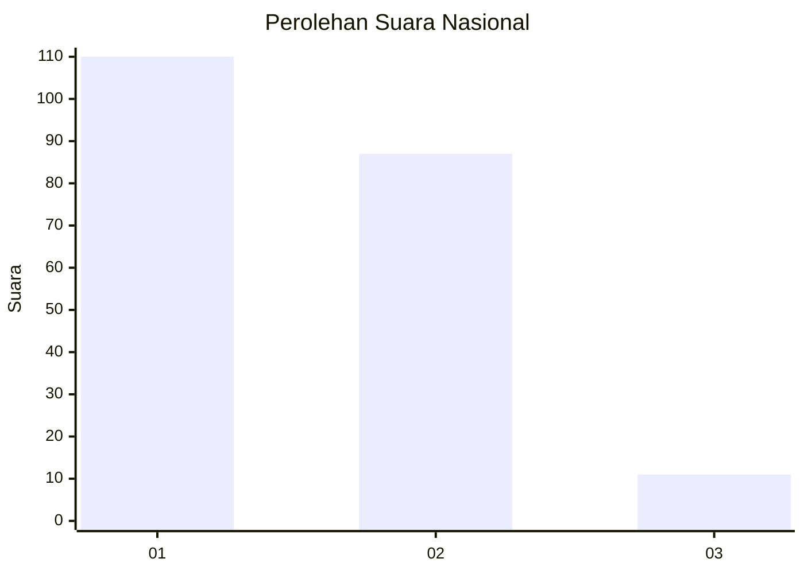
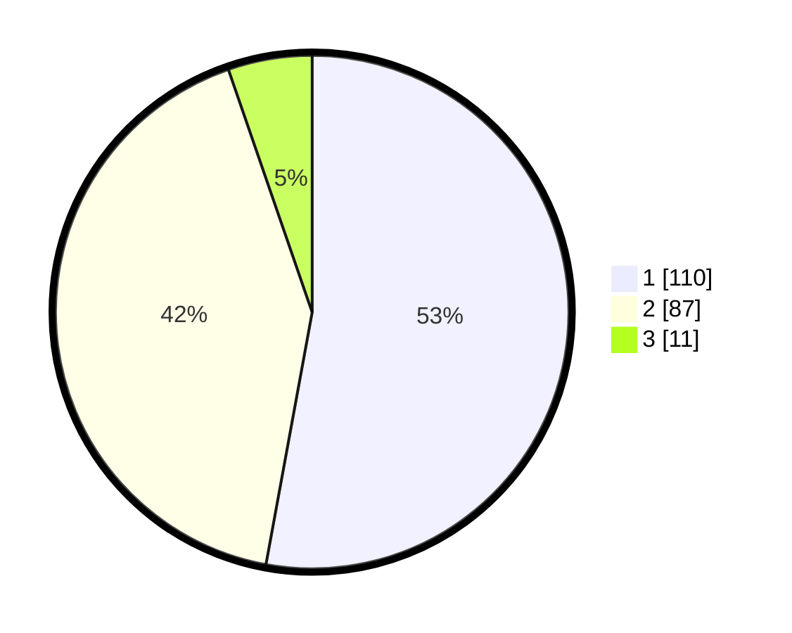

# Hasil

## Grafik

## Tabel

| No.    | Nama Paslon    | Suara | Suara (raw) | Persentase |
|:------ |:-------------- | -----:| -----------:| ----------:|
| 100025 | ANIES MUHAIMIN | 110   | [110][p-1]  | 52,88      |
| 100026 | PRABOWO GIBRAN | 87    | [87][p-2]   | 41,83      |
| 100027 | GANJAR MAHFUD  | 11    | [11][p-3]   | 5,29       |

[p-1]: https://github.com/gigit-pemilu/pemilu-2024/blob/main/pilpres/hitung-suara/sub/31-dki-jakarta/sub/75-jakarta-timur/sub/06-cakung/sub/1003-penggilingan/sub/199-tps/sub/paslon-1.txt
[p-2]: https://github.com/gigit-pemilu/pemilu-2024/blob/main/pilpres/hitung-suara/sub/31-dki-jakarta/sub/75-jakarta-timur/sub/06-cakung/sub/1003-penggilingan/sub/199-tps/sub/paslon-2.txt
[p-3]: https://github.com/gigit-pemilu/pemilu-2024/blob/main/pilpres/hitung-suara/sub/31-dki-jakarta/sub/75-jakarta-timur/sub/06-cakung/sub/1003-penggilingan/sub/199-tps/sub/paslon-3.txt

## Foto C Plano

https://sirekap-obj-formc.kpu.go.id/680e/pemilu/ppwp/31/75/06/10/03/3175061003199-20240215-021232--7c6f22e3-cf89-46a4-ad26-442128ce96ce.jpg

https://sirekap-obj-formc.kpu.go.id/680e/pemilu/ppwp/31/75/06/10/03/3175061003199-20240215-021320--d855a5ff-3243-4782-a373-565f9bd2a526.jpg

https://sirekap-obj-formc.kpu.go.id/680e/pemilu/ppwp/31/75/06/10/03/3175061003199-20240215-021324--b7256f31-de31-4be3-a14c-d48e3f409d45.jpg

## Metadata

| Key        | Value               |
| ---------- | ------------------- |
| Time Stamp | 2024-02-24 22:31:28 |

