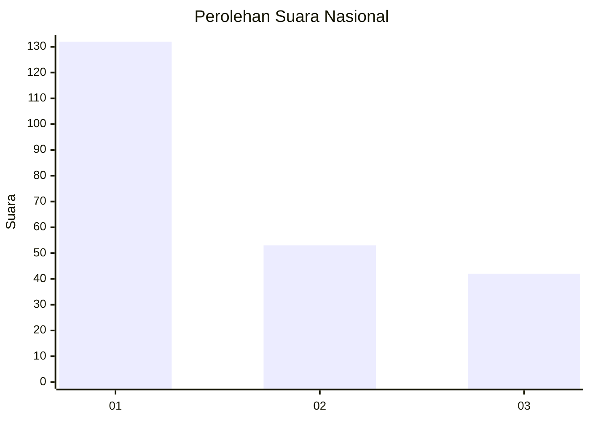
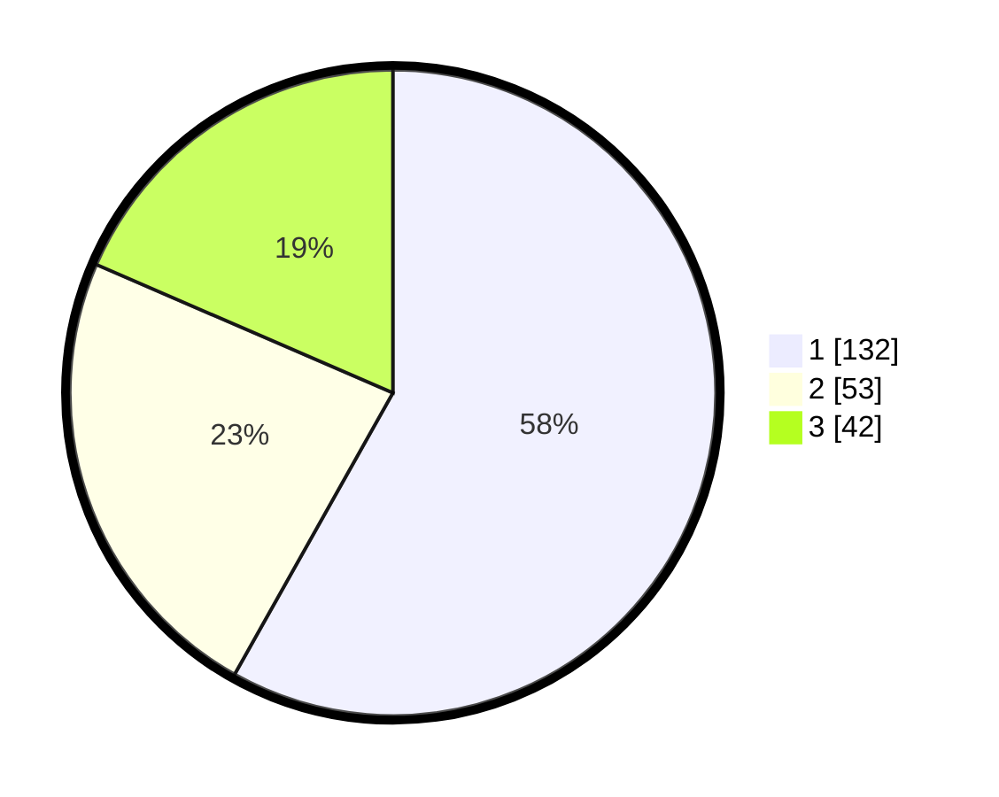

# Hasil

## Grafik

## Tabel

| No.    | Nama Paslon    | Suara | Suara (raw) | Persentase |
|:------ |:-------------- | -----:| -----------:| ----------:|
| 100025 | ANIES MUHAIMIN | 132   | [132][p-1]  | 58,15      |
| 100026 | PRABOWO GIBRAN | 53    | [53][p-2]   | 23,35      |
| 100027 | GANJAR MAHFUD  | 42    | [42][p-3]   | 18,50      |

[p-1]: https://github.com/gigit-pemilu/pemilu-2024/blob/main/pilpres/hitung-suara/sub/31-dki-jakarta/sub/75-jakarta-timur/sub/06-cakung/sub/1003-penggilingan/sub/220-tps/sub/paslon-1.txt
[p-2]: https://github.com/gigit-pemilu/pemilu-2024/blob/main/pilpres/hitung-suara/sub/31-dki-jakarta/sub/75-jakarta-timur/sub/06-cakung/sub/1003-penggilingan/sub/220-tps/sub/paslon-2.txt
[p-3]: https://github.com/gigit-pemilu/pemilu-2024/blob/main/pilpres/hitung-suara/sub/31-dki-jakarta/sub/75-jakarta-timur/sub/06-cakung/sub/1003-penggilingan/sub/220-tps/sub/paslon-3.txt

## Foto C Plano

https://sirekap-obj-formc.kpu.go.id/d560/pemilu/ppwp/31/75/06/10/03/3175061003220-20240216-122134--79da8a8a-22e4-4cdf-bf85-ab161d3e8553.jpg

https://sirekap-obj-formc.kpu.go.id/d560/pemilu/ppwp/31/75/06/10/03/3175061003220-20240216-122311--748579c8-75ba-49f4-919e-8a97adba756b.jpg

https://sirekap-obj-formc.kpu.go.id/d560/pemilu/ppwp/31/75/06/10/03/3175061003220-20240216-122502--a8dd50dd-e984-4332-b772-8ad7061f62dd.jpg

## Metadata

| Key        | Value               |
| ---------- | ------------------- |
| Time Stamp | 2024-02-19 14:00:00 |

