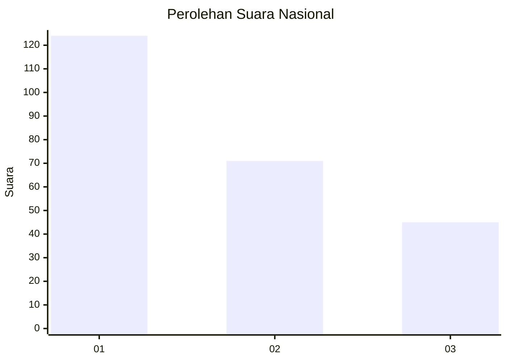
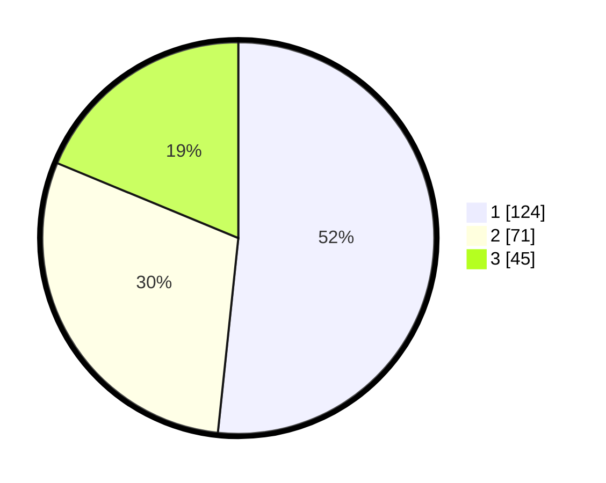

# Hasil

## Grafik

## Tabel

| No.    | Nama Paslon    | Suara | Suara (raw) | Persentase |
|:------ |:-------------- | -----:| -----------:| ----------:|
| 100025 | ANIES MUHAIMIN | 124   | [124][p-1]  | 51,67      |
| 100026 | PRABOWO GIBRAN | 71    | [71][p-2]   | 29,58      |
| 100027 | GANJAR MAHFUD  | 45    | [45][p-3]   | 18,75      |

[p-1]: https://github.com/gigit-pemilu/pemilu-2024/blob/main/pilpres/hitung-suara/sub/31-dki-jakarta/sub/75-jakarta-timur/sub/06-cakung/sub/1003-penggilingan/sub/225-tps/sub/paslon-1.txt
[p-2]: https://github.com/gigit-pemilu/pemilu-2024/blob/main/pilpres/hitung-suara/sub/31-dki-jakarta/sub/75-jakarta-timur/sub/06-cakung/sub/1003-penggilingan/sub/225-tps/sub/paslon-2.txt
[p-3]: https://github.com/gigit-pemilu/pemilu-2024/blob/main/pilpres/hitung-suara/sub/31-dki-jakarta/sub/75-jakarta-timur/sub/06-cakung/sub/1003-penggilingan/sub/225-tps/sub/paslon-3.txt

## Foto C Plano

https://sirekap-obj-formc.kpu.go.id/9b56/pemilu/ppwp/31/75/06/10/03/3175061003225-20240215-001635--ba003a11-ef83-4298-ac5b-bd36c3765358.jpg

https://sirekap-obj-formc.kpu.go.id/9b56/pemilu/ppwp/31/75/06/10/03/3175061003225-20240215-001641--a69ff39d-6a78-4fde-bb66-5fbf41623ad0.jpg

https://sirekap-obj-formc.kpu.go.id/9b56/pemilu/ppwp/31/75/06/10/03/3175061003225-20240215-001922--64b06210-cb7b-4c29-8226-fdf472f0cbd6.jpg

## Metadata

| Key        | Value               |
| ---------- | ------------------- |
| Time Stamp | 2024-02-19 12:00:00 |

