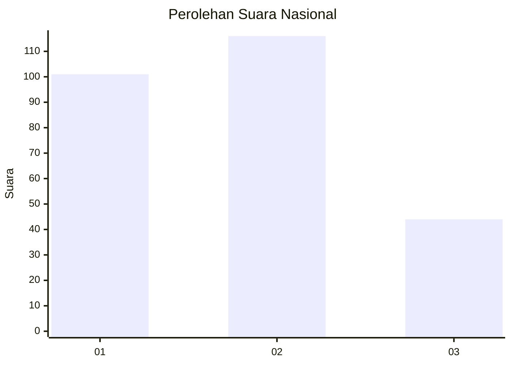
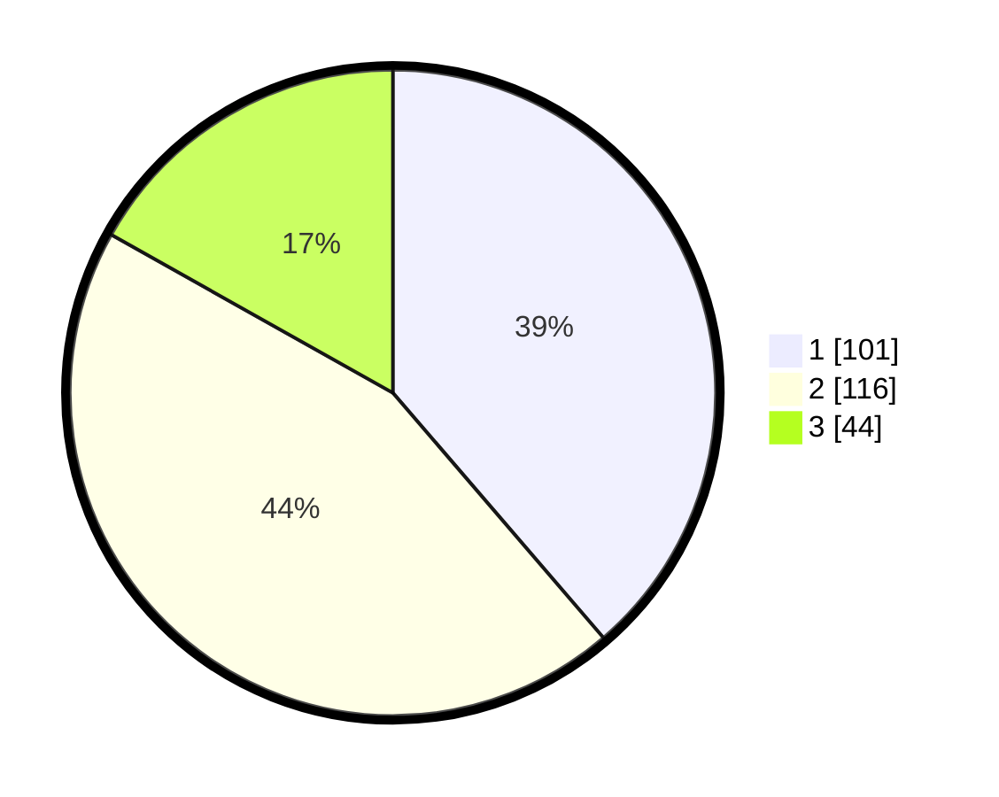

# Hasil

## Grafik

## Tabel

| No.    | Nama Paslon    | Suara | Suara (raw) | Persentase |
|:------ |:-------------- | -----:| -----------:| ----------:|
| 100025 | ANIES MUHAIMIN | 101   | [101][p-1]  | 38,70      |
| 100026 | PRABOWO GIBRAN | 116   | [116][p-2]  | 44,44      |
| 100027 | GANJAR MAHFUD  | 44    | [44][p-3]   | 16,86      |

[p-1]: https://github.com/gigit-pemilu/pemilu-2024/blob/main/pilpres/hitung-suara/sub/31-dki-jakarta/sub/75-jakarta-timur/sub/06-cakung/sub/1003-penggilingan/sub/231-tps/sub/paslon-1.txt
[p-2]: https://github.com/gigit-pemilu/pemilu-2024/blob/main/pilpres/hitung-suara/sub/31-dki-jakarta/sub/75-jakarta-timur/sub/06-cakung/sub/1003-penggilingan/sub/231-tps/sub/paslon-2.txt
[p-3]: https://github.com/gigit-pemilu/pemilu-2024/blob/main/pilpres/hitung-suara/sub/31-dki-jakarta/sub/75-jakarta-timur/sub/06-cakung/sub/1003-penggilingan/sub/231-tps/sub/paslon-3.txt

## Foto C Plano

https://sirekap-obj-formc.kpu.go.id/b696/pemilu/ppwp/31/75/06/10/03/3175061003231-20240214-223123--edaed65b-743a-43bf-8bc0-10f4fa0c6d97.jpg

https://sirekap-obj-formc.kpu.go.id/b696/pemilu/ppwp/31/75/06/10/03/3175061003231-20240214-223211--5b8ff5d7-edd2-4c85-886c-e6ecd4258a34.jpg

https://sirekap-obj-formc.kpu.go.id/b696/pemilu/ppwp/31/75/06/10/03/3175061003231-20240214-223245--d07b3c21-76d1-4567-bbc3-f4b9eb3b3659.jpg

## Metadata

| Key        | Value               |
| ---------- | ------------------- |
| Time Stamp | 2024-02-19 12:00:00 |

