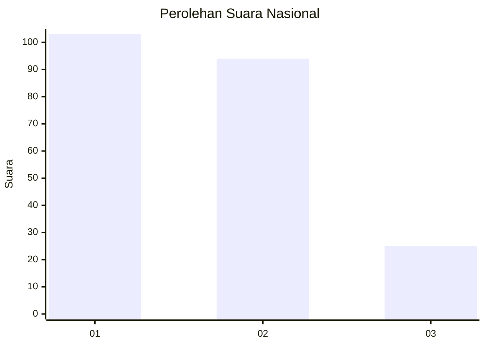
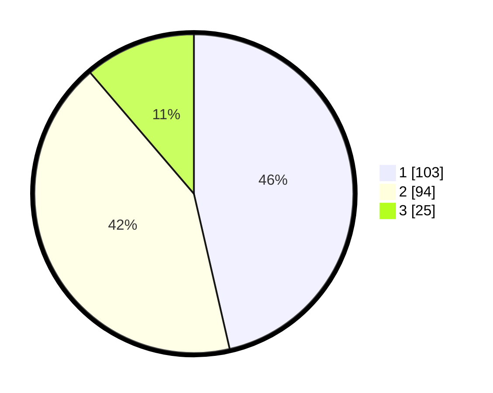

# Hasil

## Grafik

## Tabel

| No.    | Nama Paslon    | Suara | Suara (raw) | Persentase |
|:------ |:-------------- | -----:| -----------:| ----------:|
| 100025 | ANIES MUHAIMIN | 103   | [103][p-1]  | 46,40      |
| 100026 | PRABOWO GIBRAN | 94    | [94][p-2]   | 42,34      |
| 100027 | GANJAR MAHFUD  | 25    | [25][p-3]   | 11,26      |

[p-1]: https://github.com/gigit-pemilu/pemilu-2024/blob/main/pilpres/hitung-suara/sub/31-dki-jakarta/sub/75-jakarta-timur/sub/06-cakung/sub/1003-penggilingan/sub/294-tps/sub/paslon-1.txt
[p-2]: https://github.com/gigit-pemilu/pemilu-2024/blob/main/pilpres/hitung-suara/sub/31-dki-jakarta/sub/75-jakarta-timur/sub/06-cakung/sub/1003-penggilingan/sub/294-tps/sub/paslon-2.txt
[p-3]: https://github.com/gigit-pemilu/pemilu-2024/blob/main/pilpres/hitung-suara/sub/31-dki-jakarta/sub/75-jakarta-timur/sub/06-cakung/sub/1003-penggilingan/sub/294-tps/sub/paslon-3.txt

## Foto C Plano

https://sirekap-obj-formc.kpu.go.id/5072/pemilu/ppwp/31/75/06/10/03/3175061003294-20240214-235734--562ec869-a8b3-4352-94cf-7af5fafbcd5f.jpg

https://sirekap-obj-formc.kpu.go.id/5072/pemilu/ppwp/31/75/06/10/03/3175061003294-20240214-235919--46cc713a-b55c-46a1-9f30-95cc2f2afdfe.jpg

https://sirekap-obj-formc.kpu.go.id/5072/pemilu/ppwp/31/75/06/10/03/3175061003294-20240214-221401--6dc14e97-30cf-4e77-a242-c209b3987d30.jpg

## Metadata

| Key        | Value               |
| ---------- | ------------------- |
| Time Stamp | 2024-02-19 12:00:00 |

