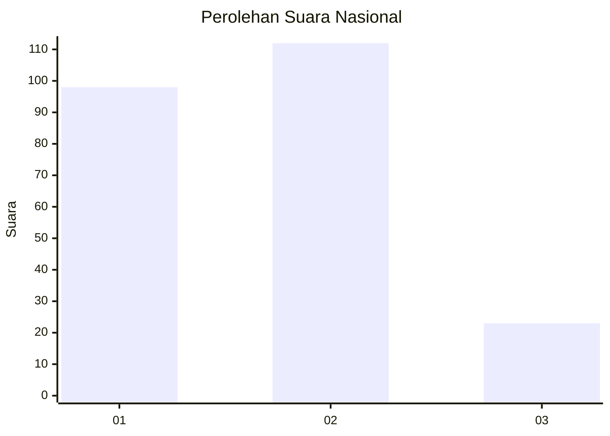
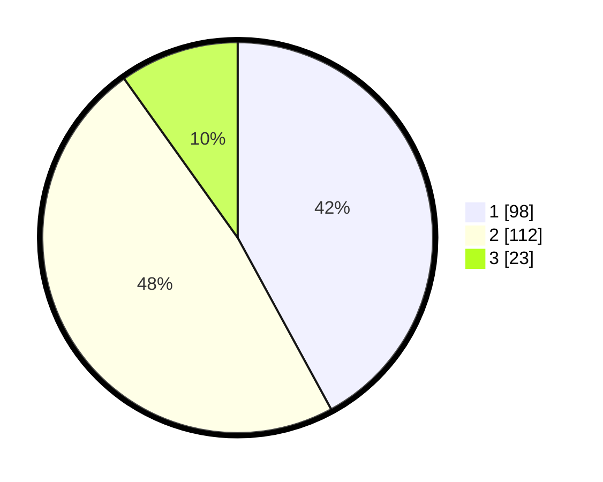

# Hasil

## Grafik

## Tabel

| No.    | Nama Paslon    | Suara | Suara (raw) | Persentase |
|:------ |:-------------- | -----:| -----------:| ----------:|
| 100025 | ANIES MUHAIMIN | 98    | [98][p-1]   | 42,06      |
| 100026 | PRABOWO GIBRAN | 112   | [112][p-2]  | 48,07      |
| 100027 | GANJAR MAHFUD  | 23    | [23][p-3]   | 9,87       |

[p-1]: https://github.com/gigit-pemilu/pemilu-2024/blob/main/pilpres/hitung-suara/sub/31-dki-jakarta/sub/75-jakarta-timur/sub/06-cakung/sub/1003-penggilingan/sub/302-tps/sub/paslon-1.txt
[p-2]: https://github.com/gigit-pemilu/pemilu-2024/blob/main/pilpres/hitung-suara/sub/31-dki-jakarta/sub/75-jakarta-timur/sub/06-cakung/sub/1003-penggilingan/sub/302-tps/sub/paslon-2.txt
[p-3]: https://github.com/gigit-pemilu/pemilu-2024/blob/main/pilpres/hitung-suara/sub/31-dki-jakarta/sub/75-jakarta-timur/sub/06-cakung/sub/1003-penggilingan/sub/302-tps/sub/paslon-3.txt

## Foto C Plano

https://sirekap-obj-formc.kpu.go.id/19ee/pemilu/ppwp/31/75/06/10/03/3175061003302-20240214-214947--90b31ad8-f5ce-489f-89e5-e1ab6b39f348.jpg

https://sirekap-obj-formc.kpu.go.id/19ee/pemilu/ppwp/31/75/06/10/03/3175061003302-20240214-215044--40b03d1b-d1fe-448d-8853-d44400c27837.jpg

https://sirekap-obj-formc.kpu.go.id/19ee/pemilu/ppwp/31/75/06/10/03/3175061003302-20240214-215148--002cc9dd-dc97-47bb-8420-57169a2b661f.jpg

## Metadata

| Key        | Value               |
| ---------- | ------------------- |
| Time Stamp | 2024-02-24 22:31:28 |

