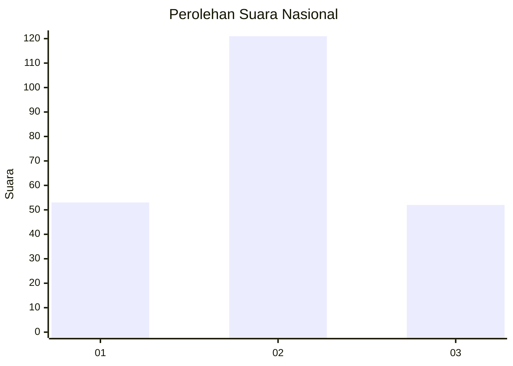
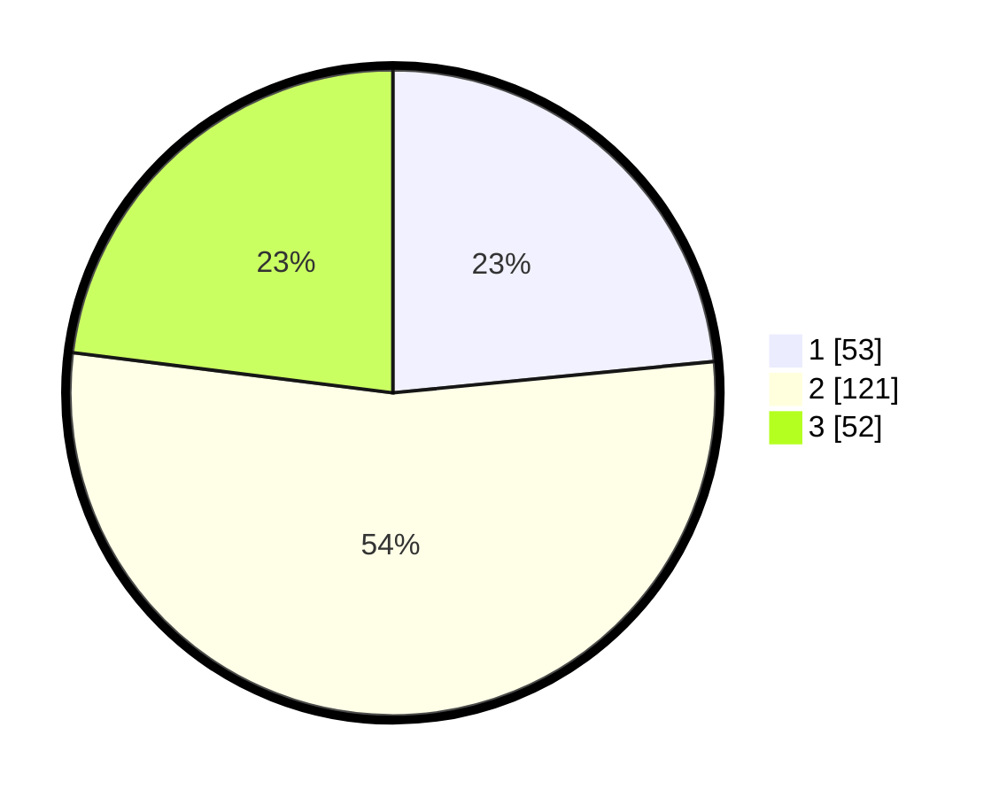

# Hasil

## Grafik

## Tabel

| No.    | Nama Paslon    | Suara | Suara (raw) | Persentase |
|:------ |:-------------- | -----:| -----------:| ----------:|
| 100025 | ANIES MUHAIMIN | 53    | [53][p-1]   | 23,45      |
| 100026 | PRABOWO GIBRAN | 121   | [121][p-2]  | 53,54      |
| 100027 | GANJAR MAHFUD  | 52    | [52][p-3]   | 23,01      |

[p-1]: https://github.com/gigit-pemilu/pemilu-2024/blob/main/pilpres/hitung-suara/sub/31-dki-jakarta/sub/75-jakarta-timur/sub/06-cakung/sub/1003-penggilingan/sub/339-tps/sub/paslon-1.txt
[p-2]: https://github.com/gigit-pemilu/pemilu-2024/blob/main/pilpres/hitung-suara/sub/31-dki-jakarta/sub/75-jakarta-timur/sub/06-cakung/sub/1003-penggilingan/sub/339-tps/sub/paslon-2.txt
[p-3]: https://github.com/gigit-pemilu/pemilu-2024/blob/main/pilpres/hitung-suara/sub/31-dki-jakarta/sub/75-jakarta-timur/sub/06-cakung/sub/1003-penggilingan/sub/339-tps/sub/paslon-3.txt

## Foto C Plano

https://sirekap-obj-formc.kpu.go.id/c6a2/pemilu/ppwp/31/75/06/10/03/3175061003339-20240214-213849--86195199-5557-4596-897e-d6e86ed7c787.jpg

https://sirekap-obj-formc.kpu.go.id/c6a2/pemilu/ppwp/31/75/06/10/03/3175061003339-20240214-214018--d9d0cced-4dcb-47ed-8ce5-fd61dea6cd76.jpg

https://sirekap-obj-formc.kpu.go.id/c6a2/pemilu/ppwp/31/75/06/10/03/3175061003339-20240214-214154--8b9e9615-b65a-452d-8ec7-6edeee771f1c.jpg

## Metadata

| Key        | Value               |
| ---------- | ------------------- |
| Time Stamp | 2024-02-24 22:31:28 |

