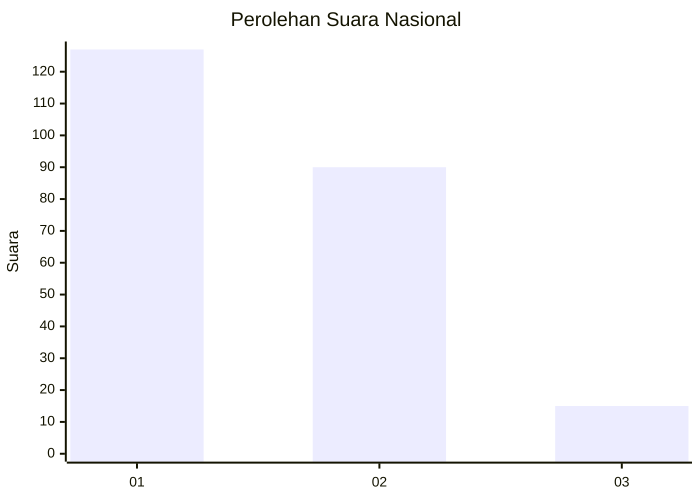
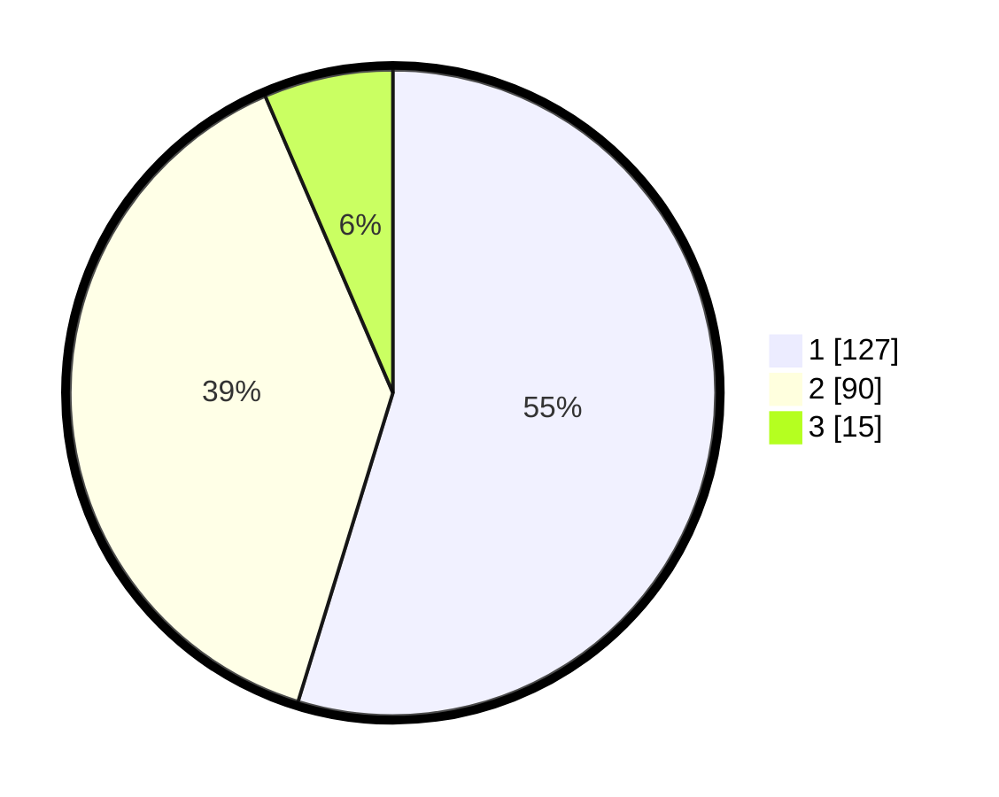

# Hasil

## Grafik

## Tabel

| No.    | Nama Paslon    | Suara | Suara (raw) | Persentase |
|:------ |:-------------- | -----:| -----------:| ----------:|
| 100025 | ANIES MUHAIMIN | 127   | [127][p-1]  | 54,74      |
| 100026 | PRABOWO GIBRAN | 90    | [90][p-2]   | 38,79      |
| 100027 | GANJAR MAHFUD  | 15    | [15][p-3]   | 6,47       |

[p-1]: https://github.com/gigit-pemilu/pemilu-2024/blob/main/pilpres/hitung-suara/sub/31-dki-jakarta/sub/75-jakarta-timur/sub/06-cakung/sub/1004-cakung-timur/sub/034-tps/sub/paslon-1.txt
[p-2]: https://github.com/gigit-pemilu/pemilu-2024/blob/main/pilpres/hitung-suara/sub/31-dki-jakarta/sub/75-jakarta-timur/sub/06-cakung/sub/1004-cakung-timur/sub/034-tps/sub/paslon-2.txt
[p-3]: https://github.com/gigit-pemilu/pemilu-2024/blob/main/pilpres/hitung-suara/sub/31-dki-jakarta/sub/75-jakarta-timur/sub/06-cakung/sub/1004-cakung-timur/sub/034-tps/sub/paslon-3.txt

## Foto C Plano

https://sirekap-obj-formc.kpu.go.id/8f7e/pemilu/ppwp/31/75/06/10/04/3175061004034-20240215-022158--78ef8634-0858-4775-8266-b76c0cfc61cb.jpg

https://sirekap-obj-formc.kpu.go.id/8f7e/pemilu/ppwp/31/75/06/10/04/3175061004034-20240215-022236--731347e0-b574-4be2-ae6f-4bcf6efc3731.jpg

https://sirekap-obj-formc.kpu.go.id/8f7e/pemilu/ppwp/31/75/06/10/04/3175061004034-20240215-022303--b9d70052-a123-42ba-b20c-f4bad4e2296a.jpg

## Metadata

| Key        | Value               |
| ---------- | ------------------- |
| Time Stamp | 2024-02-24 22:31:28 |

