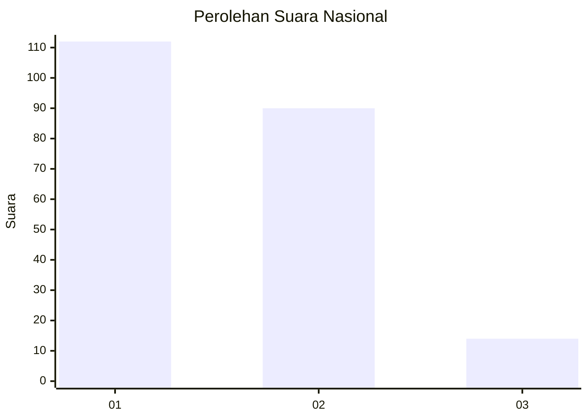
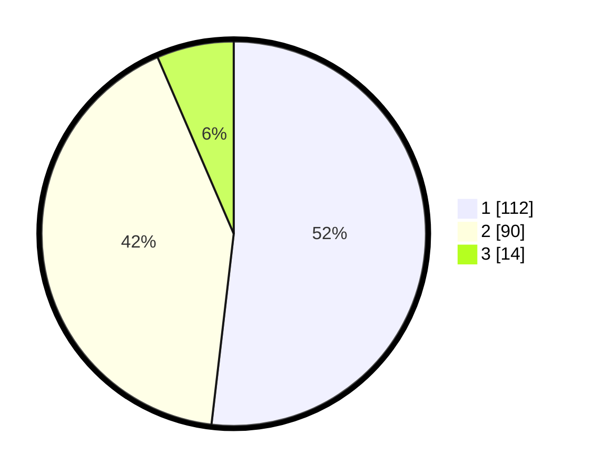

# Hasil

## Grafik

## Tabel

| No.    | Nama Paslon    | Suara | Suara (raw) | Persentase |
|:------ |:-------------- | -----:| -----------:| ----------:|
| 100025 | ANIES MUHAIMIN | 112   | [112][p-1]  | 51,85      |
| 100026 | PRABOWO GIBRAN | 90    | [90][p-2]   | 41,67      |
| 100027 | GANJAR MAHFUD  | 14    | [14][p-3]   | 6,48       |

[p-1]: https://github.com/gigit-pemilu/pemilu-2024/blob/main/pilpres/hitung-suara/sub/31-dki-jakarta/sub/75-jakarta-timur/sub/06-cakung/sub/1004-cakung-timur/sub/037-tps/sub/paslon-1.txt
[p-2]: https://github.com/gigit-pemilu/pemilu-2024/blob/main/pilpres/hitung-suara/sub/31-dki-jakarta/sub/75-jakarta-timur/sub/06-cakung/sub/1004-cakung-timur/sub/037-tps/sub/paslon-2.txt
[p-3]: https://github.com/gigit-pemilu/pemilu-2024/blob/main/pilpres/hitung-suara/sub/31-dki-jakarta/sub/75-jakarta-timur/sub/06-cakung/sub/1004-cakung-timur/sub/037-tps/sub/paslon-3.txt

## Foto C Plano

https://sirekap-obj-formc.kpu.go.id/3f3c/pemilu/ppwp/31/75/06/10/04/3175061004037-20240214-234836--0fdab81f-d708-43e7-94c8-05bb89a97519.jpg

https://sirekap-obj-formc.kpu.go.id/3f3c/pemilu/ppwp/31/75/06/10/04/3175061004037-20240214-235239--818b5192-5639-4a61-8a98-31e933eccf56.jpg

https://sirekap-obj-formc.kpu.go.id/3f3c/pemilu/ppwp/31/75/06/10/04/3175061004037-20240214-190426--59fa46b9-870f-41e5-aae6-bed742df1a79.jpg

## Metadata

| Key        | Value               |
| ---------- | ------------------- |
| Time Stamp | 2024-02-24 22:31:28 |

