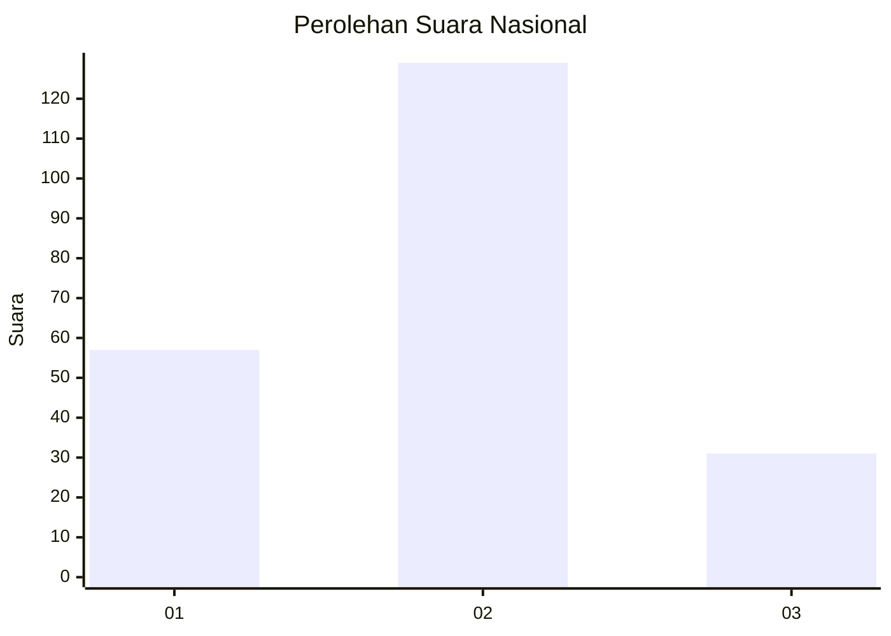
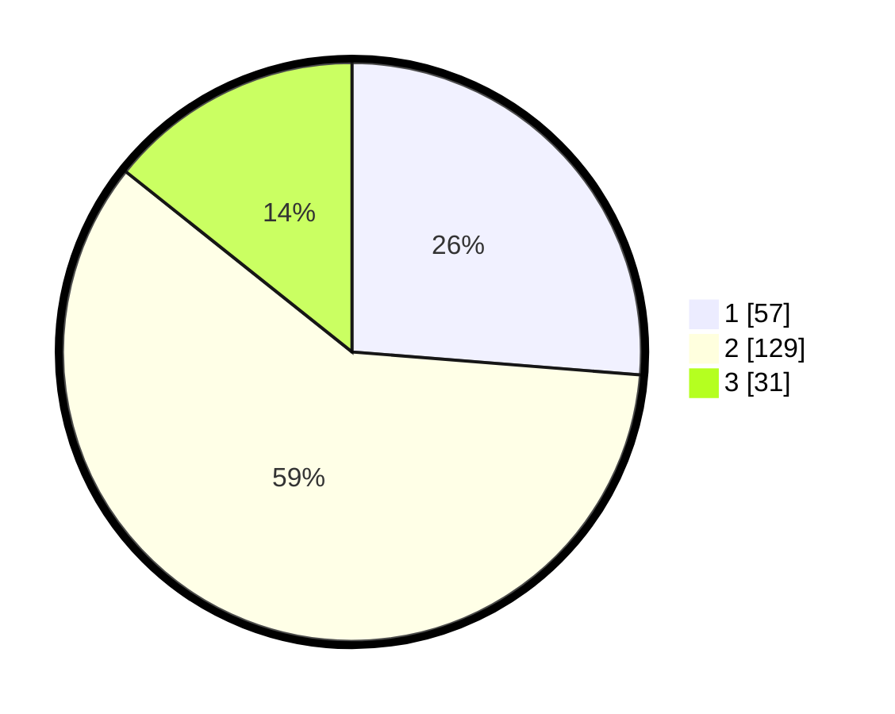

# Hasil

## Grafik

## Tabel

| No.    | Nama Paslon    | Suara | Suara (raw) | Persentase |
|:------ |:-------------- | -----:| -----------:| ----------:|
| 100025 | ANIES MUHAIMIN | 57    | [57][p-1]   | 26,27      |
| 100026 | PRABOWO GIBRAN | 129   | [129][p-2]  | 59,45      |
| 100027 | GANJAR MAHFUD  | 31    | [31][p-3]   | 14,29      |

[p-1]: https://github.com/gigit-pemilu/pemilu-2024/blob/main/pilpres/hitung-suara/sub/31-dki-jakarta/sub/75-jakarta-timur/sub/06-cakung/sub/1004-cakung-timur/sub/044-tps/sub/paslon-1.txt
[p-2]: https://github.com/gigit-pemilu/pemilu-2024/blob/main/pilpres/hitung-suara/sub/31-dki-jakarta/sub/75-jakarta-timur/sub/06-cakung/sub/1004-cakung-timur/sub/044-tps/sub/paslon-2.txt
[p-3]: https://github.com/gigit-pemilu/pemilu-2024/blob/main/pilpres/hitung-suara/sub/31-dki-jakarta/sub/75-jakarta-timur/sub/06-cakung/sub/1004-cakung-timur/sub/044-tps/sub/paslon-3.txt

## Foto C Plano

https://sirekap-obj-formc.kpu.go.id/38b5/pemilu/ppwp/31/75/06/10/04/3175061004044-20240214-205215--2364bd1a-867d-47f8-ada3-67effa3d5bed.jpg

https://sirekap-obj-formc.kpu.go.id/38b5/pemilu/ppwp/31/75/06/10/04/3175061004044-20240214-205304--4ff5e574-f0d8-457a-a74c-92b59774e4ca.jpg

https://sirekap-obj-formc.kpu.go.id/38b5/pemilu/ppwp/31/75/06/10/04/3175061004044-20240214-205349--5dd7074e-9753-41d2-9d68-ced87c0808e0.jpg

## Metadata

| Key        | Value               |
| ---------- | ------------------- |
| Time Stamp | 2024-02-24 22:31:28 |

